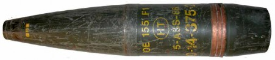
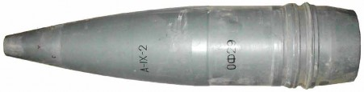
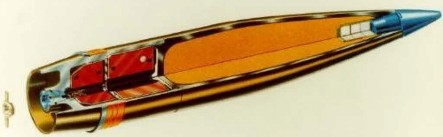

#### СНАРЯДИ

## ОФ-17

Зображення © З приватних джерел

| СУБКАТЕГОРІЯ ОЗБРОЄННЯ          | Снаряд до танкової гармати        |
| ------------------------------- | --------------------------------- |
| СПОРЯДЖЕННЯ БОЙОВОЇ ЧАСТИНИ (г) | 1 690 г, вибухова речовина A-IX-2 |
| ПОВНА МАСА (г)                  | 18 100 г                          |
| РОЗМІРИ (мм)                    | 100 x 611                         |
| КРАЇНА ПОХОДЖЕННЯ               | Росія/Болгарія                    |
| ПІДРИВНИК                       | В-429                             |

ОФ-17 — це 100-мм моноблочний осколково-фугасний постріл до танкової гармати 2А70 броньованих машин БМД-4. Абревіатура ОФ означає «осколково-фугасний». Цей постріл було знайдено відкинутим в результаті вибуху броньованих машин БМД-4. Його також знайшли як залишений вибуховий боєприпас без підривника. Цей постріл схожий за параметрами на ОФ-32, хоча трохи важчий.

Цей постріл зазвичай комплектують механічним підривником В-429 ударної дії. Підривники серії В-429 є порівняно простими й засновані на механічному принципі ударної дії. Зводяться вони під дією інерції. Швидкість пострілу на виході з дула становить 850 м/с. Підривник В-429 дуже схожий на підривники РГМ-2, якими комплектуються артилерійські снаряди. Можливе також використання іншого підривника — В-35. Він дуже схожий на підривник M-12 до мінометної міни.

## ОФ-19

Зображення © Arcon Partners Ltd

| СУБКАТЕГОРІЯ ОЗБРОЄННЯ          | Снаряд до танкової гармати |
| ------------------------------- | -------------------------- |
| СПОРЯДЖЕННЯ БОЙОВОЇ ЧАСТИНИ (г) | 3 150 г, тротил            |
| ПОВНА МАСА (г)                  | 23 219 г                   |
| РОЗМІРИ (мм)                    | 125 x 670                  |
| КРАЇНА ПОХОДЖЕННЯ               | Росія/Болгарія             |
| ПІДРИВНИК                       | В-429                      |

ОФ-19 — це 125-мм фугасний постріл для танкової гармати, який у польоті стабілізується закручуванням. Постріли цього типу були значною мірою замінені на ОФ-26. Обидва постріли комплектуються підривниками В-429, які зводяться під дією інерції. Обидва мають чотири хвостові стабілізатори, які забезпечують стабілізацію в польоті методом повільного закручування. Основна відмінність полягає в заряді вибухової речовини: в ОФ-19 використовується тротил, а не A-IX-2. У поєднанні з пороховими зарядами 4Ж40/4Ж52 весь постріл має позначення «3ВОФ22».

Постріл ОФ-19 дуже схожий на свого наступника 3ОФ-26. Маркування — це найпростіший спосіб їх відрізнити. Якщо маркування не видно, ОФ-19 із підривником на 5 мм коротший за ОФ-26. Підривник В-429 дуже схожий на підривники РГМ-2, якими комплектуються артилерійські снаряди.

## ОФ-26

Зображення © Державна служба України з надзвичайних ситуацій

| СУБКАТЕГОРІЯ ОЗБРОЄННЯ          | Снаряд до танкової гармати        |
| ------------------------------- | --------------------------------- |
| СПОРЯДЖЕННЯ БОЙОВОЇ ЧАСТИНИ (г) | 3 340 г, вибухова речовина A-IX-2 |
| ПОВНА МАСА (г)                  | 23 200 г                          |
| РОЗМІРИ (мм)                    | 125 x 675                         |
| КРАЇНА ПОХОДЖЕННЯ               | Росія/Болгарія                    |
| ПІДРИВНИК                       | В-429                             |

ОФ-26 — це стандартний 125-мм осколково-фугасний постріл російського виробництва. Його повний індекс ГРАУ — 3ОФ-26. Якщо такий постріл буде знайдено як залишений вибуховий боєприпас (ЗВП), він буде мати окремий вузол метального заряду 4Ж40/4Ж52, де використовується однокомпонентне паливо. Повністю зібраний постріл 3ОФ-26 і пороховий заряд разом позначаються як «3ВОФ36». Снаряд вистрілюється з гладкодульних танкових гармат та стабілізується із застосуванням хвостових стабілізаторів. Чотири хвостові стабілізатори забезпечують повільну швидкість закручування, яка не впливає на зведення підривника. Підривники серії В-429 є порівняно простими й засновані на механічному принципі ударної дії. Зводяться вони під дією інерції. Швидкість пострілу на виході з дула становить 850 м/с.

Ідентифікацію слід підтвердити шляхом перевірки маркування на боєприпасі, так як цей постріл легко сплутати з ОФ-19. Зазвичай написи ОФ-26 і A-IX-2 наносяться чорним кольором на одному боці боєприпаса. Постріли упаковуються по одній одиниці й окремому пороховому заряду в коробці. Боєприпаси постачаються в упакуванні як з установленими підривниками, так і без них. Навколо знищених БМП виявлено велику кількість снарядів ОФ-26 зі слідами перегрівання. Підривник В-429 дуже схожий на підривники РГМ-2, якими комплектуються артилерійські снаряди.

## ОФ-32

Зображення © Шон Мурхаус (Sean Moorhouse)

| СУБКАТЕГОРІЯ ОЗБРОЄННЯ          | Снаряд до танкової гармати        |
| ------------------------------- | --------------------------------- |
| СПОРЯДЖЕННЯ БОЙОВОЇ ЧАСТИНИ (г) | 1 700 г, вибухова речовина A-IX-2 |
| ПОВНА МАСА (г)                  | 15 660 г                          |
| РОЗМІРИ (мм)                    | 100 x 490                         |
| КРАЇНА ПОХОДЖЕННЯ               | Росія                             |
| ПІДРИВНИК                       | В-429                             |

ОФ-32 — це 100-мм моноблочний осколково-фугасний постріл до танкової гармати 2А70 броньованих машин БМД-4. Абревіатура ОФ означає «осколково-фугасний». Цей постріл було знайдено відкинутим в результаті вибуху броньованих машин БМД-4. Його також знаходили, як залишений вибуховий боєприпас (ЗВП) без підривника. Цей постріл схожий на ОФ-17, але трохи легший.

Цей постріл зазвичай комплектують механічним підривником В-429 ударної дії. Підривники серії В-429 є порівняно простими й засновані на механічному принципі ударної дії. Зводяться вони під дією інерції. Швидкість пострілу на виході з дула становить 850 м/с. Підривник В-429 дуже схожий на підривники РГМ-2, якими комплектуються артилерійські снаряди. Можливе також використання іншого підривника — В-35. Він дуже схожий на підривник M-12 до мінометної міни.

## БМ-26

Зображення © Шон Мурхаус (Sean Moorhouse)

| СУБКАТЕГОРІЯ ОЗБРОЄННЯ          | Снаряд APFSDS (бронебійний снаряд із відокремлюваним піддоном і хвостовим стабілізатором) |
| ------------------------------- | ------------------------------------------------------------ |
| СПОРЯДЖЕННЯ БОЙОВОЇ ЧАСТИНИ (г) | Невідомо                                                     |
| ПОВНА МАСА (г)                  | 4 800 г — снаряд. 7 050 г — повний постріл                   |
| РОЗМІРИ (мм)                    | 125 x 395 (тільки снаряд)                                    |
| КРАЇНА ПОХОДЖЕННЯ               | Росія                                                        |
| ПІДРИВНИК                       | Невідомо                                                     |

БМ-26 — це поширений 125-мм бронебійний снаряд із відокремлюваним піддоном і хвостовим стабілізатором (APFSDS) до гладкодульних танкових гармат російського виробництва. Осердя пострілу зроблене зі сплаву вольфрам-нікель-залізо (важкий металевий вольфрамовий сплав, HMTA). Постріли постачаються як двокомпонентна конструкція зі здвоєним пороховим зарядом.

Моноблочний постріл із пороховим зарядом 4Ж63 може називатися «3ВБМ11/3БМ26/27». Сам постріл має назву «БМ-26».

Ці постріли не слід знищувати методом підриву через можливе спікання в результаті цього. Ці постріли слід вилучати для спеціалізованого промислового переробляння.

## БМ-32

Зображення © З відкритих джерел

| СУБКАТЕГОРІЯ ОЗБРОЄННЯ          | Снаряд APFSDS (бронебійний снаряд із відокремлюваним піддоном і хвостовим стабілізатором) |
| ------------------------------- | ------------------------------------------------------------ |
| СПОРЯДЖЕННЯ БОЙОВОЇ ЧАСТИНИ (г) | Невідомо                                                     |
| ПОВНА МАСА (г)                  | 7 050 г                                                      |
| РОЗМІРИ (мм)                    | 125 x 585 (тільки снаряд)                                    |
| КРАЇНА ПОХОДЖЕННЯ               | Росія                                                        |
| ПІДРИВНИК                       | Невідомо                                                     |

БМ-32 — це поширений 125-мм бронебійний снаряд із відокремлюваним піддоном і хвостовим стабілізатором (APFSDS) для гладкодульних танкових гармат російського виробництва. Осердя пострілу зроблене зі збідненого урану. У разі застосування зі здвоєними пороховими зарядами він має позначення 3ВБМ-13. Починаючи з 1980-х років, це був перший радянський постріл APFSDS, споряджений збідненим ураном. Він може згадуватися як «Вант», що відповідає назві дослідницького проєкту, в рамках якого він був розроблений.

Дуже важливо, щоб ці постріли були правильно ідентифіковані й не були сплутані з іншими моделями APFSDS. Ці постріли не слід знищувати методом підриву через можливе спікання. Ці постріли слід вилучати для спеціалізованого промислового переробляння.

## БК-13M

Зображення © Шон Мурхаус (Sean Moorhouse)

| СУБКАТЕГОРІЯ ОЗБРОЄННЯ          | Снаряд — протитанковий кумулятивний |
| ------------------------------- | ----------------------------------- |
| СПОРЯДЖЕННЯ БОЙОВОЇ ЧАСТИНИ (г) | 1 800 г, вибухова речовина A-IX-1   |
| ПОВНА МАСА (г)                  | 18 200 г                            |
| РОЗМІРИ (мм)                    | 122 x 637 (тільки снаряд)           |
| КРАЇНА ПОХОДЖЕННЯ               | Росія                               |
| ПІДРИВНИК                       | Невідомо                            |

БК-13 — це 122-мм кумулятивний протитанковий постріл із хвостовими стабілізаторами й трасером (HEAT-FS-T). Він вистрілюється з гаубиці Д-30 прямим наведенням. У поєднанні з пороховим зарядом у 122-мм металевій гільзі, цей снаряд може мати назву «3ВБК9М». Подовження в головній частині використовується як центральне тіло, що виступає. У цій частині немає тандемного заряду. Тільки один кумулятивний заряд знаходиться в основній бойовій частині. Напрямний поясок зазвичай нефарбований. Оперення складається із шести хвостових стабілізаторів.

Найпростіша ознака, за якою можна визначити, чи був снаряд вистрілений, — це наявність пошкоджень навколо подовження / центрального тіла в головній частині пострілу.

## БК-14

Зображення © Державна служба України з надзвичайних ситуацій

| СУБКАТЕГОРІЯ ОЗБРОЄННЯ          | Снаряд — протитанковий кумулятивний |
| ------------------------------- | ----------------------------------- |
| СПОРЯДЖЕННЯ БОЙОВОЇ ЧАСТИНИ (г) | 1 850 г, вибухова речовина ОКФОЛ    |
| ПОВНА МАСА (г)                  | 19 020 г                            |
| РОЗМІРИ (мм)                    | 125 x 677 (тільки снаряд)           |
| КРАЇНА ПОХОДЖЕННЯ               | Росія                               |
| ПІДРИВНИК                       | В-15                                |

БМ-14 — це поширений 125-мм протитанковий кумулятивний постріл із хвостовими стабілізаторами й трасером (HEAT-FS-T) для гладкодульних танкових гармат російського виробництва. Він має один кумулятивний заряд в основній бойовій частині. В-15 — це донний детонаційний підривник ударної дії. Подовження в головній частині не містить тандемного заряду. Цей кумулятивний протитанковий снаряд зазвичай входить до боєкомплекту більшості основних бойових танків Т-72 й Т-80.

Зазвичай позначення пострілу нанесено чорною фарбою за допомогою трафарету, але спостерігалися нефарбовані й немарковані снаряди.

У випадку використання з пороховими зарядами 4Ж40/4Ж52, повний постріл позначається як ЗВБК10М. Це ті ж самі порохові заряди, які використовуються з іншими 125-мм пострілами до гладкодульних танкових гармат російського виробництва.

БК-14 можна сплутати з БК-29. Найпростіша ознака, за якою можна розрізнити їх – це незначна різниця у формі кінця подовження.

## ОФ-462

Зображення © Ролі Еванс (Roly Evans)

| СУБКАТЕГОРІЯ ОЗБРОЄННЯ          | Осколково-фугасний снаряд      |
| ------------------------------- | ------------------------------ |
| СПОРЯДЖЕННЯ БОЙОВОЇ ЧАСТИНИ (г) | 3460 г, тротил                 |
| ПОВНА МАСА (г)                  | 21 760 г                       |
| РОЗМІРИ (мм)                    | 122 x 645                      |
| КРАЇНА ПОХОДЖЕННЯ               | Росія/Україна/Болгарія/Румунія |
| ПІДРИВНИК                       | РГМ-2                          |

ОФ-462 — це поширений 122-мм осколково-фугасний артилерійський снаряд. Корпус виготовлено зі сталі. Вистрілені снаряди будуть мати насічки на мідному напрямному пояску. Хоча боєприпас стабілізується закручуванням, типовий підривник РГМ-2 ударної дії зводиться під дією інерції. Хоча існують неконтактні підривник з різьбою 36 мм, сумісні з даним снарядом, більшість наразі виявлених підривників були порівняно простими механічними підривниками ударної дії.

Ці постріли вистрілюються з гаубиць Д-30, і їх можна виявити як залишені вибухові боєприпаси навколо покинутих або зруйнованих позицій гаубиць Д-30. Їх виявлення також є імовірним у залишених або зруйнованих самохідних 122-мм артилерійських установках, наприклад у самохідній гаубиці 2С1.

Позначення ОФ-462 й тротилового вибухового заряду наноситься з одного боку снаряда (зазвичай позначається літерою «Т»), з іншого — заводський номер, номер партії та рік виготовлення.

## С-463

Зображення © Шон Мурхаус (Sean Moorhouse)

| СУБКАТЕГОРІЯ ОЗБРОЄННЯ          | Освітлювальний снаряд |
| ------------------------------- | --------------------- |
| СПОРЯДЖЕННЯ БОЙОВОЇ ЧАСТИНИ (г) | 20 г, вибивний заряд  |
| ПОВНА МАСА (г)                  | 21 960 г              |
| РОЗМІРИ (мм)                    | 122 x 551             |
| КРАЇНА ПОХОДЖЕННЯ               | Росія                 |
| ПІДРИВНИК                       | Т-7                   |

С-463 — це стандартний 122-мм освітлювальний постріл для гаубиць Д-30 і самохідних 122-мм артилерійських установок, таких як 2С1. Мідний напрямний поясок може бути видимим або зафарбованим. Як і у випадку багатьох освітлювальних пострілів, освітлювальна піротехнічна свічка виштовхується з корпусу снаряда за допомогою невеликого вибивного заряду чорного пороху масою 20 г. Час розгортання освітлювальної піротехнічної свічки зазвичай установлюється дистанційною трубкою із вогневою трубкою (PTTF) T-7. Після розгортання освітлювальної піротехнічної свічки вона утримується в повітрі завдяки білому парашута. Освітлювальна піротехнічна свічка, що приземлилася, зазвичай помітна через наявність парашута або слідів горіння на ґрунті.

## ОФ-25

Зображення © Шон Мурхаус (Sean Moorhouse)

| СУБКАТЕГОРІЯ ОЗБРОЄННЯ          | Осколково-фугасний снаряд         |
| ------------------------------- | --------------------------------- |
| СПОРЯДЖЕННЯ БОЙОВОЇ ЧАСТИНИ (г) | 6 800 г, вибухова речовина A-IX-2 |
| ПОВНА МАСА (г)                  | 43 560 г (без підривника)         |
| РОЗМІРИ (мм)                    | 152 x 646                         |
| КРАЇНА ПОХОДЖЕННЯ               | Росія                             |
| ПІДРИВНИК                       | РГМ-2                             |

ОФ-25 — це поширений 152-мм осколково-фугасний артилерійський снаряд. Корпус виготовлено зі сталі. Вистрілені снаряди матимуть насічки на мідному напрямному пояску, який пофарбований у такий самий колір, як і решта снаряда. Хоча боєприпас стабілізується закручуванням, типовий підривник РГМ-2 ударної дії зводиться під дією інерції. Хоча існують неконтактні підривники з різьбою 36 мм, сумісні з цим снарядом, більшість наразі виявлених підривників були за своїм характером порівняно простими механічними підривниками ударної дії.

Ці постріли вистрілюються з гаубиць Д-20, і їх можна виявити як залишені вибухові боєприпаси навколо покинутих або зруйнованих позицій гаубиць Д-20. Їх також можна знайти в залишених або зруйнованих самохідних 152-мм артилерійських установках, наприклад 2С3 «Акація».

Позначення ОФ-25 і вибухової речовини A-IX-2 нанесені з одного боку снаряда, а з іншого — заводський номер, номер партії та рік виготовлення.

## ОФ-45

Зображення © Шон Мурхаус (Sean Moorhouse)

| СУБКАТЕГОРІЯ ОЗБРОЄННЯ          | Осколково-фугасний снаряд         |
| ------------------------------- | --------------------------------- |
| СПОРЯДЖЕННЯ БОЙОВОЇ ЧАСТИНИ (г) | 7 650 г, вибухова речовина A-IX-2 |
| ПОВНА МАСА (г)                  | 43 560 г (без підривника)         |
| РОЗМІРИ (мм)                    | 152 x 864                         |
| КРАЇНА ПОХОДЖЕННЯ               | Росія                             |
| ПІДРИВНИК                       | РГМ-2                             |

ОФ-45 — це поширений 152-мм осколково-фугасний артилерійський снаряд, який був розроблений у 1980-х роках. Він помітно довший ніж інші 152-мм фугасні артилерійські постріли. Корпус виготовлено зі сталі. Вистрілені снаряди матимуть насічки на мідному напрямному пояску, який пофарбований у такий самий колір, як і решта снаряда. Донна частина боєприпаса є порожнистою, а з’єднання з нею є видимим нижче напрямного пояска. Хоча боєприпас стабілізується закручуванням, типовий підривник РГМ-2 ударної дії зводиться під дією інерції. Хоча існують неконтактні підривники з різьбою 36 мм, сумісні з цим снарядом, більшість наразі виявлених підривників були за своїм характером порівняно простими механічними підривниками ударної дії.

Ці постріли вистрілюються з гаубиць Д-20, і їх можна виявити як залишені вибухові боєприпаси навколо покинутих або зруйнованих позицій гаубиць Д-20. Їх також можна знайти в залишених або зруйнованих самохідних 152-мм артилерійських установках, наприклад 2С3 «Акація».

Позначення ОФ-25 і вибухової речовини A-IX-2 нанесені з одного боку снаряда, а з іншого — заводський номер, номер партії та рік виготовлення.

## БП-540

Зображення © Шон Мурхаус (Sean Moorhouse)

| СУБКАТЕГОРІЯ ОЗБРОЄННЯ          | Снаряд — протитанковий кумулятивний |
| ------------------------------- | ----------------------------------- |
| СПОРЯДЖЕННЯ БОЙОВОЇ ЧАСТИНИ (г) | 3 920 г, вибухова речовина A-IX-2   |
| ПОВНА МАСА (г)                  | 27 400 г                            |
| РОЗМІРИ (мм)                    | 152 x 531                           |
| КРАЇНА ПОХОДЖЕННЯ               | Росія                               |
| ПІДРИВНИК                       | ГПВ-3                               |

БП-540 — це 152-мм протитанковий кумулятивний снаряд для ведення вогню прямим наведенням із гаубиць Д-20. Корпус виготовлено зі сталі. Вистрілені снаряди матимуть насічки на мідному напрямному пояску, який пофарбований у такий самий колір, як і решта снаряда. В основі оживальної частини є два відмітні отвори під ключ. Хоча БП-540 стабілізується шляхом закручування, підривник ГПВ-3, який зазвичай використовується, зводиться під дією інерції. Це донний детонаційний підривник ударної дії з функцією вогневого ланцюга без будь-якого механізму самоліквідації. Снаряд оснащений трасером.

Заводський номер, номер партії, рік виготовлення й калібр зазвичай нанесені на одній стороні боєприпаса, а заряд вибухової речовини — на іншій.

Снаряд використовується для стрільби з гаубиці Д-20, а також із самохідних артилерійських установок, таких як 2С3, 2С19 і 2А65.

## ОФ-43

Зображення © Шон Мурхаус (Sean Moorhouse)

| СУБКАТЕГОРІЯ ОЗБРОЄННЯ          | Осколково-фугасний снаряд          |
| ------------------------------- | ---------------------------------- |
| СПОРЯДЖЕННЯ БОЙОВОЇ ЧАСТИНИ (г) | 17 800 г, вибухова речовина A-IX-2 |
| ПОВНА МАСА (г)                  | 110 000 г                          |
| РОЗМІРИ (мм)                    | 203                                |
| КРАЇНА ПОХОДЖЕННЯ               | Росія                              |
| ПІДРИВНИК                       | В-491                              |

ОФ-43 — це 203-мм осколково-фугасний снаряд для самохідних гаубиць 2С7 «Піон» і 2С7М «Малка». Снаряди використовуються з двома мішечками порохових зарядів.

В-491 — це механічний підривник ударної дії зі зведенням під дією інерції. Швидкість снаряда на виході з дула становить 960 м/с. В-491 оснащений селекторним болтом для встановлення режиму спрацювання: із затримкою або миттєвої дії.

Ці снаряди упаковані в дерев’яну систему пакування, подібну до тієї, яка використовувалася в радянських військах ППО.

## БРОНЕБІЙНО-ТРАСУЮЧИЙ СНАРЯД 30X165 ММ 3УБР6

Зображення © Державна служба України з надзвичайних ситуацій

| СУБКАТЕГОРІЯ ОЗБРОЄННЯ          | Гарматний снаряд — бронебійно-трасуючий      |
| ------------------------------- | -------------------------------------------- |
| СПОРЯДЖЕННЯ БОЙОВОЇ ЧАСТИНИ (г) | 123 г метального заряду                      |
| ПОВНА МАСА (г)                  | 853 г                                        |
| РОЗМІРИ (мм)                    | Повний патрон — 30x292 мм Снаряд — 30x165 мм |
| КРАЇНА ПОХОДЖЕННЯ               | Росія / Болгарія                             |

Бронебійно-трасуючий боєприпас калібру 30x165 мм — це поширений російський патрон до автоматичних гармат 2А38, 2А42 та 2А72, що встановлюються на БМП-2, БМП-3 та певні модифікації БТР-80. Ці боєприпаси також використовуються для бойового живлення авіаційної гармати НР-30 калібру 30 мм та гармати ГШ-30-2, що встановлюється на штурмовик Су-25. Повний патрон, прийнятий на озброєння сухопутними військами ЗС РФ, має індекс ГРАУ

«3УБР6». Сам снаряд — суцільний сталевий із цинковим балістичним наконечником. На снаряді міститься мідний напрямний поясок, що після відстрілювання міститиме насічки. Стакан під трасуючий елемент слід перевірити на відсутність піротехнічного складу. Якщо снаряди виявлено в залишеному стані, метальний заряд у гільзі (зазвичай більше ніж 100 г) слід утилізувати. Такі боєприпаси не рекомендується утилізовувати підривом. Гарматні снаряди калібру 30 мм легко сплутати з боєприпасами калібру 23 мм, що відстрілюються із зенітних установок серії ЗСУ-23. Один із простих способів відрізними ці боєприпаси — за характерним подвійним обтисканням навколо канелюр.

## ОСКОЛКОВО-ФУГАСНИЙ ЗАПАЛЮВАЛЬНИЙ СНАРЯД 30X165 ММ 3УОФ8

Зображення © Державна служба України з надзвичайних ситуацій

| СУБКАТЕГОРІЯ ОЗБРОЄННЯ          | Гарматний снаряд — осколково-фугасний запалювальний |
| ------------------------------- | --------------------------------------------------- |
| СПОРЯДЖЕННЯ БОЙОВОЇ ЧАСТИНИ (г) | 49 г речовини А-IX-2 та 123 г метальної речовини    |
| ПОВНА МАСА (г)                  | 837 г                                               |
| РОЗМІРИ (мм)                    | Повний патрон — 30x292 мм Снаряд — 30x165           |
| КРАЇНА ПОХОДЖЕННЯ               | Росія / Болгарія                                    |
| ПІДРИВНИК                       | A-670M                                              |

Осколково-фугасний запалювальний боєприпас калібру 30x165 мм — це поширений російський патрон до автоматичних гармат 2А38, 2А42 та 2А72, що встановлюються на БМП-2, БМП-3 та певні модифікації БТР-80. Ці боєприпаси також використовуються для бойового живлення авіаційної гармати НР-30 калібру 30 мм та гармати ГШ-30-2, що встановлюється на штурмовик Су-25. Повний патрон, прийнятий на озброєння сухопутними військами ЗС РФ, має індекс ГРАУ 3УОФ8. Якщо снаряд калібру 30 мм вкрито чорною оксидною фарбою, він має позначення ОФЗ-30.

Головний контактний підривник А-670М зводиться силою осідання та відцентровою силою. Існує варіант підривника із самоліквідатором, у якому використовується круговий вогневий ланцюг. Самоліквідація спрацьовує за 7,5–14,5 секунди. Зазвичай це відповідає польоту на дальність 3900–5300 м. Цей боєприпас можна легко переплутати з ОФЗ-25 калібру 30 мм. В обох випадках підривник однаковий — А-670М. Болгарські варіанти 3УОФ8 мають позначення «АР-302» та характерні болгарські фабричні маркування. Поводитися з гарматними боєприпасами слід обережно. Відстріляні осколково-фугасні запалювальні снаряди необхідно знищувати на місці.

## СНАРЯД ЗАГАЛЬНОГО ПРИЗНАЧЕННЯ M1 105 ММ

Зображення © З приватних джерел

| СУБКАТЕГОРІЯ ОЗБРОЄННЯ          | Артилерійський снаряд            |
| ------------------------------- | -------------------------------- |
| СПОРЯДЖЕННЯ БОЙОВОЇ ЧАСТИНИ (г) | 2300 г тротилу або Composition B |
| ПОВНА МАСА (г)                  | 13,6 кг (снаряд)                 |
| РОЗМІРИ (мм)                    | 552x105 мм                       |
| КРАЇНА ПОХОДЖЕННЯ               | США / Болгарія / Італія          |

Снаряд M1 калібру 105 мм складається з пустотілого кованого сталевого корпусу зі звуженою хвостовою частиною, обтічною оживальною частиною та напрямним пояском із мідно- цинкового сплаву. Кришку донної частини приварено до донної частини снаряда. Заряд бризантної ВР може складатися з литого тротилу або Composition B. У заряді з носової сторони є виїмка під підривник. Щоб запобігти обсипанню бризантної ВР під час транспортування та вантажно-розвантажувальних робіт, виїмка має облицювання, що простягається на певну глибину та має різьбу під підривник. У гільзі міститься блок капсуля-запалювача та сім окремо запакованих і пронумерованих метальних зарядів. У донній частині гільзи просвердлено отвір, у який впресовано блок капсуля-запалювача. Блок капсуля-запалювача складається з ударного запалювального елемента та перфорованої запалювальної трубки з чорним порохом. У залишеному стані снаряд буде вставлено в латунну гільзу, що містить метальний заряд масою 1400 г. Гаубиці L119 також можуть вести вогонь снарядами калібру 105 мм з окремими метальними зарядами. Боєприпаси M1 використовувалися з підривниками M739A1, встановленими на контактну або вповільнену дію.

## КУМУЛЯТИВНИЙ ПРОТИТАНКОВИЙ СНАРЯД БК-18 125 ММ

Зображення © Державна служба України з надзвичайних ситуацій

| СУБКАТЕГОРІЯ ОЗБРОЄННЯ          | Кумулятивний протитанковий снаряд |
| ------------------------------- | --------------------------------- |
| СПОРЯДЖЕННЯ БОЙОВОЇ ЧАСТИНИ (г) | 1760 г речовини А-IX-1            |
| ПОВНА МАСА (г)                  | 19 000 г                          |
| РОЗМІРИ (мм)                    | 680x125 мм                        |
| КРАЇНА ПОХОДЖЕННЯ               | Росія                             |

Снаряд 3-БК-18М калібру 125 мм (постріл, що складається зі снаряда, метального заряду та піддону, має назву 3-ВБК-16) — це основний кумулятивний протитанковий снаряд зі стабілізаторами, що використовується для стрільби з гармат калібру 125 мм основних бойових танків (Т-64, Т-72, Т-80 і Т-90). Постріл заряджається з разом із метальним зарядом Ж-52 у гільзі, що згоряє наполовину. Метальний заряд — одноосновний із додаванням тротилу. Постріл споряджається п’єзоелектричним підривником із вогневим каналом ВУ-729.

На корпус снаряда нанесено чорне трафаретне маркування «BK18M». Під час знищення протитанкових кумулятивних боєприпасів із таким снарядом, спеціалістам зі знешкодження ВНП слід дотримуватися стандартних запобіжних заходів, зважаючи на значну загрозу з носової частини через кумулятивний струмінь. Зазвичай відстріляні та приведені в бойовий стан БК-18 мають якісь ударні ушкодження стрижня.

## СНАРЯД ЗАГАЛЬНОГО ПРИЗНАЧЕННЯ OE 155 F1 155 ММ

Зображення © Міністерство оборони США

| СУБКАТЕГОРІЯ ОЗБРОЄННЯ          | Артилерійський снаряд                     |
| ------------------------------- | ----------------------------------------- |
| СПОРЯДЖЕННЯ БОЙОВОЇ ЧАСТИНИ (г) | 8800 г речовини Composition B або тротилу |
| ПОВНА МАСА (г)                  | 42 200 г                                  |
| РОЗМІРИ (мм)                    | 841x155                                   |
| КРАЇНА ПОХОДЖЕННЯ               | Франція                                   |

OE 155 F1 — це стандартний артилерійський снаряд загального призначення калібру 155 мм. Він використовується в озброєнні калібрів 155 мм/39 і 155 мм/52 зразків НАТО. Такі боєприпаси постачалися до самохідних артилерійських установок CAESAR калібру 155 мм та з довжиною ствола в 52 калібри. Снаряд може оснащуватися донним газогенератором, що містить метальну ВР і підвищує дальність пострілу, або мати виїмку в дні.

Різьба стандарту 2” дає змогу встановлювати різні сумісні з НАТО підривники. З підривником довжина снаряда становить 841 мм, а без підривника — 768 мм.

## ОСКОЛКОВО-ФУГАСНИЙ СНАРЯД ОФ-29 152 ММ

Зображення © Міністерство оборони США

| СУБКАТЕГОРІЯ ОЗБРОЄННЯ          | Артилерійський снаряд  |
| ------------------------------- | ---------------------- |
| СПОРЯДЖЕННЯ БОЙОВОЇ ЧАСТИНИ (г) | 6420 г речовини А-IX-2 |
| ПОВНА МАСА (г)                  | 46 000 г               |
| РОЗМІРИ (мм)                    | 725x152                |
| КРАЇНА ПОХОДЖЕННЯ               | Росія                  |
| ПІДРИВНИК                       | РГМ-2                  |

ОФ-29 — це поширений осколково-фугасний російський артилерійський снаряд калібру 152 мм, призначений для стрільби з усіх гармат цього калібру на озброєнні ЗС РФ, включно з буксированими гаубицями Д-1 і Д-20 та самохідними артилерійськими установками 2С3

«Акація» та 2С19 «Мста-С».

Корпус снаряда виконано зі сталі. Він має типову конструкцію. На снаряд зазвичай встановлюються головні контактні підривники РГМ-2 або РГМ-2М. Цей снаряд також може оснащуватися радіопідривниками В-90 або АР-5.

Маркування ОФ-29 і назву речовини основного заряду А-IX-2 нанесено з одного боку, а фабричний номер, номер партії та рік виробництва — з іншого. Зазвичай напис «А-IX-2» наноситься на оживальну частину, а не поряд із маркуванням моделі. Характерними рисами є подвійний напрямний поясок, подвійні центрувальні потовщення та адаптер підривника з двома технологічними отворами.

## УДОСКОНАЛЕНИЙ ЗВИЧАЙНИЙ АРТИЛЕРІЙСЬКИЙ СНАРЯД 3-О-13 152 ММ

Зображення © Міністерство оборони США

| СУБКАТЕГОРІЯ ОЗБРОЄННЯ          | Артилерійський снаряд                   |
| ------------------------------- | --------------------------------------- |
| СПОРЯДЖЕННЯ БОЙОВОЇ ЧАСТИНИ (г) | 1840 г А-IX-2 (8 суббоєприпасів 3-О-16) |
| ПОВНА МАСА (г)                  | 41 400 г                                |
| РОЗМІРИ (мм)                    | 664x152                                 |
| КРАЇНА ПОХОДЖЕННЯ               | Росія                                   |
| ПІДРИВНИК                       | Механічний дистанційної дії             |

3-О-13 — це російський удосконалений звичайний снаряд калібру 152 мм. 3-О-13 зазвичай несе вісім осколково-фугасних суббоєприпасів 3-О-16 (див. окремий розділ). Снаряд виконано зі сталі та пофарбовано в сірий колір. Він має один напрямний поясок і центрувальне потовщення. Його зазвичай оснащено механічним підривником дистанційної дії, що запалює викидний заряд у потрібній точці траєкторії. Викидання суббоєприпасів здійснюється з донної частини снаряда. Маркування 3-О-13 і назву речовини основного заряду суббоєприпасів А-IX-2 нанесено з одного боку, а фабричний номер, номер партії та рік виробництва — з іншого.

Застосування снарядів 3-О-13 було підтверджено в Харківській області у квітні 2022 року. 3-О-13 відповідає визначенню касетних боєприпасів, наведеному в Статті 2 Конвенції про касетні боєприпаси.

Знайдені в цільному стані відстріляні (з насічками на напрямному пояску) снаряди слід утилізувати із застосуванням значного донорського заряду, щоб знищити весь снаряд і суббоєприпаси. Якщо донорський заряд буде недостатнім, зі снаряда може бути викинуто суббоєприпаси у зведеному стані, що становить очевидну загрозу.

## СНАРЯД 3ОФ39 «КРАСНОПОЛЬ» 152 ММ

Зображення © Military-Today.com

| СУБКАТЕГОРІЯ ОЗБРОЄННЯ          | Керований артилерійський снаряд |
| ------------------------------- | ------------------------------- |
| СПОРЯДЖЕННЯ БОЙОВОЇ ЧАСТИНИ (г) | 6400 г речовини А-IX-2          |
| ПОВНА МАСА (г)                  | 58 000 г                        |
| РОЗМІРИ (мм)                    | 1305x152 мм                     |
| КРАЇНА ПОХОДЖЕННЯ               | Росія                           |

3ОФ39 — це артилерійський снаряд калібру 152 мм із лазерною системою наведення, що з’явився наприкінці 1980-х років. Разом із зарядом 54-ЖН-546 постріл має назву «3ОФ64». Назва снаряда окремо — 3ОФ39.

Цей снаряд оснащено механічним підривником дистанційної дії в носовій частині, що дає аеродинамічному обтічнику, який захищає лазерну головку самонаведення, змогу відкидатись у відповідній точці траєкторії. У снаряді використовується лазерна головка самонаведення, що виявляє лазерний промінь, який відбивається від цілі, підсвіченої закодованим лазерним цілевказівником. Блок наведення та управління подає сигнали корегування на рулі з живленням від батареї, розташовані попереду від бойової частини. Хвостове оперення стабілізує снаряд у польоті. Живлення всіх бортових електричних систем забезпечує термобатарея.

Осколково-фугасна бойова частина досить велика, як для снаряда калібру 152 мм. Вона важить 20,5 кг, із яких 6400 г — це маса А-IX-2. Однією з характерних рис є тонкий мідний напрямний поясок позаду від оперення, яке розкривається після пострілу. На відстріляних снарядах цей поясок має насічки. Оливково-зелений корпус має чорні трафаретні маркування.

Також виробляється варіант цього снаряда в калібрі 155 мм — «Краснополь-М». Він містить дещо меншу чисту кількість вибухової речовини — 6200 г А-IX-2.

## СНАРЯД ЗАГАЛЬНОГО ПРИЗНАЧЕННЯ LU 211 IM 155 ММ

Зображення © Данський центр пошуку та утилізації вибухових боєприпасів (Danish EOD and Search Center)

| СУБКАТЕГОРІЯ ОЗБРОЄННЯ          | Артилерійський снаряд          |
| ------------------------------- | ------------------------------ |
| СПОРЯДЖЕННЯ БОЙОВОЇ ЧАСТИНИ (г) | 8800 г речовини EIDS XF 13 333 |
| ПОВНА МАСА (г)                  | 43 250 г                       |
| РОЗМІРИ (мм)                    | 940x155                        |
| КРАЇНА ПОХОДЖЕННЯ               | Франція                        |

LU 211 — це артилерійський снаряд загального призначення калібру 155 мм. Він використовується в озброєнні калібрів 155 мм/39 і 155 мм/52 зразків НАТО. Такі боєприпаси постачалися до самохідних артилерійських установок CAESAR калібру 155 мм та з довжиною ствола в 52 калібри. Снаряд може оснащуватися донним газогенератором, що містить метальну ВР і підвищує дальність пострілу, (варіант LU 211-IM-BB) або мати виїмку в дні (варіант LU 211-IM-HB). Різьба стандарту 2” дає змогу встановлювати в LU 211 різні сумісні з НАТО підривники. З підривником довжина снаряда становить 940 мм, а без підривника — 867 мм. LU 211 може споряджатися тротилом або речовиною Composition B, хоча в застосуванні помічалися малочутливі зразки з речовиною XF 13 333. Такі снаряди мають маркування

«MURAT» — «Munition à Risques Atténués» (боєприпаси зниженого ризику). Склад XF® 13 333 (31% тротилу, 48% нітротріазолону, 13,5% порошкового алюмінію та 7,5% парафіну) придатний до лиття в розплавленому стані. Знайдені залишені боєприпаси без підривників рекомендується знищувати запалюванням через гніздо для підривника. Якщо снаряд з IM було відстріляно, і він не розірвався, утилізацію підривом слід виконувати за допомогою великого донорського заряду, щоб досягти максимальної детонації енергетичного наповнювача. Оливково-сірі снаряди LU 211, що не розірвалися після пострілу, часто мають пошкодження шару фарби, з-під якого проступає метал. Із часом з’являтимуться сліди впливу навколишнього середовища. Назву моделі та дату виробництва зазвичай нанесено трафаретним написом над подвійним мідним напрямним пояском.

## СНАРЯД ЗАГАЛЬНОГО ПРИЗНАЧЕННЯ OFD MKM 155 ММ

Зображення © MSM Group

| СУБКАТЕГОРІЯ ОЗБРОЄННЯ          | Артилерійський снаряд |
| ------------------------------- | --------------------- |
| СПОРЯДЖЕННЯ БОЙОВОЇ ЧАСТИНИ (г) | 10 000 г тротилу      |
| ПОВНА МАСА (г)                  | 43 550 г              |
| РОЗМІРИ (мм)                    | 829x155               |
| КРАЇНА ПОХОДЖЕННЯ               | Словаччина            |

OFd MKM — це артилерійський снаряд загального призначення калібру 155 мм. Він використовується в озброєнні калібрів 155 мм/39 і 155 мм/52 зразків НАТО. Снаряд може оснащуватися газогенератором у звуженій донній частині, що містить метальну ВР і підвищує дальність пострілу, або мати виїмку в дні. У цьому боєприпасі використовується головний контактний підривник KZ-984.

Різьба стандарту 2” дає змогу встановлювати різні сумісні зі зразками НАТО підривники.

## СНАРЯД ЗАГАЛЬНОГО ПРИЗНАЧЕННЯ DM121 155 ММ

Зображення © Rheinmetall GmbH

| СУБКАТЕГОРІЯ ОЗБРОЄННЯ          | Артилерійський снаряд                    |
| ------------------------------- | ---------------------------------------- |
| СПОРЯДЖЕННЯ БОЙОВОЇ ЧАСТИНИ (г) | 1100 г речовини Composition B / PBX RH26 |
| ПОВНА МАСА (г)                  | 43 500 г                                 |
| РОЗМІРИ (мм)                    | 841x155                                  |
| КРАЇНА ПОХОДЖЕННЯ               | Німеччина                                |

DM121 — це стандартний німецький артилерійський снаряд загального призначення калібру 155 мм. Його призначено для стрільби із САУ PzH 2000, але він використовується в озброєнні калібрів 155 мм/39 і 155 мм/52 зразків НАТО. Донна частина має виїмку. Снаряд може оснащуватися донним газогенератором, що містить метальну ВР і підвищує дальність пострілу, або мати виїмку в дні.

Різьба стандарту 2” дає змогу встановлювати різні сумісні зі зразками НАТО підривники.

## СНАРЯД ЗАГАЛЬНОГО ПРИЗНАЧЕННЯ M107 155 ММ

Зображення © З приватних джерел

| СУБКАТЕГОРІЯ ОЗБРОЄННЯ          | Артилерійський снаряд                    |
| ------------------------------- | ---------------------------------------- |
| СПОРЯДЖЕННЯ БОЙОВОЇ ЧАСТИНИ (г) | 5 950 г речовини Composition B / тротилу |
| ПОВНА МАСА (г)                  | 42 600 г                                 |
| РОЗМІРИ (мм)                    | 858x155                                  |
| КРАЇНА ПОХОДЖЕННЯ               | Словаччина                               |
| ПІДРИВНИК                       | KZ-984                                   |

Снаряд загального призначення M107 калібру 155 мм — це старий зразок озброєння США, конструкцію якого скопіював словацький постачальник. Дальність ведення вогню такими снарядами та їхній основний заряд менші, ніж у деяких інших снарядів загального призначення цього ж калібру, але M107 усе одно відповідає критеріям STANAG НАТО, і його можна використовувати для стрільби з артилерійських установок калібру 155 мм зразків НАТО. Цей боєприпас оснащується словацьким головним контактним підривником KZ-984. Словацькі маркування відповідають кольоровому кодуванню НАТО. Мідний напрямний поясок упресовується під час пострілу.

Різьба стандарту 2” дає змогу встановлювати різні сумісні з НАТО підривники.

Кожна палета містить вісім снарядів M107. M107 — це, мабуть, наймасовіший снаряд калібру 155 мм для артилерії зразків НАТО.

## АКТИВНО-РЕАКТИВНИЙ СНАРЯД ЗАГАЛЬНОГО ПРИЗНАЧЕННЯ M549 155 ММ

Зображення © Міністерство оборони США

| СУБКАТЕГОРІЯ ОЗБРОЄННЯ          | Артилерійський снаряд                     |
| ------------------------------- | ----------------------------------------- |
| СПОРЯДЖЕННЯ БОЙОВОЇ ЧАСТИНИ (г) | 10 650 г речовини Composition B / тротилу |
| ПОВНА МАСА (г)                  | 42 600 г                                  |
| РОЗМІРИ (мм)                    | 858x155                                   |
| КРАЇНА ПОХОДЖЕННЯ               | США                                       |

Активно-реактивний снаряд загального призначення M549 калібру 155 мм оснащено твердопаливним ракетним двигуном, що дає змогу уражати цілі на дальності до 30 км. Попереду від напрямного пояска видно місце з’єднання ракетного двигуна та бойової частини. Ці снаряди можна використовувати з гаубицями M777, САУ M109 та іншими зразками озброєння НАТО калібру 155 мм. Різьба стандарту 2” дає змогу встановлювати різні сумісні зі зразками НАТО підривники, включно з M557 і M739. З M549 можна також використовувати комплекти високоточного керованого наведення. З технічної точки зору, цей вибуховий боєприпас є снарядом, що відстрілюється з гарматного ствола, але є джерела, що вважають його реактивним снарядом через наявність власного двигуна.

## СНАРЯД ЗАГАЛЬНОГО ПРИЗНАЧЕННЯ M795 155 ММ

Зображення © Міністерство оборони США

| СУБКАТЕГОРІЯ ОЗБРОЄННЯ          | Артилерійський снаряд                     |
| ------------------------------- | ----------------------------------------- |
| СПОРЯДЖЕННЯ БОЙОВОЇ ЧАСТИНИ (г) | 10 940 г речовини Composition B / IMX-101 |
| ПОВНА МАСА (г)                  | 47 060 г                                  |
| РОЗМІРИ (мм)                    | 748x155 мм                                |
| КРАЇНА ПОХОДЖЕННЯ               | США                                       |

Снаряд загального призначення M795 калібру 155 мм було прийнято на озброєння в ЗС США на заміну снаряду M107 з 1990-х років. Напрямний поясок із мідно-цинкового сплаву дає змогу використовувати метальні заряди, кращі, ніж в M107. Це збільшує дальність пострілу. Старіші варіанти M795 використовують в основному заряді тротил, а боєприпаси, вироблені протягом останнього десятиліття, частіше мають заряд з IMX-101. Наразі в Україні було виявлено версії з тротилом. Снаряди M795 зазвичай використовуються для стрільби з гаубиць M777, хоча вони загалом сумісні з артилерією калібру 155 мм стандарту НАТО STANAG-4425. Ці снаряди зазвичай споряджаються головними контактними підривниками M739A1 і багаторежимними підривниками M782. У випадку виявлення снарядів із речовиною IMX-101 в невідстріляному стані або без підривника спеціалістам зі знешкодження ВНП рекомендується поміщати донорські заряди в гнізда для підривників. Якщо знайдено снаряди, що не розірвалися, рекомендується використовувати великий донорський заряд.

## 122-ММ СНАРЯД 3Ш1

Зображення © Ролі Еванс (Roly Evans)

| СУБКАТЕГОРІЯ ОЗБРОЄННЯ          | Артилерійський снаряд          |
| ------------------------------- | ------------------------------ |
| СПОРЯДЖЕННЯ БОЙОВОЇ ЧАСТИНИ (г) | Невеликий заряд чорного пороху |
| ПОВНА МАСА (г)                  | 22 340 г                       |
| РОЗМІРИ (мм)                    | 122 x 480 (без підривника)     |
| КРАЇНА ПОХОДЖЕННЯ               | Росія                          |
| ПІДРИВНИК                       | ДТМ-75                         |

Снаряд 3Ш1 — це 122-мм снаряд, що доставляє бойову частину зі стрілоподібними уражальними елементами. Він стоїть на озброєнні з 1970-х років. Усі стрілоподібні елементи виготовлені зі сталі. На корпус снаряда та на пакунок часто наноситься просте маркування Ш1. За своєю конструкцією снаряд призначений для спрацювання в повітрі через необхідний період часу, встановлений у підривнику з годинниковим механізмом ДТМ-75. Полум’я, що утворюється внаслідок спрацювання носового підривника, передається через дистанційну трубку на заряд чорного пороху, розташований у нижній частині снаряда. Згаданий заряд приводить у дію натискний диск і слабку ланку в передній частині снаряда. Стрілоподібні елементи розкидаються на високій швидкості. Зазвичай 3Ш1 застосовується зі 122-мм гаубиці Д-30, але також може використовуватись іншими 122-мм артилерійськими засобами, як-от САУ 2С1 «Гвоздика». В ідеальному випадку ці боєприпаси не слід знищувати з використанням методів детонації високого порядку. У випадках, коли цей боєприпас було знайдено як ВНВ, рекомендується видалення підривника та застосування спеціальних методів знешкодження до його транспортування.
