#### РЕАКТИВНІ СНАРЯДИ ТА ПОСТРІЛИ БЕЗВІДКАТНИХ ГРАНАТОМЕТІВ

## ОГ-7В

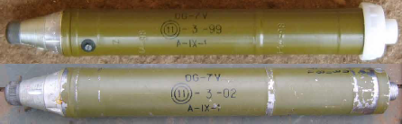

ОГ-7 болгарського виробництва. Зображення © Ролі Еванс (Roly Evans)

| СУБКАТЕГОРІЯ ОЗБРОЄННЯ          | Осколково-фугасний постріл безвідкатного гранатомета |
| ------------------------------- | ---------------------------------------------------- |
| СПОРЯДЖЕННЯ БОЙОВОЇ ЧАСТИНИ (г) | 210 г, A-IX-1                                        |
| СТАРТОВА МАСА (г)               | 1 760 г                                              |
| РОЗМІРИ (мм)                    | 593 x 40                                             |
| КРАЇНА ПОХОДЖЕННЯ               | Росія/Болгарія                                       |
| ПІДРИВНИК                       | O-4M                                                 |

ОГ-7В — це осколкова реактивна граната, яка запускається з гранатометів РПГ-7 калібру 40 мм.

«O» в назві означає «осколкова» та вказує на розлітання уламків після вибуху боєзаряду. Єдиним видом застосування є стандартне виштовхування заряду, який використовується в складі пострілу РПГ. Секція маршового двигуна, на відміну від інших протитанкових боєприпасів для РПГ, відсутня, тому початкова швидкість на зрізі дула є лише такою, яку забезпечує метальний заряд; отже, вона менша, ніж в інших пострілів РПГ. Ефективна дальність також менша (280 м), хоча іноді заявляється про дальність 1 000 м.

Підривник О4-М/ГО-2 використовує спрощений варіант стандартної радянської реакційної конструкції гільзи. Важливо зауважити про відсутність у підривнику запобіжного пристрою, як-от закриву. Капсуль-детонатор розташований у вогневому ланцюгу з ударником, запобіжники для дула не передбачені.

Перед пострілом із підривника знімається чорна металева кришка. Відсутність такої кришки та будь-які ударні пошкодження разом із вигорілим метальним зарядом є вірогідними індикаторами того, що виріб зведений. Вироби, знайдені з білою чи чорною пластиковою транспортною кришкою на вогневому каналі, що йде від метального заряду, імовірно, можна класифікувати як залишений вибуховий боєприпас (ЗВП). Пуста секція метального заряду не обов’язково вказує на те, що виріб зведений, оскільки покинуті гранати ОГ-7, які, попри це були підготовлені до стрільби, будуть надалі зазнавати швидкої руйнації картонного корпусу й метального заряду під дією атмосферних чинників.

## ПГ-7М

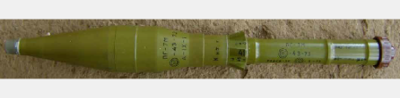

ПГ-7ВМ болгарського виробництва. Зображення © Ролі Еванс (Roly Evans)

| СУБКАТЕГОРІЯ ОЗБРОЄННЯ          | Протитанковий кумулятивний постріл безвідкатного гранатомета |
| ------------------------------- | ------------------------------------------------------------ |
| СПОРЯДЖЕННЯ БОЙОВОЇ ЧАСТИНИ (г) | 320 г A-IX-1 / 420 г метального заряду                       |
| СТАРТОВА МАСА (г)               | 1 500 г                                                      |
| РОЗМІРИ (мм)                    | 675 x 71                                                     |
| КРАЇНА ПОХОДЖЕННЯ               | Росія/Болгарія                                               |
| ПІДРИВНИК                       | ВП-7М                                                        |

ПГ-7ВМ — це протитанкова кумулятивна реактивна граната, яка запускається з гранатометів РПГ-7 калібру 40 мм. ПГ-7ВM функціонує в спосіб, подібний до того, у який функціонують інші постріли типу ПГ-7. Виліт пострілу з пускової установки здійснюється за допомогою метального заряду, який нагвинчується на тильну сторону маршового реактивного двигуна. Маршовий двигун гарантує безпечну відстань попереду стрільця; він же розвиває відповідну тягу, щоб доставити бойову частину на відстань максимальної дальності. Постріл оснащується вертикальними стабілізаторами, які розташовані в оточенні метального заряду, захищеного трубою з картону, просякнутого воском. Бойова частина оснащується головним ініціювальним та донним детонаційним підривником ударної дії (PIBD), який також має у своєму складі піротехнічний механізм самознищення, що надає можливість бойовій частині спрацьовувати на відстані максимальної дальності (приблизно 950 м).

ПГ-7ВМ відрізняється від ПГ-7В не тільки формою, але й пластиковим бронювальним покриттям, яке використовується в балістичному наконечнику гранати з метою мінімізації засліплення через коротке замикання у випадку дотичного контакту з об’єктом, перш ніж п’єзогенератор уразить ціль.

Постріл ПГ-7ВМ усе ще перебуває у виробництві. Його можна легко переплутати з пострілом ПГ-7ВС, який має схожий зовнішній вигляд, але в нього бойова частина має діаметр 72 мм та інше маркування: ПГ-7ВС. Примітно, що в ПГ-7ВС використовується ОКФОЛ, а не A-IX-1. Деякі джерела припускають, що новіші версії використовують постріл ВП-22.

До індикаторів імовірно зведеного підривника належать згорілі ущільнення, що вкривають трубки маршового двигуна, а також щербини на ударному капсулі в зоні торця двигуна. Використані постріли ПГ-7М, що не спрацювали біля цілі, слід знищувати на місці. Також потрібно подбати про зниження чинника небезпеки, який несе кумулятивний заряд бойової частини.

## ПГ-7В

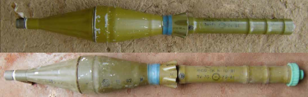

ПГ-7В болгарського виробництва. Зображення © Ролі Еванс (Roly Evans)

| СУБКАТЕГОРІЯ ОЗБРОЄННЯ          | Протитанковий кумулятивний постріл безвідкатного гранатомета |
| ------------------------------- | ------------------------------------------------------------ |
| СПОРЯДЖЕННЯ БОЙОВОЇ ЧАСТИНИ (г) | 390 г A-IX-1 / 420 г метального заряду                       |
| СТАРТОВА МАСА (г)               | 1 750 г                                                      |
| РОЗМІРИ (мм)                    | 646 x 85                                                     |
| КРАЇНА ПОХОДЖЕННЯ               | Росія/Болгарія                                               |
| ПІДРИВНИК                       | ВП-7М                                                        |

ПГ-7В — це протитанкова кумулятивна реактивна граната, яка запускається з гранатометів РПГ-7 калібру 40 мм. Імовірно, це найпоширеніший варіант пострілу ПГ-7. Виліт пострілу з пускової установки здійснюється за допомогою метального заряду, який нагвинчується на тильну сторону маршового реактивного двигуна. Маршовий двигун гарантує безпечну відстань попереду стрільця; він же розвиває відповідну тягу, щоб доставити бойову частину на відстань максимальної дальності. Постріл оснащується вертикальними стабілізаторами, які розташовані в оточенні метального заряду, захищеного трубою з картону, просякнутого воском. Постріл оснащується головним ініціювальним та донним детонаційним підривником ударної дії (PIBD) ВП-7. Кумулятивний заряд має мідне бронювання. Також передбачається піротехнічна затримка детонатора самознищення, який ініціюється реакційним запальним пристроєм у складі ВП-7. Цей засіб має спрацювати через 4,8-5 секунди (на відстані польоту приблизно 950 м). Разом із цим слід зауважити про часті відмови.

Канал виходу полум’я з капсуля-детонатора до метального заряду також має бути порожнім, хоча часом це не можна розгледіти, якщо все ще закріплена алюмінієва рама метального заряду. Випущені постріли з гранатами, що не розірвалися, зазвичай знаходять із прикріпленим витраченим метальним зарядом. Ці постріли здебільшого мають на зовнішніх поверхнях корпусу бойової частини пошкодження внаслідок удару. Такі пошкодження можуть спричинити коротке замикання між п’єзогенератором і підривником ВП-7 у донній частині кумулятивного заряду. До індикаторів імовірно зведеного підривника належать згорілі ущільнення, що вкривають трубки маршового двигуна, а також щербини на ударному капсулі в зоні торця двигуна. Використані постріли ПГ-7В, що не спрацювали біля цілі, слід знищувати на місці. Також потрібно подбати про зниження чинника небезпеки, який несе кумулятивний заряд бойової частини.

## ПГ-7ВЛ

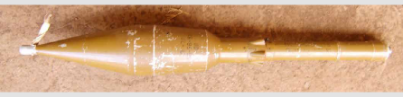

ПГ-7ВЛ російського виробництва. Зображення © Ролі Еванс (Roly Evans)

| СУБКАТЕГОРІЯ ОЗБРОЄННЯ          | Протитанковий кумулятивний постріл безвідкатного гранатомета |
| ------------------------------- | ------------------------------------------------------------ |
| СПОРЯДЖЕННЯ БОЙОВОЇ ЧАСТИНИ (г) | 1 030 г вибухової речовини ОКФОЛ / 420 г метального заряду   |
| СТАРТОВА МАСА (г)               | 2 600 г                                                      |
| РОЗМІРИ (мм)                    | 93 x 40                                                      |
| КРАЇНА ПОХОДЖЕННЯ               | Росія/Болгарія                                               |
| ПІДРИВНИК                       | ВП-22                                                        |

ПГ-7ВЛ — це протитанкова кумулятивна реактивна граната, яка запускається з гранатометів РПГ-7 калібру 40 мм. Це вдосконалена протитанкова кумулятивна реактивна граната, яка перебуває на озброєнні з кінця 1970-х років і досі. Система підривника така сама, як і в інших пострілах ПГ-7, однак кумулятивний заряд пострілу помітно більший (діаметр 93 мм). Кумулятивний заряд великої ваги на основі октогену (HMX) — 1 кг вибухової речовини окфол — надає відмінну здатність до пробивання броні в порівнянні з іншими варіантами конструкції ПГ-7В. «Л» у назві означає російське слово «луч» (промінь). Це кодова назва проєкту розробки цього вдосконаленого пострілу. Через те, що цей постріл на 1 кг важчий, ніж більшість інших пострілів ПГ-7, секція двигуна забезпечує меншу швидкість на виході з дула, отже, ефективна дальність становить усього 300 м. Виліт пострілу з пускової установки здійснюється за допомогою метального заряду, який нагвинчується на тильну сторону маршового реактивного двигуна. Маршовий двигун гарантує безпечну відстань попереду стрільця; він же розвиває відповідну тягу, щоб доставити бойову частину на відстань максимальної дальності. Постріл оснащується вертикальними стабілізаторами, які розташовані в оточенні метального заряду, захищеного трубою з картону, просякнутого воском. Постріл оснащується головним ініціювальним та донним детонаційним підривником ударної дії (PIBD) ВП-7.

Індикаторами використаного й потенційно зведеного пристрою є ті ж самі ознаки, що й в інших моделей ПГ-7. Найімовірніше, що балістичний наконечник буде пошкоджений. Метальний заряд вигорить, і залишиться лише алюмінієва рама. На капсулі-детонаторі будуть щербини. Герметизація на трубках буде відсутня, а також будуть наявні ознаки горіння. Як і на ПГ-7ВМ, на ПГ-7ВЛ передбачена лінія в носовій частині, призначена для зменшення потенційної небезпеки через коротке замикання в разі дотичного контакту пострілу з об’єктом. Система підривника ВП-22 дуже подібна до інших моделей пострілу стандарту ПГ-7: вона має у своєму складі підривник типу ВП-7 зі зведенням реакційного типу, а також використовується піротехнічний механізм самознищення. П’єзогенератор у носовій частині забезпечує ударну ініціацію на достатній відстані, якщо виріб не ушкоджений.

Використані постріли ПГ-7ВЛ, що не спрацювали біля цілі, слід знищувати на місці. Також потрібно подбати про зниження чинника небезпеки, який несе кумулятивний заряд бойової частини.

## ПГ-7Р

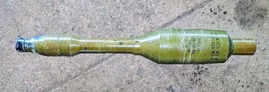

Зображення © Шон Мурхаус (Sean Moorhouse)

| СУБКАТЕГОРІЯ ОЗБРОЄННЯ          | Протитанковий кумулятивний постріл безвідкатного гранатомета |
| ------------------------------- | ------------------------------------------------------------ |
| СПОРЯДЖЕННЯ БОЙОВОЇ ЧАСТИНИ (г) | 1 590 г вибухової речовини ОКФОЛ / 420 г метального заряду   |
| СТАРТОВА МАСА (г)               | 3 630 г                                                      |
| РОЗМІРИ (мм)                    | 1 230 x 105 (з метальним зарядом)                            |
| КРАЇНА ПОХОДЖЕННЯ               | Росія                                                        |
| ПІДРИВНИК                       | Донний підривник В-728 / підривник засобу прориву K-728      |

ПГ-7Р — це протитанкова кумулятивна реактивна граната, яка запускається з гранатометів РПГ-7 калібру 40 мм. Буква «Р» у назві ПГ-7Р означає «резюме».

Бойова частина тандемний кумулятивний заряд, призначений для ураження динамічного захисту. ПГ-7Р — це здебільшого та сама бойова частина, що застосовується з моделями ПГ-27 та ПГ-29, але адаптована до пускової установки РПГ-7 калібру 40 мм. Виліт пострілу з пускової установки здійснюється за допомогою метального заряду, який нагвинчується на тильну сторону маршового реактивного двигуна. Маршовий двигун гарантує безпечну відстань попереду стрільця; він же розвиває відповідну тягу, щоб доставити бойову частину на відстань максимальної дальності. Постріл оснащується вертикальними стабілізаторами, які розташовані в оточенні метального заряду, захищеного трубою з картону, просякнутого воском. Провідний (передній) заряд оснащується підривником К-728, а основний (задній) заряд — підривником В-728. Обидва підривники реакційного зведення під час пострілу.

Є дуже схожа версія ПГ-7ВР, довжина якої на 30 мм більше; вона має той самий діаметр бойової частини (105 мм), хоча оснащена зарядом більшої маси: 1 740 г вибухового заряду ОКФОЛ.

Використані постріли ПГ-7Р, що не спрацювали біля цілі, слід знищувати на місці. Також потрібно подбати про зниження чинника небезпеки, яку несуть кумулятивні заряди бойових частин. Провідний заряд може зруйнуватися під час удару об тверду поверхню цілі, і може знадобитися його окрема утилізація.

## ТГ-73

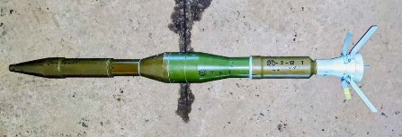

Зображення © Шон Мурхаус (Sean Moorhousе)

| СУБКАТЕГОРІЯ ОЗБРОЄННЯ          | Протитанковий кумулятивний постріл безвідкатного гранатомета |
| ------------------------------- | ------------------------------------------------------------ |
| СПОРЯДЖЕННЯ БОЙОВОЇ ЧАСТИНИ (г) | A-IX-1                                                       |
| СТАРТОВА МАСА (г)               | Невідомо                                                     |
| РОЗМІРИ (мм)                    | 73 мм                                                        |
| КРАЇНА ПОХОДЖЕННЯ               | Болгарія                                                     |
| ПІДРИВНИК                       | Невідомо                                                     |

ТГ-73 — це постріл, який запускається з пускової установки DRTG-73 одноразового використання. Відповідні компоненти виробляють підприємства VMZ Sopot та Arsenal у Болгарії.

Відомості про постріл обмежені. Відомо, що він оснащений вертикальними стабілізаторами. Бойова частина виконана за тандемною схемою. Провідний заряд містить A-IX-1. Невідомо, яку вибухову речовину — на основі гексогену (RDX) чи октогену (HMX) — містить основний заряд.

Як і в більшості підривників із боєприпасами болгарського виробництва, заводське трафаретне маркування чітко нанесено чорною фарбою як на реактивному пострілі, так і на пусковій установці.

На пострілах, виявлених в Україні, присутнє маркування виробника за 2012 та 2014 роки.

## ТБГ-7Л

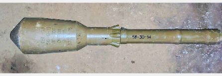

Зображення © Шон Мурхаус (Sean Moorhouse)

| СУБКАТЕГОРІЯ ОЗБРОЄННЯ          | Термобаричний постріл безвідкатного гранатомета |
| ------------------------------- | ----------------------------------------------- |
| СПОРЯДЖЕННЯ БОЙОВОЇ ЧАСТИНИ (г) | Невідомо                                        |
| СТАРТОВА МАСА (г)               | Невідомо                                        |
| РОЗМІРИ (мм)                    | 93 (діаметр)                                    |
| КРАЇНА ПОХОДЖЕННЯ               | Росія                                           |
| ПІДРИВНИК                       | Невідомо                                        |

ТБГ-7Л — це термобарична реактивна граната, яка запускається з гранатометів РПГ-7 калібру 40 мм. Вона призначена для ураження особового складу в закритих приміщеннях.

## ПГ-15

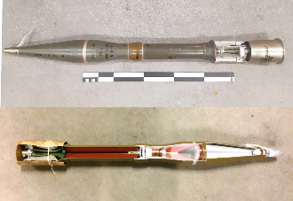

Зображення зверху ©Kdo Kamir. Зображення знизу © Данський центр розвідки й утилізації вибухових боєприпасів (Danish EOD and Search Center)

| СУБКАТЕГОРІЯ ОЗБРОЄННЯ          | Протитанковий кумулятивний постріл безвідкатного гранатомета |
| ------------------------------- | ------------------------------------------------------------ |
| СПОРЯДЖЕННЯ БОЙОВОЇ ЧАСТИНИ (г) | 320 г A-IX-1                                                 |
| СТАРТОВА МАСА (г)               | 3 470 г                                                      |
| РОЗМІРИ (мм)                    | 878 x 82                                                     |
| КРАЇНА ПОХОДЖЕННЯ               | Росія/Болгарія                                               |
| ПІДРИВНИК                       | ВП-15                                                        |

ПГ-15 вистрілюється із 73-мм гладкодульної гармати 2А28 «Гром», яка встановлюється на броньованих машинах БМП-1 та БМД-1. ПГ-15 має конструкцію подібну до ПГ-9, але оснащується відсіком метального заряду іншого типу. Найпростіший спосіб відрізнити ці два боєприпаси — за розміром відсіку метального заряду. Постріл ПГ-15 у металевій гільзі менший за розміром.

У будь-якому разі, маркування на бойовій частині часто буде «ПГ-9».

За функціями ПГ-15 переважно дуже подібний до ПГ-7В. Підривник ВП-9 майже ідентичний підривнику ВП-7. У версії з позначенням «Н» спостерігається тенденція щодо використання вибухової речовини ОКФОЛ замість A-IX-1.

Використані постріли ПГ-15, що не спрацювали біля цілі, слід знищувати на місці. Також потрібно подбати про зниження чинника небезпеки, яку несуть кумулятивні заряди бойових частин. Постріли ПГ-15, які перебували на складах чи в боєзапасі броньованих машин під час вибухів або пожеж, можуть перейти до зведеного стану під час розлітання, через що вони підлягають знищенню на місці.

## ОГ-15

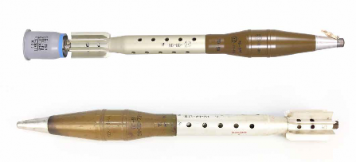

Зображення зверху © VMZ Sopot. Зображення знизу © Нідерландський центр утилізації вибухових боєприпасів (Dutch EOD Center)

| СУБКАТЕГОРІЯ ОЗБРОЄННЯ          | Осколково-фугасний постріл безвідкатного гранатомета |
| ------------------------------- | ---------------------------------------------------- |
| СПОРЯДЖЕННЯ БОЙОВОЇ ЧАСТИНИ (г) | 660 г TD-50                                          |
| СТАРТОВА МАСА (г)               | 4 600                                                |
| РОЗМІРИ (мм)                    | 828 x 82                                             |
| КРАЇНА ПОХОДЖЕННЯ               | Росія/Болгарія                                       |
| ПІДРИВНИК                       | ГО-2 або О-4М                                        |

ОГ-15 вистрілюється із 73-мм гладкодульної гармати 2А28 «Гром», яка встановлюється на броньованих машинах БМП-1 та БМД-1. ОГ-15 має конструкцію, подібну до ОГ-9, але оснащується модифікованим відсіком метального заряду. Найпростіший спосіб відрізнити ці два боєприпаси — за розміром відсіку метального заряду. Патрон ОГ-15 у металевій гільзі менший за розміром. Використовується менш якісна вибухова речовина, ніж у кумулятивному боєприпасі із цього ж сімейства. У старіших версіях може застосовуватися тротил, а в новіших — TГ-50, який є сумішшю 50/50 тротилу й гексогену (RDX). Ці постріли оснащуються підривником ГО-2 або 0-4М. У підривниках обох типів використовується детонаційний ланцюг, тобто вони не можуть розглядатися як такі, що мають запобіжник у детонаційному ланцюзі.

Використані постріли ОГ-15, що не спрацювали біля цілі, слід знищувати на місці. Постріли ОГ-15, які перебували на складах чи в боєзапасі броньованих машин під час вибухів або пожеж, можуть перейти до зведеного стану під час розлітання, через що вони підлягають знищенню на місці.

## ПГ-18

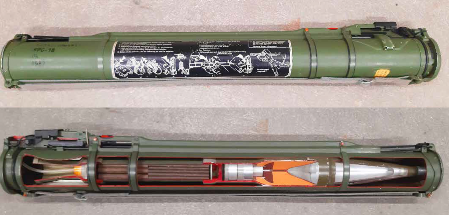

Зображення © Kdo Kamir

| СУБКАТЕГОРІЯ ОЗБРОЄННЯ          | Протитанковий кумулятивний постріл безвідкатного гранатомета |
| ------------------------------- | ------------------------------------------------------------ |
| СПОРЯДЖЕННЯ БОЙОВОЇ ЧАСТИНИ (г) | 400 г вибухової речовини ОКФОЛ                               |
| СТАРТОВА МАСА (г)               | 2 600 г (пускова установка)1 400 г (постріл)                 |
| РОЗМІРИ (мм)                    | 705 x 64                                                     |
| КРАЇНА ПОХОДЖЕННЯ               | Росія / Болгарія / Східна Німеччина                          |
| ПІДРИВНИК                       | ВП-18                                                        |

Гранатомет РПГ-18 — це пристрій одноразового використання. За своєю конструкцією він подібний до американського виробу M72 LAW калібром 66 мм. Сучасний варіант пострілу ПГ-18, коли не перебуває в пусковій трубі, схожий на ПГ-9/ПГ-15, але більш як на 100 мм коротший та має менший калібр бойової частини (64 мм). Він був розроблений на початку 1970-х років. Пускова установка одноразового використання відрізняється від версій РПГ, що випускалися раніше, оскільки ті були призначені для багаторазового використання. Ця зброя розроблена для застосування на коротких відстанях (до 200 м). Підривник ВП-18 працює здебільшого в той самий спосіб, як і розроблені раніше версії підривників ВП — вони оснащені п’єзоелектричними донним детонаційним підривником ударної дії (PIBD), до складу якого також входить механізм самознищення. Бойова частина з кумулятивним зарядом ОКФОЛ вагою 400 г на основі октогену (HMX) має відносно невеликі розміри в порівнянні з використовуваними в сучасних гранатометах одноразового застосування. Характеристики ПГ-18 були перевершені в пізніших моделях ПГ-22 й ПГ-26 розробки 1980-х років. Старі східнонімецькі версії ПГ-18 постачалися до України. Вони отримали назву «Муха». Хоча ПГ-18, який розташовано в нерозсувній пусковій установці, може вважатися незведеним, рекомендується проявляти обережність, оскільки такі вироби можуть бути мінами-пастками. Використані постріли ПГ-18, що не спрацювали біля цілі, слід знищувати на місці. Також потрібно подбати про зниження чинника небезпеки, яку несе кумулятивний заряд бойової частини.

## ПГ-22

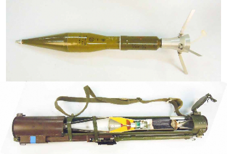

Зображення © Нідерландський центр утилізації вибухових боєприпасів (Dutch EOD Center)

| СУБКАТЕГОРІЯ ОЗБРОЄННЯ          | Протитанковий кумулятивний постріл безвідкатного гранатомета |
| ------------------------------- | ------------------------------------------------------------ |
| СПОРЯДЖЕННЯ БОЙОВОЇ ЧАСТИНИ (г) | 450 г вибухової речовини ОКФОЛ                               |
| СТАРТОВА МАСА (г)               | 2 700 г (пускова установка)1 480 г (постріл)                 |
| РОЗМІРИ (мм)                    | 755 x 72,5                                                   |
| КРАЇНА ПОХОДЖЕННЯ               | Росія/Болгарія                                               |
| ПІДРИВНИК                       | ВП-22                                                        |

ПГ-22 — це друге покоління протитанкових гранат для гранатометів одноразового використання. Містить трохи більший обсяг кумулятивного заряду на основі октогену (HMX) (450 г вибухової речовини ОКФОЛ) у порівнянні з попередньою моделлю ПГ-18. Боєприпас виготовлявся до початку 1990-х років у Росії й досі виробляється в Болгарії.

ПГ-22 має укорочену секцію двигуна, якщо порівняти з попередньою моделлю, у зв’язку із чим коротшою є дальність стрільби (150 м). Підривник ВП-22 — донний детонаційний підривник ударної дії (PIBD) з механізмом самознищення. Явно виражена опуклість на секції двигуна — це одна з відмітних ознак бойової частини ПГ-26; інша — незначні відмінності форми самої бойової частини. Маркування залишається розбірливим для ідентифікації навіть на використаних пострілах. Якщо знайдений боєприпас розташовано в пусковій установці, ПГ-22 можна відрізнити за розсувною пусковою трубою, якої немає в ПГ-26.

## ПГ-26

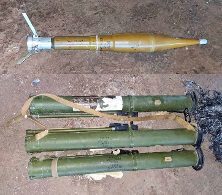

Зображення © Шон Мурхаус (Sean Moorhouse)

| СУБКАТЕГОРІЯ ОЗБРОЄННЯ          | Протитанковий кумулятивний постріл безвідкатного гранатомета |
| ------------------------------- | ------------------------------------------------------------ |
| СПОРЯДЖЕННЯ БОЙОВОЇ ЧАСТИНИ (г) | 570 г вибухової речовини ОКФОЛ                               |
| СТАРТОВА МАСА (г)               | 2 900 г (пускова установка) 1 480 г (постріл)                |
| РОЗМІРИ (мм)                    | 770 x 72,5                                                   |
| КРАЇНА ПОХОДЖЕННЯ               | Росія/Болгарія                                               |
| ПІДРИВНИК                       | ВП-26                                                        |

ПГ-26 — це друге покоління протитанкових гранат для гранатометів одноразового використання. Цей виріб оснащений жорсткою нетелескопічною пусковою трубою й містить більшу масу кумулятивного заряду (570 г вибухової речовини ОКФОЛ) у порівнянні з попередньою моделлю ПГ-22. Максимальна ефективна дальність стрільби становить 250 м. Постріл іноді називають

«Аглень». Варіант РШГ-2 з термобаричною бойовою частиною зараз перебуває в обігу. Гранатомет РШГ-2 має конфігурацію з бойовою частиною циліндричної форми.

## ПГ-27

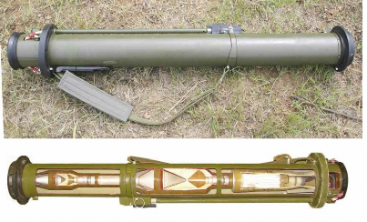

Зображення © З приватних джерел

| СУБКАТЕГОРІЯ ОЗБРОЄННЯ          | Протитанковий кумулятивний постріл безвідкатного гранатомета |
| ------------------------------- | ------------------------------------------------------------ |
| СПОРЯДЖЕННЯ БОЙОВОЇ ЧАСТИНИ (г) | 1 790 г, октоген (HMX)                                       |
| СТАРТОВА МАСА (г)               | 8 300                                                        |
| РОЗМІРИ (мм)                    | 1 135 x 105                                                  |
| КРАЇНА ПОХОДЖЕННЯ               | Росія                                                        |
| ПІДРИВНИК                       | Донний підривник В-728 / підривник засобу прориву K-728      |

ПГ-27 — це друге покоління протитанкових гранат для гранатометів одноразового використання; іноді вони іменуються як «Таволга». Ефективна дальність стрільби — 200 м. Бойова частина містить тандемний кумулятивний заряд, призначений для ураження динамічного захисту. ПГ-27 оснащений бойовою частиною значно більшого розміру в порівнянні з попередником ПГ-26. (1 790 г вибухової речовини ОКФОЛ у порівнянні з 570 г).

Був розроблений варіант РШГ-1 із термобаричною бойовою частиною. РШГ-1 (реактивна штурмова граната) оснащується однією термобаричною бойовою частиною у формі цибулини. Інший варіант — реактивна багатоцільова граната (РМГ) — оснащується тандемною бойовою частиною, до складу якої входять провідний заряд (HEAT, протитанковий кумулятивний) й основний заряд (термобаричний).

Використані постріли ПГ-27, що не спрацювали біля цілі, слід знищувати на місці. Також потрібно подбати про зниження чинника небезпеки, яку несе кумулятивний заряд бойової частини. Для варіантів із тандемною бойовою частиною провідний заряд може потребувати окремої утилізації.

## ПГ-29

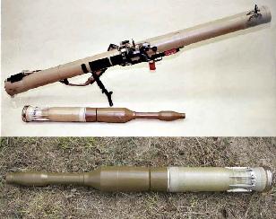

Зображення зверху © Державна власність Уряду США. Зображення знизу © З приватних джерел

| СУБКАТЕГОРІЯ ОЗБРОЄННЯ          | Протитанковий кумулятивний постріл безвідкатного гранатомета |
| ------------------------------- | ------------------------------------------------------------ |
| СПОРЯДЖЕННЯ БОЙОВОЇ ЧАСТИНИ (г) | 2 330 г, октоген (HMX)                                       |
| СТАРТОВА МАСА (г)               | 6 700 г                                                      |
| РОЗМІРИ (мм)                    | 1 097 x 105                                                  |
| КРАЇНА ПОХОДЖЕННЯ               | Росія                                                        |
| ПІДРИВНИК                       | Донний підривник В-728 / підривник засобу прориву K-728      |

ПГ-29 — це перезаряджуваний безвідкатний протитанковий реактивний комплекс з ефективною дальністю стрільби 500 м. Бойова частина містить тандемний кумулятивний заряд, призначений для ураження динамічного захисту. Донний підривник В-728 призначений для ініціювання основного заряду, окремий підривник К-728 застосовується для провідного заряду. Обидва підривники реакційного зведення. ПГ-29В можна ідентифікувати за індексом ГРАУ 7П29. Іноді боєприпас ПГ-29 має назву «Вампір». Постріл ПГ-29, коли він не розташований усередині пускової установки, можна легко сплутати з ПГ-7ВР, оскільки вони дійсно мають однакову конструкцію бойової частини. Однак секція двигуна відрізняється й дозволяє легко виявити відмінності. Пускова труба виконана з армованого склопластику. Використані постріли ПГ-7Р, що не спрацювали біля цілі, слід знищувати на місці. Також потрібно подбати про зниження чинника небезпеки, яку несуть кумулятивні заряди бойових частин. Провідний заряд може зруйнуватися під час удару об тверду поверхню цілі, і може знадобитися його окрема утилізація.

## РПГ-76 «КОМАР»

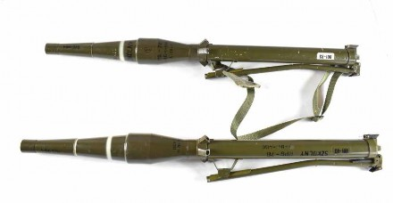

Зображення © Defence Express

| СУБКАТЕГОРІЯ ОЗБРОЄННЯ          | Протитанковий кумулятивний постріл безвідкатного гранатомета |
| ------------------------------- | ------------------------------------------------------------ |
| СПОРЯДЖЕННЯ БОЙОВОЇ ЧАСТИНИ (г) | 320 г A-IX-1                                                 |
| СТАРТОВА МАСА (г)               | 2 100 г                                                      |
| РОЗМІРИ (мм)                    | 1 190 x 68 (у розсуненому стані)                             |
| КРАЇНА ПОХОДЖЕННЯ               | Польща                                                       |
| ПІДРИВНИК                       | Невідомо                                                     |

РПГ-78 — це кумулятивний протитанковий постріл малої маси для одноразового використання, перебуває на озброєнні з 1980-х років. Він несумісний із 40-мм пусковими установками РПГ. Цей вид озброєння має назву «ракетна підтримка стрілецької бригади», оскільки цей протитанковий кумулятивний постріл ефективний лише проти легко броньованих машин або тоді, коли ціллю ураження призначається бункер.

Система підривника відрізняється від тих, які використовуються з іншими варіантами ПГ-7. Це донний детонувальний підривник реакційного зведення. П’єзоелектричні елементи не передбачені. Допускається, що підривник оснащений запобіжним пристроєм повзункового типу, який вивільнюється під час горіння піротехнічної гранули. Також вважається, що після того, як повзунок просуває капсуль-запальник у детонаційний ланцюг, підривник спрацьовує під дією ударно-інерційного механізму.

Цей боєприпас має назву «Комар».

## РПО-A

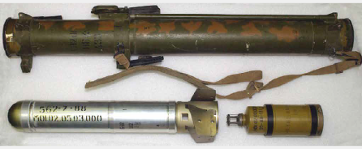

Зображення © NAVEODTECHDIV

| СУБКАТЕГОРІЯ ОЗБРОЄННЯ          | Термобаричний постріл безвідкатного гранатомета |
| ------------------------------- | ----------------------------------------------- |
| СПОРЯДЖЕННЯ БОЙОВОЇ ЧАСТИНИ (г) | 2 100 г термобаричного спорядження              |
| СТАРТОВА МАСА (г)               | 22 000 г                                        |
| РОЗМІРИ (мм)                    | 920 x 93                                        |
| КРАЇНА ПОХОДЖЕННЯ               | Росія                                           |
| ПІДРИВНИК                       | Невідомо                                        |

РПО-А («Реактивный Пехотный Огнемёт», що перекладається як «реактивний піхотний вогнемет») — це термобаричний постріл, який запускається з плеча. Він призначений для ураження особового складу в закритих приміщеннях. Оскільки назва цього озброєння розшифровується як «реактивний піхотний вогнемет», його іноді відносять до категорії вогнеметів, а не реактивних чи безвідкатних гранатометів. Як і у випадку з пострілами ПГ-7, цей реактивний снаряд оснащено двоступеневою енергетичною установкою. Метальний заряд відокремлює запальник від газового струменю маршового реактивного двигуна. У точці стрільби часто знаходять металічний корпус метального заряду. Ефективна дальність стрільби РПО-А сягає 200 м.

Пускова труба виконана з армованого склопластику. Головка містить вибивний заряд низько- енергетичної вибухової речовини. Термобаричний заряд використовує атмосферний кисень для створення високоімпульсної вибухової хвилі, яка особливо ефективна в районах міської забудови. Сам постріл нефарбований, виконаний із металу сріблястого кольору. Корпус метального заряду пофарбований зеленими та чорними смугами.

РПО-А часто має назву «Джміль», але якщо визначити точніше, то назвою «Джміль» охоплюється ширше сімейство безвідкатних засобів ураження, стрільба якими здійснюється з плеча. Українська версія РПО-А має індекс РПВ-16. Вона перебуває на озброєнні з 2016 року.

## M72 LAW

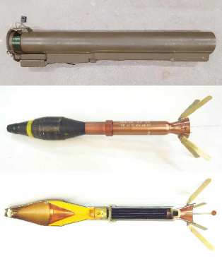

Зображення © Данський центр розвідки й утилізації вибухових боєприпасів (Danish EOD and Search Center) та Нідерландський центр утилізації вибухових боєприпасів (Dutch EOD Center)

| СУБКАТЕГОРІЯ ОЗБРОЄННЯ          | Протитанковий кумулятивний постріл безвідкатного гранатомета |
| ------------------------------- | ------------------------------------------------------------ |
| СПОРЯДЖЕННЯ БОЙОВОЇ ЧАСТИНИ (г) | 315 г, вибухова речовина ОКТОЛ                               |
| СТАРТОВА МАСА (г)               | 3 450 г                                                      |
| РОЗМІРИ (мм)                    | 981 x 66 (у розсуненому стані)                               |
| КРАЇНА ПОХОДЖЕННЯ               | США                                                          |
| ПІДРИВНИК                       | M412A1                                                       |

M72 LAW постачається в кількох версіях. Вважається, що в Україну постачалися лише останні версії, оснащені реактивними двигунами більшого розміру та вісьмома вертикальними стабілізаторами. Спорядження бойової частини — вибухова суміш ОКТОЛ (70 % октогену (HMX) / 30 % тротилу (TNT)), а секції двигуна використовують двокомпонентне ракетне паливо. Ротор призначений як запобіжник детонаційного ланцюга, який спрацьовує через 20 м після виходу з дула. Донний детонаційний підривник M412A1 ударно-інерційної дії без сповільнення. Реакційне зведення. Пускову трубу M72 можна сплутати з РПГ-18 або РПГ-22. Версії M72A5 були помічені в Україні.

## RGW 90 HH

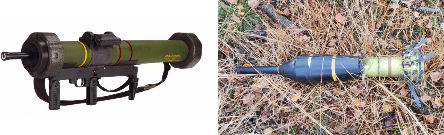

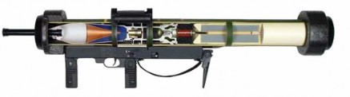

RGW 90 HH. Зображення © Dynamit Nobel Defence GmbH

| СУБКАТЕГОРІЯ ОЗБРОЄННЯ          | Протитанковий кумулятивний/ бронебійно- фугасний постріл безвідкатного гранатомета з головною частиною, що мнеться |
| ------------------------------- | ------------------------------------------------------------ |
| СПОРЯДЖЕННЯ БОЙОВОЇ ЧАСТИНИ (г) | Невідомо                                                     |
| СТАРТОВА МАСА (г)               | 8 900 г                                                      |
| РОЗМІРИ (мм)                    | 1 000 x 90                                                   |
| КРАЇНА ПОХОДЖЕННЯ               | Німеччина/Ізраїль/Сінгапур                                   |
| ПІДРИВНИК                       | Невідомо                                                     |

RGW означає «Rückstoßfreie Granatwaffe 90». У дослівному перекладі це «безвідкатний гранатомет 90 з протитанковим кумулятивним пострілом (HEAT) / бронебійно-фугасним пострілом із головною частиною, що мнеться (HESH)». RGW 90 дозволяє застосовувати обидва способи ураження бойовою частиною: HEAT і HESH. Коли застосовується режим HEAT, боєприпас використовує спеціальний віддалений зонд, що виступає в передній частині. У режимі HESH цей зонд втягується. Цей вид зброї доцільно використовувати в зонах міської забудови, оскільки системи врівноважувальних мас Дейвіса дозволяють вести вогонь із замкнених приміщень. Ця система викидає подрібнену пластмасу з тильної сторони зброї. Згадана подрібнена пластмаса може використовуватися персоналом, що здійснює розвідування, пошук і виявлення ВНП, як доказ використання цієї системи озброєння. На ринку RGW 90 також відомий як Panzerfaust-90. Версія, що виготовляється за ліцензією в Ізраїлі та Сінгапурі, іноді називається MATADOR.

## PANZERFAUST 3

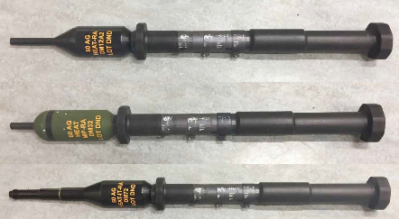

Зображення © Нідерландський центр утилізації вибухових боєприпасів (Dutch EOD Center)

| СУБКАТЕГОРІЯ ОЗБРОЄННЯ          | Протитанковий кумулятивний/ бронебійно- фугасний постріл безвідкатного гранатомета з головною частиною, що мнеться |
| ------------------------------- | ------------------------------------------------------------ |
| СПОРЯДЖЕННЯ БОЙОВОЇ ЧАСТИНИ (г) | Гексоген (RDX) чи октоген (HMX)                              |
| СТАРТОВА МАСА (г)               | Невідомо                                                     |
| РОЗМІРИ (мм)                    | Невідомо                                                     |
| КРАЇНА ПОХОДЖЕННЯ               | Німеччина                                                    |
| ПІДРИВНИК                       | Невідомо                                                     |

Panzerfaust 3 — це переносна безвідкатна реактивна система, розроблена в 1980-х роках. Базовий варіант конструкції реактивного двигуна з того часу залишився здебільшого незмінним, хоча й були реалізовані нові конструкції бойових частин. Пускова установка може застосовуватися з реактивними боєприпасами різних типів, діаметр двигунів у яких дорівнює 60 мм. Як і RGW 90 HH, системи DM-12, DM-32 та DM-72 оснащені висувними віддаленими зондами. Коли зонд не висунений, усі три варіанти функціонують у режимі HESH. Система DM-72 оснащена тандемною бойовою частиною з невеликим провідним зарядом у висувному зонді. Спеціалістам зі знешкодження ВНП слід проявляти обережність під час знищення як тандемних, так і основних бойових частин. Система DM-12 оснащується зарядом на основі гексогену (RDX), тоді як у DM-32 та DM-72 використовується десенсибілізована форма октогену (HMX). Ці реактивні боєприпаси зберігаються із забезпеченням умов для категорії небезпеки HCC 1.1E.

## AT-4

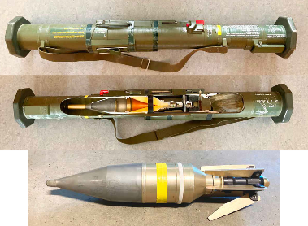

Зображення © Данський центр розвідки й утилізації вибухових боєприпасів (Danish EOD and Search Center)

| СУБКАТЕГОРІЯ ОЗБРОЄННЯ          | Протитанковий кумулятивний/ бронебійно- фугасний постріл безвідкатного гранатомета з головною частиною, що мнеться |
| ------------------------------- | ------------------------------------------------------------ |
| СПОРЯДЖЕННЯ БОЙОВОЇ ЧАСТИНИ (г) | 830 октогену (HMX) / тротилу (TNT)                           |
| СТАРТОВА МАСА (г)               | 6 800 г                                                      |
| РОЗМІРИ (мм)                    | 1 016 x 84                                                   |
| КРАЇНА ПОХОДЖЕННЯ               | Швеція                                                       |
| ПІДРИВНИК                       | Невідомо                                                     |

AT-4 — це безвідкатний протитанковий реактивний гранатомет одноразового застосування. Стабілізація реактивного пострілу в польоті здійснюється за допомогою вертикального оперення. Пускова труба виконана з армованого склопластику. Чека виймається оператором перед пуском. Вона розташована поряд із тильною стороною пускової труби. Чека діє як стопорний пристрій на підпружинений ударник, що рухається вздовж запальної трубки. Чека зазвичай маркується чіткими білими літерами. На покинутій пусковій установці можна бачити маркування від одного торця до іншого.

Залежно від засобу класифікації цей виріб може бути віднесений до безвідкатних пострілів або до реактивних снарядів. Є також версія AT4 CS (для замкнених просторів), яка дозволяє вести стрільбу з позицій у приміщеннях. Замість подрібнювача пластмасової врівноважувальної маси в цій версії використовується розбризкування солоної води в аерозольному стані.

## РЕАКТИВНИЙ СНАРЯД С-5 КО

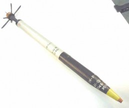

Зображення © Нідерландський центр утилізації вибухових боєприпасів (Dutch EOD Center)

| СУБКАТЕГОРІЯ ОЗБРОЄННЯ          | ПРОТИТАНКОВИЙ КУМУЛЯТИВНИЙ ПОСТРІЛ (HEAT) З ОСКОЛКОВО-ФУГАСНОЮ БОЙОВОЮ ЧАСТИНОЮ |
| ------------------------------- | ------------------------------------------------------------ |
| СПОРЯДЖЕННЯ БОЙОВОЇ ЧАСТИНИ (г) | 330 г A-IX-1                                                 |
| СТАРТОВА МАСА (г)               | 4 500 г                                                      |
| РОЗМІРИ (мм)                    | 1 004 x 57                                                   |
| КРАЇНА ПОХОДЖЕННЯ               | Росія/Болгарія                                               |
| ПІДРИВНИК                       | В-5К                                                         |

Реактивні снаряди С-5 діаметром 57 мм призначені для стрільби з різноманітних блоків некерованих авіаційних ракет, установлених на російських літаках штурмової авіації з незмінною геометрією крила та гелікоптерах. В Україні реактивні снаряди С-5 зазвичай спостерігалися на штурмовиках Су-25, гелікоптерах вогневої підтримки Мі-24/35 та Ка-52. С-5 КО — це реактивні снаряди класу «повітря-земля» подвійного призначення, оскільки мають протитанкову кумулятивну головку (HEAT) та осколкову оболонку, помітну в структурі корпусу. У складі бойової частини застосовується ударний підривник порівняно простої конструкції на основі інерційно- реакційної гільзи в підпружиненій конфігурації, який має індекс В-5К. Конструкція подібна до підривника ГК-1, який використовується в боєприпасах безвідкатної зброї. Підривник реакційного зведення. Як і у випадку з О4-М, підривник не містить повзункового механізму, тобто детонатор застосовується в детонаційному ланцюзі в точці пуску, отже, запобіжник не передбачено. Спеціалістам зі знешкодження ВНП рекомендується вживати максимальної обережності навіть для тих виробів, які були оцінені як залишені вибухові боєприпаси (ЗВП). У разі виявлення в складі блока некерованих авіаційних ракет УБ-16-57У слід дотримуватися процедур заземлення. КО означає «кумулятивно-осколковий». Бойова частина забезпечує ураження кумулятивним зарядом та розлітання уламків навколо бойової частини. Через це індексом «КО» позначається бойова частина подвійного призначення. Звертаючи увагу на низьку чутливість та обмежені функціональні можливості підривника боєприпасу В-5К, реактивні снаряди С-5, які були виявлені в складі блока некерованих авіаційних ракет, слід розглядати як такі, що перебувають у зведеному стані. У зв’язку із цим вони потребують обережного поводження.

## РЕАКТИВНИЙ СНАРЯД С-8 КО

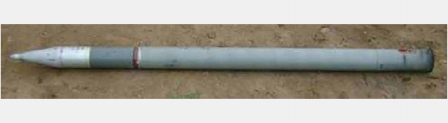

Зображення © Ролі Еванс (Roly Evans)

| СУБКАТЕГОРІЯ ОЗБРОЄННЯ          | ПРОТИТАНКОВИЙ КУМУЛЯТИВНИЙ ПОСТРІЛ (HEAT) З ОСКОЛКОВО-ФУГАСНОЮ БОЙОВОЮ ЧАСТИНОЮ |
| ------------------------------- | ------------------------------------------------------------ |
| СПОРЯДЖЕННЯ БОЙОВОЇ ЧАСТИНИ (г) | 4 120 г A-IX-10                                              |
| СТАРТОВА МАСА (г)               | 11 300 г                                                     |
| РОЗМІРИ (мм)                    | 1 570 x 80                                                   |
| КРАЇНА ПОХОДЖЕННЯ               | Росія/Болгарія                                               |
| ПІДРИВНИК                       | В-5КП1                                                       |

Реактивні снаряди С-8 діаметром 80 мм призначені для стрільби з різноманітних блоків некерованих авіаційних ракет, установлених на російських літаках штурмової авіації з незмінною геометрією крила та гелікоптерах.

С-8 КО — це реактивні снаряди класу «повітря-земля» подвійного призначення, оскільки мають протитанкову кумулятивну головку (HEAT) та осколкову оболонку, помітну в структурі корпусу. До складу бойової частини входить підривник В-5КП1, подібний до підривників типу ВП-7, які використовуються в пострілах РПГ. Слід дотримуватися заходів безпеки, рекомендованих під час поводження з п’єзоелектричними підривниками.

Запускатися реактивні снаряди С-8 КО можуть із 3 пускових установок. Блоки Б8В20 та Б8М містять по 20 ракет, а Б8С7 — тільки 7.

КО означає «кумулятивно-осколковий». Бойова частина забезпечує ураження кумулятивним зарядом та розлітання уламків навколо бойової частини. Через це індексом «КО» позначається бойова частина подвійного призначення.

Звертаючи увагу на низьку чутливість та обмежені функціональні можливості підривника боєприпасу В-5К, реактивні снаряди С-8, які були виявлені в складі блока некерованих авіаційних ракет, слід розглядати як такі, що перебувають у зведеному стані. У зв’язку із цим вони потребують обережного поводження.

## 122-ММ РАКЕТА 9М22 «ГРАД»

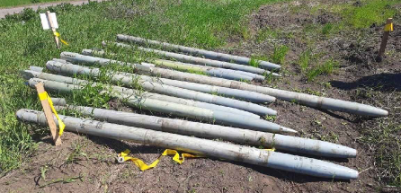

Зображення © Державна служба України з надзвичайних ситуацій

| СУБКАТЕГОРІЯ ОЗБРОЄННЯ          | ОСКОЛКОВО-ФУГАСНА БОЙОВА ЧАСТИНА      |
| ------------------------------- | ------------------------------------- |
| СПОРЯДЖЕННЯ БОЙОВОЇ ЧАСТИНИ (г) | 6 400 г A-IX-2                        |
| СТАРТОВА МАСА (г)               | 66 000 г                              |
| РОЗМІРИ (мм)                    | 2 729 x 122                           |
| КРАЇНА ПОХОДЖЕННЯ               | Росія/Болгарія/Польща/Румунія/ Сербія |
| ПІДРИВНИК                       | В-5КП1                                |

Ракети серії 9М22 — це, імовірно, одні з найпоширеніших артилерійських ракет в історії. Назва

«Град» належить пусковій установці 122-мм ракет, але вона перейшла й на самі ракети.

Бойова частина ініціюється звичайним ударним підривником МРВ. Конструкція підривника піддалася широкомасштабному копіюванню в кількох країнах. Цей підривник має стандартне інерційно-реакційне компонування з повзунковим механізмом, який діє як запобіжний пристрій.

Ракета 9М22У — це вдосконалена версія.

Типова пускова установка БМ-21 містить 40 ракет (4 ряди по 10 ракет). Однак не кожний залп виконується з усіх 40 пускових труб. Пускова установка може вести вогонь прямою наводкою по цілях на відстані від 5 до 20 км. Стрільба поодинокими ракетами ведеться не часто. Надійність підривника МРВ невисока, отже, часто доводиться стикатися з ракетами, що не розірвалися.

## 220-ММ РАКЕТИ 9М27 «УРАГАН»

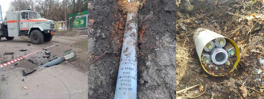

Зображення © Державна служба України з надзвичайних ситуацій

| СУБКАТЕГОРІЯ ОЗБРОЄННЯ          | Залежить від типу бойової частини                            |
| ------------------------------- | ------------------------------------------------------------ |
| СПОРЯДЖЕННЯ БОЙОВОЇ ЧАСТИНИ (г) | Залежить від типу бойової частини (моноблочний фугасний заряд, 51,9 кг) |
| СТАРТОВА МАСА (г)               | 2 800 г (9М27Ф)                                              |
| РОЗМІРИ (мм)                    | 4 833 x 220                                                  |
| КРАЇНА ПОХОДЖЕННЯ               | Росія                                                        |
| ПІДРИВНИК                       | Залежить від типу бойової частини                            |

Ракети серії 9М27 запускаються РСЗВ 9K57 «Ураган». Система також має позначення БМ-27. Ракети серії 9М27 використовуються за різними призначеннями. У засобах масової інформації ці ракети також іноді згадуються як «Ураган».

Якщо ракета 9М27 використовується як носій, вона може доставляти касетні боєприпаси. Ракета 9М27К1 із бойовою частиною 9Н128К може нести до 30 касет 9Н210 із вибуховою речовиною. Ця ракета також може використовуватися для дистанційного мінування та розкидання зведених за допомогою датчиків бойових елементів касетних боєприпасів. Ракета 9М27К2 доставляє 24 протитранспортні міни ПТМ-1, ракета 9М27К3 — 312 протипіхотних мін, а ракета 9М59 — 9 протитранспортних мін ПТМ-3. Осколково-фугасні бойові частини мають масу нетто вибухової речовини 51,7 кг (9М27Ф). Це великий фугасний заряд для артилерійського боєприпасу будь-якого типу. Система підривника серії 9М27 часто є копією механізму, який використовується в 122-мм ракетах «Град». Контактні підривники МРВ можуть застосовуватися для бойових частин з осколково-фугасним зарядом (наприклад, 9М27Ф). Для версії, що використовується як носій, іноді передбачаються прості механічні дистанційні трубки, як-от ТМ-120.

Якщо застосовується в бойових частинах-носіях боєприпасів (для бойових елементів, що уражають або для мін, що розкидаються), бойова частина ініціюється в певній точці траєкторії ракети, щоб здійснити розкидання боєприпасів на заданій цільовій площі. Задня секція реактивного двигуна продовжуватиме політ за балістичною траєкторією. Вона часто врізається в землю за межами місця, куди завдається удар. Служби оперативного реагування та групи з утилізації ВНП можуть не мати можливостей для точного визначення корисного навантаження, поки не знайдуть і не витягнуть із ґрунту залишки реактивного двигуна. Спеціалістам зі знешкодження ВНП слід вести активний пошук підтверджувальних доказів, щоб спробувати визначити тип бойової частини. Наприклад, це можуть бути уламки касетних боєприпасів. Конструкція хвостової секції 220-мм ракети 9М27 та 300-мм ракети 9М55 однакова з погляду конфігурації, але ключова різниця полягає в діаметрі та формі паза заднього стабілізатора.

## 300-ММ РАКЕТИ 9М55 «СМЕРЧ»

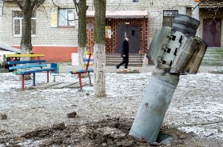

Зображення © З приватних джерел

| СУБКАТЕГОРІЯ ОЗБРОЄННЯ          | Залежить від типу бойової частини                            |
| ------------------------------- | ------------------------------------------------------------ |
| СПОРЯДЖЕННЯ БОЙОВОЇ ЧАСТИНИ (г) | Залежить від типу бойової частини (бойова частина з моноблочним фугасним зарядом, 70 кг) |
| СТАРТОВА МАСА (г)               | 800 кг                                                       |
| РОЗМІРИ (мм)                    | 7 600 у довжину x 300 в діаметрі                             |
| КРАЇНА ПОХОДЖЕННЯ               | Росія                                                        |
| ПІДРИВНИК                       | Залежить від типу бойової частини                            |

300-мм ракети серії 9М55 запускаються РСЗВ 9К58 «Смерч». Пускова платформа також іноді має позначення БМ-30. Ракети серії 9М55 використовуються за різними призначеннями. У засобах масової інформації ці ракети також іноді згадуються як «СМЕРЧ». РСЗВ «Смерч» має у своєму складі 12 ракет. Є 25 відомих моделей із різними бойовими частинами, 19 із яких вважаються носіями боєприпасів певного типу. Ракети всіх типів стабілізуються в польоті за допомогою вертикального оперення та мають у своєму складі твердопаливний реактивний двигун. Інші бойові частини є за своїм характером або осколково-фугасними, або термобаричними. Зокрема, варто відзначити бойові частини 9М55К, які доставляють 72 бойові уражувальні елементи 9Н235. 9М55К4 доставляє 25 протитранспортних мін ПТМ-3. Є три різні типорозміри реактивних двигунів. Вони забезпечують відповідні максимальні дальності стрільби (70, 90 та 120 км).

Існують різні точки зору щодо того, чи слід вважати зброю серії 9М55 некерованими або керованими ракетами, попри те, що окремий відсік наведення не передбачений у цьому боєприпасі.

Конструкція хвостової секції ракет 9М27 та 9М55 однакова з погляду на конфігурацію, але ключова різниця полягає в діаметрі та розмірі паза заднього стабілізатора. Хвостові секції ракет часто з великою силою стикаються з ґрунтом. Вони можуть легко долати дорожнє покриття чи руйнувати будівельні конструкції. Підтверджувальні докази для визначення типу та стану бойової частини слід знайти до того, як розпочинати переміщення секції двигуна, що заглибилася в землю.

## BULLSPIKE PG-22

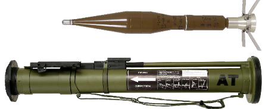

Зображення © VMZ Sopot

| СУБКАТЕГОРІЯ ОЗБРОЄННЯ          | Постріл до безвідкатного гранатомета |
| ------------------------------- | ------------------------------------ |
| СПОРЯДЖЕННЯ БОЙОВОЇ ЧАСТИНИ (г) | 450 г речовини OKFOL                 |
| СТАРТОВА МАСА (г)               | 3480 г (ПГ-22)                       |
| РОЗМІРИ (мм)                    | 774x73                               |
| КРАЇНА ПОХОДЖЕННЯ               | Болгарія                             |

«BULLSPIKE» — це модернізований варіант гранатомета одноразового застосування РПГ-22. Основною відмінністю є те, що після того як труби розкладено, а гранатомет приведено в бойове положення, його можна скласти знову. РПГ-22 такої змоги не дає. Пускову трубу

«BULLSPIKE» можна легко визначити та відрізнити від пускових труб РПГ-22. Реактивний постріл — ПГ-22 з кумулятивною протитанковою бойовою частиною та маркуваннями

«VMZ Sopot». Гранатомети поставляються в ящиках по п’ять одиниць. Кожна одиниця має герметичну прозору пластикову упаковку.

## C90-CR-AM (M3)

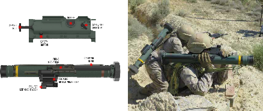

Зображення © Instalaza

| СУБКАТЕГОРІЯ ОЗБРОЄННЯ          | Постріл до безвідкатного гранатомета |
| ------------------------------- | ------------------------------------ |
| СПОРЯДЖЕННЯ БОЙОВОЇ ЧАСТИНИ (г) | Залежить від бойової частини         |
| СТАРТОВА МАСА (г)               | 5200 г                               |
| РОЗМІРИ (мм)                    | 774x90                               |
| КРАЇНА ПОХОДЖЕННЯ               | Іспанія                              |

C-90 — це легкий гранатомет одноразового застосування, що з’явився на початку 1980-х років. Виготовлялися варіанти з різними бойовими частинами. Серед цих варіантів — протитанкові (C90-CR-RB), подвійної дії кумулятивні протитанкові / протипіхотні (C90-CR-AM), димові та запалювальні (C90-CR-FIM), а також протифортифікаційні (C90-CR-BK).

C90-CR-AM (M3) — це бойова частина подвійної дії, що має не лише кумулятивний заряд для пробиття броні (або бетону), а й осколкову сорочку для ураження особового складу.

Така протитанково-осколкова бойова частина позначається подвійною жовто-чорною застережною смугою по периметру біля дульного зрізу пускової труби. З тильної сторони по периметру пускова труба має коричневу застережну смугу, що позначає метальну вибухову речовину.

## М80 «ЗОЛЯ» КАЛІБРУ 64 ММ

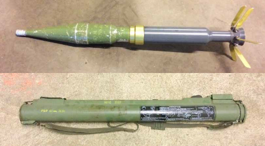

Зображення © Данський центр пошуку та утилізації вибухових боєприпасів (Danish EOD and Search Center)

| СУБКАТЕГОРІЯ ОЗБРОЄННЯ          | Постріл до безвідкатного гранатомета        |
| ------------------------------- | ------------------------------------------- |
| СПОРЯДЖЕННЯ БОЙОВОЇ ЧАСТИНИ (г) | 300 г                                       |
| СТАРТОВА МАСА (г)               | 3000 г                                      |
| РОЗМІРИ (мм)                    | 800x64 мм (1200x64 мм у бойовому положенні) |
| КРАЇНА ПОХОДЖЕННЯ               | Колишня Югославія                           |

M-80 — це легкий гранатомет одноразового застосування з кумулятивною протитанковою гранатою. Він має риси, аналогічні до РПГ-18. Підривник УТ ПЕ М80 СП також використовує п’єзоелектричний кристал, але його додатково оснащено самоліквідатором із дистанційним підривником.

## ПГ-7Л

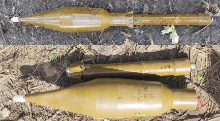

Зображення © Державна служба України з надзвичайних ситуацій

| СУБКАТЕГОРІЯ ОЗБРОЄННЯ          | Реактивний постріл до безвідкатного гранатомета |
| ------------------------------- | ----------------------------------------------- |
| СПОРЯДЖЕННЯ БОЙОВОЇ ЧАСТИНИ (г) | 890 г речовини OKFOL / 420 г метального заряду  |
| СТАРТОВА МАСА (г)               | 1590 г                                          |
| РОЗМІРИ (мм)                    | 680x93 мм                                       |
| КРАЇНА ПОХОДЖЕННЯ               | Росія                                           |

ПГ-7Л — це російський постріл до безвідкатного гранатомета, що використовується з кінця 1970-х років. Кумулятивний заряд більший і містить 890 г речовини OKFOL — флегматизованого варіанта октогену. Цей постріл має значно кращу пробивну дію, ніж його попередник ПГ-7М. Маса вибухового заряду приблизно у два рази більша, ніж у ПГ-7М, а використана вибухова речовина потужніша, що створює більший тиск детонації. Також постріл має модернізований підривник — ВП-22 замість ВП-7М. На заміну ПГ-7Л досить швидко прийшов постріл ПГ-7ВЛ (1030 г речовини OKFOL), а потім — тандемні кумулятивні бойові частини. ПГ-7Л усе ще широко застосовується в Україні. Як і у випадку інших підривників ВП, той факт, що цей підривник не має носового п’єзоелемента ВП-16ГЧ, не означає, що виріб можна пересувати. Як і ВП-7М, ВП-22 має самоліквідатор. ПГ-7Л позначається чорним трафаретним написом на двигуні та корпусі підривника. Код заводу-виробника, номер партії та рік виробництва також нанесено відповідно до російських стандартів.

## ОГ-9В

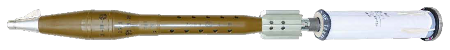

Зображення © VMZ Sopot

| СУБКАТЕГОРІЯ ОЗБРОЄННЯ          | Постріл до безвідкатної гармати                      |
| ------------------------------- | ---------------------------------------------------- |
| СПОРЯДЖЕННЯ БОЙОВОЇ ЧАСТИНИ (г) | 655–750 г речовини на основі тротилу, зазвичай ТД-50 |
| СТАРТОВА МАСА (г)               | 3700                                                 |
| РОЗМІРИ (мм)                    | 774x73                                               |
| КРАЇНА ПОХОДЖЕННЯ               | Росія / Болгарія / Угорщина                          |

ОГ-9В — це осколково-фугасний постріл до безвідкатної гармати СПГ-9 «Спис» калібру 73 мм, що використовується з початку 1970-х років. Незважаючи на вік, завдяки своїй точності на дальності до 600 м СПГ-9 усе ще використовується за певних обставин. Граната практично не відрізняється від тієї, що використовується в ОГ-15В, і є взаємозамінною за умови приєднання довшого порохового заряду. Бойова частина виготовляється з чавуну та має два центрувальні потовщення. Хвостова частина виготовляється з пресованого алюмінію та первинно стабілізує реактивний снаряд у польоті.

Постріл обладнується носовим головним підривником ГО-2 або О-4М. У підривнику ГО-2 використовується типова російська конфігурація з оболонкою, що осідає, і стопорними кульками, але запалювач завжди перебуває на одній лінії з ударником. Рушій не використовується. Якщо боєприпас не відстрілювався, ударник має перебувати в положенні, у якому він не може здійснити наколювання капсуля-запалювача, але діяти всеодно слід обережно. Якщо боєприпас було відстрілено та він не розірвався, ударник від запалювача відділяє лише контрзапобіжна пружина. Болгарський варіант ГО-2 має позначення «АФ71». Постріли ОГ-9 із підривниками, що піддавалися впливу пожежі та які було викинуто з епіцентру вибуху (наприклад, із бойової броньованої машини або тимчасового складу боєприпасів), слід вважати приведеними в бойовий стан. Діяти з ними слід обережно.

## ПГ-9В

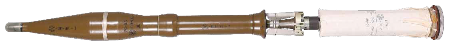

Зображення © VMZ Sopot

| СУБКАТЕГОРІЯ ОЗБРОЄННЯ          | Постріл до безвідкатної гармати |
| ------------------------------- | ------------------------------- |
| СПОРЯДЖЕННЯ БОЙОВОЇ ЧАСТИНИ (г) | 330 г речовини А-IX-1           |
| СТАРТОВА МАСА (г)               | 2530 г                          |
| РОЗМІРИ (мм)                    | 774x73                          |
| КРАЇНА ПОХОДЖЕННЯ               | Росія / Болгарія / Угорщина     |

ПГ-9В — це протитанковий кумулятивний постріл до безвідкатної гармати СПГ-9 «Спис» калібру 73 мм, що використовується з початку 1960-х років. Через появу легких гранатометів одноразового застосування та протитанкових керованих ракет, цей протитанковий засіб вважається застарілим. Граната практично не відрізняється від тієї, що використовується в ПГ-15В, і є взаємозамінною за умови приєднання довшого порохового заряду. ПГ-9В має одне центрувальне потовщення посередині бойової частини та ще одне між реактивним двигуном і стабілізаторами. Граната оснащується шістьма розкладними стабілізаторами на шарнірах, розташованими перед пороховим зарядом.

ПГ-9В оснащується головодонним підривником ВП-9, схожим на ВП-7. Варіанти пізніших років виробництва мають модернізовані підривники. Деякі варіанти можуть оснащуватися підривниками, аналогічними ВП-22. В обігу спостерігається модернізована версія ПГ-9ВН із Болгарії. На її бойову частину нанесено позначення «ПГ-9Н». Також в обігу спостерігається ПГ-9С — цей постріл має бойову частину з 330 грамами октогену. Довгий пороховий заряд також має маркування, але його буде видно лише на залишених боєприпасах, що не відстрілювалися. У залишеному стані пороховий заряд пострілу, дуже імовірно, уже піддався достатньому впливу навколишнього середовища. Порохові заряди зазвичай містяться в характерних трубках із твердої пластмаси зеленого кольору.

## РПГ-30

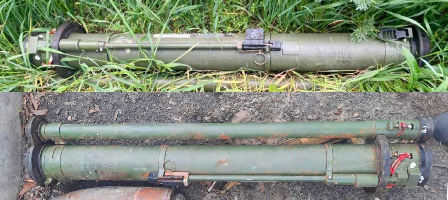

Зображення © Державна служба України з надзвичайних ситуацій

| СУБКАТЕГОРІЯ ОЗБРОЄННЯ          | Постріл до безвідкатної гармати                |
| ------------------------------- | ---------------------------------------------- |
| СПОРЯДЖЕННЯ БОЙОВОЇ ЧАСТИНИ (г) | 1830 г речовини OKFOL                          |
| СТАРТОВА МАСА (г)               | 10 300 г                                       |
| РОЗМІРИ (мм)                    | 1135x105                                       |
| КРАЇНА ПОХОДЖЕННЯ               | Росія                                          |
| ПІДРИВНИК                       | К-728 (імітатор цілі) і В-728 (основний заряд) |

РПГ-30 — це модернізований безвідкатний протитанковий гранатомет із тандемною бойовою частиною. Його було прийнято на озброєння у 2011 році і досі виробляється. Цю зброю легко розпізнати по окремій трубі запуску імітатора цілі, призначеного для подолання систем активного захисту на сучасних бойових броньованих машинах. Індекс ГРАУ — 7П53. Іноді також використовується назва «Крюк» («Гак»). У тактико-технічних характеристиках стверджується, що основна бойова частина здатна пробивати катану однорідну броню товщиною до 600 мм. Постріл до безвідкатного гранатомета ПГ-30 виглядає майже ідентично до ПГ-29 і використовує ті ж підривники. Основний заряд — речовина OKFOL на базі октогену.

## RPG-75

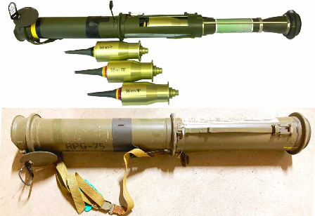

Зображення © Меган Лінн (Megan Lynn). Зображення © Данський центр пошуку та утилізації вибухових боєприпасів (Danish EOD and Search Center)

| СУБКАТЕГОРІЯ ОЗБРОЄННЯ          | Постріл до безвідкатного гранатомета |
| ------------------------------- | ------------------------------------ |
| СПОРЯДЖЕННЯ БОЙОВОЇ ЧАСТИНИ (г) | 320 г речовини А-IX-1                |
| СТАРТОВА МАСА (г)               | 800 г                                |
| РОЗМІРИ (мм)                    | 630x68                               |
| КРАЇНА ПОХОДЖЕННЯ               | Чеська Республіка                    |

RPG-75 — це легкий протитанковий гранатомет одноразового застосування. Назва RPG-75 розшифровується як «Reaktivního Protitankového Granátu Vzor 75». У перекладі — «Реактивна протитанкова граната моделі 75». Снаряд не має секції двигуна, і через це його іноді відносять до вистрілюваних гранат. У похідному положенні пускова труба має довжину 633 мм, а в бойовому — 890 мм. Кумулятивна протитанкова бойова частина відносно невелика та дієва лише проти легкоброньованої техніки.

Також може застосовуватися термобарична бойова частина, розроблена в 2000-х роках. Найпростіший спосіб визначити бойову частину — подивитися на кольорові застережні смужки по периметру стрижня бойової частини для підриву на віддаленні. Жовто-чорні смужки позначають протитанкову кумулятивну БЧ, як і на багатьох інших боєприпасах НАТО, а жовто- червоні смужки — термобаричну БЧ. Ці кольорові позначення дублюються на зовнішній частині пускової труби біля дульного зрізу.

## С-24

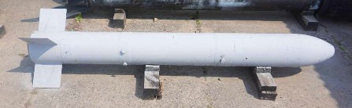

Зображення © Боб Седдон (Bob Seddon)

| СУБКАТЕГОРІЯ ОЗБРОЄННЯ          | Реактивний снаряд класу «повітря — земля». |
| ------------------------------- | ------------------------------------------ |
| СПОРЯДЖЕННЯ БОЙОВОЇ ЧАСТИНИ (г) | 29 кг тротилу                              |
| СТАРТОВА МАСА (г)               | 239 кг                                     |
| РОЗМІРИ (мм)                    | 2120x240 мм                                |
| КРАЇНА ПОХОДЖЕННЯ               | Росія                                      |
| ПІДРИВНИК                       | В24-А                                      |

С-24 — це некерований реактивний снаряд класу «повітря — земля», розроблений у 1960-х роках. Зустрічаються два варіанти — С-24А та С-24Б. Їх відмінність полягає у двохосновному ракетному пальному у двигуні С-24Б, що утворює менше диму. Іноді цей реактивний снаряд називають «некерованою авіаційною ракетою». Реактивний снаряд С-24 найчастіше використовується на літаках, що виконують штурмові завдання, — Су-24, Су-25 і Су-27. С-24 активно використовують в Україні, схоже, віддаючи цьому боєприпасу перевагу перед керованими ракетами.

Бойова частина С-24 містить 29 кг тротилу та проміжний детонатор зі 150 г тетрилу. Реактивний двигун (С-24Б) містить 46 кг двохосновного пального та оснащується запалювачем із чорного пороху й подвійними електричними ініціюючими пристроями. Ініціюючі пристрої розміщено в передній частині ракетного двигуна біля секції бойової частини. Ракетний двигун має шість характерних окремих сопел. На С-24 зазвичай застосовується електротехнічний підривник миттєвої та уповільненої дії В-24А. Якщо ціллю є укріплені укриття, наприклад бліндажі, снаряд також можна споряджати підривником відкладеної дії В-575. Також можливе встановлення неконтактного радіопідривника С-24Н.

## С-25-О

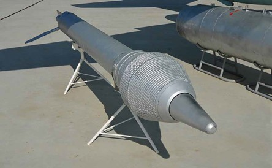

Зображення © ruaviation.com

| СУБКАТЕГОРІЯ ОЗБРОЄННЯ          | Реактивний снаряд класу «повітря — земля».               |
| ------------------------------- | -------------------------------------------------------- |
| СПОРЯДЖЕННЯ БОЙОВОЇ ЧАСТИНИ (г) | 150 кг тротилу                                           |
| СТАРТОВА МАСА (г)               | 385 кг                                                   |
| РОЗМІРИ (мм)                    | 3760x266 мм                                              |
| КРАЇНА ПОХОДЖЕННЯ               | Росія                                                    |
| ПІДРИВНИК                       | Головний підривник або неконтактний радіопідривник РВ-25 |

С-25-О — це некерований реактивний снаряд класу «повітря — земля». Він має масивну осколково-фугасну бойову частину (148 кг тротилу). Секція двигуна з двохосновним ракетним пальним також становить значну небезпеку. Бойова частина має характерну опуклість на носі. Діаметр у найширшій частині становить 420 мм. Поверхня бойової частини підготовлена під утворення осколків.

С-25-О може оснащуватися головним підривником або неконтактним радіопідривником РВ-25. Якщо використовується неконтактний радіопідривник, невідомо, протягом якого часу ініціюючий конденсатор зберігає заряд. Слід діяти обережно.
