#### ПРОТИТАНКОВЕ КЕРОВАНЕ ОЗБРОЄННЯ

## 9К111 «ФАГОТ» AT-4 SPIGOT

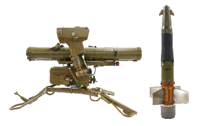

Зображення © VMZ Sopot

| СУБКАТЕГОРІЯ ОЗБРОЄННЯ          | Протитанкова керована зброя               |
| ------------------------------- | ----------------------------------------- |
| СПОРЯДЖЕННЯ БОЙОВОЇ ЧАСТИНИ (г) | 1 800 г, вибухова речовина ОКФОЛ          |
| ПОВНА МАСА (г)                  | 13 000 г                                  |
| РОЗМІРИ (мм)                    | Ракета довжиною 875 мм і діаметром 120 мм |
| КРАЇНА ПОХОДЖЕННЯ               | Росія                                     |
| ПІДРИВНИК                       | Електричний, контактний                   |

9К111 «Фагот» є напівавтоматичною системою протитанкової керованої зброї (ATGW) з дротяним керуванням в зоні прямої видимості (SACLOS), яка була розроблена на початку 1970-х років. Система складається з ракети 9М111 і пускової установки 9П135. Кодове позначення НАТО для 9K111 — AT-4 Spigot. Ракета транспортується в герметичному транспортно-пусковому контейнері зі скловолокна. Під час запуску стартовий двигун 9Х147 викидає ракету з пускової труби, а маршовий двигун 9Х145 запускається на відстані приблизно 10 метрів від пускової установки. Ракета 9М111 оснащена однією кумулятивною протитанковою боєголовкою 9Н122, яка містить приблизно 1,8 кг вибухової речовини на основі октогену з мідною кумулятивною виїмкою і здатна пробити 40 см катаної однорідної броні. Оператор відстежує ціль протягом усього польоту, а пускова установка автоматично передає на ракету поправки наведення за допомогою тонкого дроту, який виходить із хвостової частини ракети. Інфрачервоні джерела випромінювання на хвостовій частині ракети допомагають відстежувати політ ракети. Існує тандемний варіант бойової частини 9М111, позначений як

«9М111М». Розрахунок протитанкової керованої ракети зазвичай складається з трьох осіб, одна з яких несе пускову установку, а інші двоє — по дві ракети. За умови підтримки бойової машини піхоти (БТР/БМП), зазвичай доступні ще вісім ракет. Ракети 9M111 «Фагот» (AT-4 Spigot) і 9M113

«Конкурс» (AT-5 Spandrel) мають зовнішню схожість.

## 9K113 «КОНКУРС» AT-5 SPANDREL

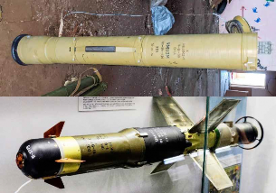

Зображення зверху © Шон Мурхаус (Sean Moorhouse). Зображення знизу © Томас Т (Thomas T)

| СУБКАТЕГОРІЯ ОЗБРОЄННЯ          | Протитанкова керована зброя               |
| ------------------------------- | ----------------------------------------- |
| СПОРЯДЖЕННЯ БОЙОВОЇ ЧАСТИНИ (г) | 1 800 г, вибухова речовина ОКФОЛ          |
| ПОВНА МАСА (г)                  | 14 500 г                                  |
| РОЗМІРИ (мм)                    | Ракета довжиною 955 мм і діаметром 120 мм |
| КРАЇНА ПОХОДЖЕННЯ               | Росія                                     |
| ПІДРИВНИК                       | Електричний, контактний                   |

9M113 є напівавтоматичною системою протитанкової керованої зброї (ATGW) з дротяним керуванням в зоні прямої видимості (SACLOS), яка була розроблена в середині 1970-х років. Ракета 9М113 може бути запущена з пускової установки системи 9К111 «Фагот» (9П135). Крім того, вона встановлюється на бойові машини піхоти, оснащені пусковою установкою 9П148, наприклад БМП-2, БМД-2 і БРДМ-2. Кодове позначення НАТО для 9M113 — AT-5 Spandrel.

Ракета транспортується в герметичному транспортно-пусковому контейнері зі скловолокна. Ракета 9M113 оснащена однією кумулятивною бойовою частиною 9Н131, що споряджена приблизно 1,8 кг вибухової речовини на основі октогену з мідною кумулятивною виїмкою. Вона здатна пробити 60 см катаної однорідної броні.

Версія 9M113M оснащена лампа-фара, яка відрізняє її від 9M113. Обидві версії оснащуються тандемною бойовою частиною для подолання активного динамічного бронезахисту (ERA). Спеціалістам зі знешкодження ВНП рекомендується забезпечити знищення кожної бойової частини й усіх залишків твердого палива ракетного двигуна.

## 9M119 «СВІР» AT-11 SNIPER

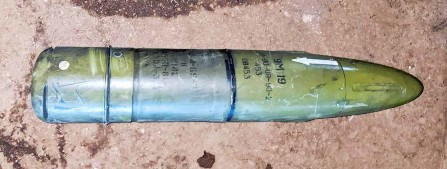

Зображення © Шон Мурхаус (Sean Moorhouse)

| СУБКАТЕГОРІЯ ОЗБРОЄННЯ          | Протитанкова ракета, що вистрілюється з гармати              |
| ------------------------------- | ------------------------------------------------------------ |
| СПОРЯДЖЕННЯ БОЙОВОЇ ЧАСТИНИ (г) | Провідний заряд: 800 г; основний: 2 250 г вибухової речовини ОКФОЛ |
| ПОВНА МАСА (г)                  | 17 200 г                                                     |
| РОЗМІРИ (мм)                    | 695 мм у довжину, 125 мм у діаметрі                          |
| КРАЇНА ПОХОДЖЕННЯ               | Росія                                                        |
| ПІДРИВНИК                       | Головний перемикач підривника із затримкою зведення піропатрона |

9М119 — це 125-мм протитанкова ракета, що запускається з гладкодульної гармати й стабілізується в польоті за допомогою хвостових стабілізаторів. Наведення ракети здійснюється за допомогою лазерного променя, коли навідник танку безперервно підсвічує ціль, а ракета здійснює автоматичне наведення на призначену ціль. Ракета 9М119 оснащена бойовою частиною тандемного компонування й, таким чином, здатна уражати активний динамічний бронезахист.

Ракета 9М119 має нетрадиційну конфігурацію, через що основна бойова частина розташована за секцією маршового ракетного двигуна. Спеціалістам зі знешкодження ВНП слід зважити на те, що основна бойова частина знаходиться позаду передніх сопел перед стабілізаторами ракети. 9M119 має радіус дії до 4 км.

Ракета має російське позначення «Свір» або «Рефлекс», і кодове позначення НАТО «AT11AA SNIPER». Версії 9M119Ф і 9M119А1 мають удосконалені бойові частини, хоча неясно, які конструктивні особливості це тягне за собою. «Свір» і «Рефлекс» не ідентичні й мають незначні відмінності в конструкції. Версія 9M119M «Інвар» датується початком 1990-х років.

Якщо ракета була вистрілена, її слід уважати зведеною. Ракета містить піротехнічний механізм самознищення, який може спрацювати в проміжок 25-ї до 45-ї секунди польоту після пострілу.

## 9K127 «ВИХОР» AT-16 SCALLION

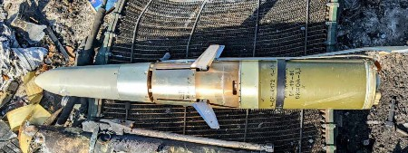

Бойова частина ракети AT-16 і відсік наведення. Зображення © Шон Мурхаус (Sean Moorhouse)

| СУБКАТЕГОРІЯ ОЗБРОЄННЯ          | Авіаційна протитанкова ракета    |
| ------------------------------- | -------------------------------- |
| СПОРЯДЖЕННЯ БОЙОВОЇ ЧАСТИНИ (г) | 4 300 г, вибухова речовина ОКФОЛ |
| ПОВНА МАСА (г)                  | 47 000 г                         |
| РОЗМІРИ (мм)                    | 2 750 x 130                      |
| КРАЇНА ПОХОДЖЕННЯ               | Росія                            |
| ПІДРИВНИК                       | Невідомо                         |

Ракетний комплекс 9К127 «Вихрь» («Вихор») — це протитанкова ракета «повітря-земля», що вистрілюється з пускової труби й наводиться за лазерним променем. Стабілізація в польоті відбувається за допомогою хвостових стабілізаторів. Цей комплекс розроблений на базі ракети 9М127 «Вихор». Зазвичай ним оснащуються ударні вертольоти Ка-52. Він був спроєктований на початку 1990-х років. Лазерна система наведення дуже схожа на систему наведення ракети/ снаряда 9М119 «Свір». Ракета керується за допомогою чотирьох крил у носовій частині і стабілізується чотирма хвостовими стабілізаторами.

Ракета оснащена двома ступенями з твердопаливними ракетними двигунами й тандемною бойовою частиною, яка характеризується кумулятивним і осколковим факторами ураження. Ракета має підривник ударної та безконтактної дії з елементом самознищення, який зводиться під дією інерції. Ракета має максимальну швидкість польоту 600 м/с, що втричі більше, ніж в аналогічної портативної протитанкової керованої ракети. Ракети запускаються групами із 6 пускових труб під кожним пілоном вертольота. Пускові труби спереду обладнані відкидними кришками, які відкриваються перед запуском.

9К121 «Вихор» може бути встановлений на ударні вертольоти Ка-50 і Ка-52, а також на штурмовики Су-25Т й Су-25ТМ/Су-39 із фіксованою геометрією крила. Ракета 9М127 «Вихор»/ АТ-16 Scallion часто зустрічається в Україні на збитих ударних вертольотах Ка-52.

## 9K133 «КОРНЕТ» AT-14 SPRIGGAN

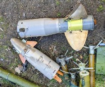

Зображення © Шон Мурхаус (Sean Moorhouse)

| СУБКАТЕГОРІЯ ОЗБРОЄННЯ          | Протитанкова керована зброя                                  |
| ------------------------------- | ------------------------------------------------------------ |
| СПОРЯДЖЕННЯ БОЙОВОЇ ЧАСТИНИ (г) | Варіант із кумулятивною протитанковою бойовою частиною (HEAT): 4 300 г вибухової речовини ОКФОЛ |
| ПОВНА МАСА (г)                  | 27 000 г                                                     |
| РОЗМІРИ (мм)                    | 1 250 мм у довжину; 152 мм у діаметрі                        |
| КРАЇНА ПОХОДЖЕННЯ               | Росія                                                        |
| ПІДРИВНИК                       | Електричний ударний підривник                                |

Ракетний комплекс 9К133 «Корнет» оснащується протитанковою ракетою сімейства 9М133

«Корнет» із хвостовим стабілізатором, що вистрілюється з пускової труби й наводиться за лазерним променем. Кодове позначення НАТО — AT-14 Spriggan. «Корнет» часто встановлюється на машини БМП-3 або може застосовуватися екіпажем із портативної триноги. Ракета оснащена або тандемною бойовою частиною (9M133) з кумулятивним зарядом (HEAT), яка адаптована для використання проти броньованих цілей, або удосконаленою (термобаричною) бойовою частиною (9М133Ф), яка призначена для використання в районах міської забудови. Варіант 9M133 споряджається вибуховою речовиною на основі окфолу, варіант 9М133Ф містить суміш гексогену (RDX), алюмінію та ізопропілнітрату. Ракета 9М133

«Корнет» має розгінний двигун, який містить приблизно 850 г палива й маршовий ракетний двигун з єдиним зарядом двокомпонентного твердого палива. Останній забезпечує ракеті сигнатуру струму з низькою видимістю в польоті. Наведення ракети в польоті досягається шляхом застосування крил, розташованих у передній частині ракети. Стабілізація польоту забезпечується хвостовими стабілізаторами в задній частині ракети.

Тандемна бойова частина розділена більшою мірою, ніж у ранніх версіях радянських ПТКР. Невеликий кумулятивний заряд знаходиться в носовій частині, головна бойова частина знаходиться безпосередньо перед хвостовими стабілізаторами. Дві бойові частини розділені основною секцією твердопаливного двигуна, розташованою в центральній частині ракети. Ще один твердопаливний вишибний заряд знаходиться у хвостовій частині. Сопла знаходяться поруч із меншими передніми стабілізаторами. Знебарвлення на цьому місці під дією тепла, на задньому вибивному заряді разом із пошкодженнями від удару, а також знаходження ракети за межами її пускової труби є надійними ознаками потенційно зведеного боєприпаса.

## «СКІФ»/«СТУГНА-П»

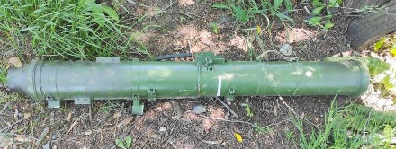

Зображення © Державна служба України з надзвичайних ситуацій

| СУБКАТЕГОРІЯ ОЗБРОЄННЯ          | Протитанкова керована зброя                  |
| ------------------------------- | -------------------------------------------- |
| СПОРЯДЖЕННЯ БОЙОВОЇ ЧАСТИНИ (г) | Невідомо                                     |
| ПОВНА МАСА (г)                  | 37 000 г                                     |
| РОЗМІРИ (мм)                    | 1 435 x 130—152                              |
| КРАЇНА ПОХОДЖЕННЯ               | Україна                                      |
| ПІДРИВНИК                       | Невідомий імовірний електричний датчик удару |

Ракетні комплекси «Скіф»/«Стугна-П» — це протитанкові керовані ракети, розроблені й виготовлені в Україні, що наводяться із застосуванням лазерного променя. Сама ракета має характерну форму з опуклістю біля передньої частини ракети, яка вказує на розташування одного з двох кумулятивних зарядів і осколкових бойових частин.

Коли ракетні комплекси розташовані на транспортних засобах, вони можуть позначатися як «Амулет», а в переносному варіанті — «Стугна-П». Також відомо, що експортні версії цього комплексу мають позначення «Скіф», тоді як версії на озброєнні в Збройних силах України мають позначення «Стугна-П». Український код позначення «РК-2М-ОФ». Для комплексу

«Стугна-П» застосовуються ракети як у 130-мм, так і в 152-мм конфігурації.

Основна бойова частина поєднує в собі ударне ядро (EFP) й осколкову оболонку. Вибуховий заряд невідомий, хоча вважається, що це вибухівка на основі октогену (HMX).

## NLAW

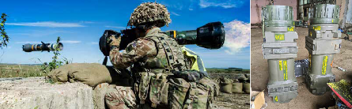

Зображення ліворуч © Міністерство оборони Великої Британії.

Зображення праворуч © Шон Мурхаус (Sean Moorhouse)

| СУБКАТЕГОРІЯ ОЗБРОЄННЯ          | Протитанкова керована зброя                                  |
| ------------------------------- | ------------------------------------------------------------ |
| СПОРЯДЖЕННЯ БОЙОВОЇ ЧАСТИНИ (г) | 850 г, нечутлива вибухова речовина з полімерним сполучним матеріалом (PBX) |
| ПОВНА МАСА (г)                  | 12 500 г                                                     |
| РОЗМІРИ (мм)                    | 1 000 мм у довжину, 310 мм у діаметрі                        |
| КРАЇНА ПОХОДЖЕННЯ               | Великобританія/Швеція                                        |
| ПІДРИВНИК                       | Неконтактний підривник                                       |

Керований протитанковий ракетний постріл NLAW K170A2 був прийнятий на озброєння збройних сил Великобританії у 2009 році й широко використовується в Україні для ураження танків на коротких дистанціях. Як одноразова пускова установка, ця зброя теоретично може захоплювати й знищувати цілі на мінімальній відстані від 20 м, але максимально — до 800 м. Після того як ракета залишає пускову установку, вона не керується ззовні й використовує інерційну систему наведення на основі прогнозованої лінії видимості (PLOS). Це вимагає від стрільця перед запуском відстежувати ціль протягом 3—6 секунд. Якщо ціль рухається, здійснюється прогнозування траєкторії польоту ракети. Можна вибрати два режими атаки: атака у верхню площину, або атака прямим наведенням. NLAW обладнана противідкотною системою, що дозволяє робити запуск із замкненого приміщення.

Стартовий двигун містить приблизно 120 г двокомпонентного палива й відділяється від ракети після пострілу. Маршовий двигун містить приблизно 750 г двокомпонентного палива й запускається на безпечній дистанції від стрільця.

Бойова частина NLAW використовує нечутливу вибухову речовину з полімерним сполучним матеріалом (PBX); сумарна чиста маса вибухової речовини менш ніж 1 кг. Спеціалістам зі знешкодження ВНП методом підриву рекомендується використовувати достатньо великий донорський заряд у разі утилізації ракет NLAW, що не спрацювали. Спеціалістам зі знешкодження ВНП рекомендується застосовувати безпечний період очікування 30 хвилин, перш ніж наблизитися до ракети NLAW, що впала не розірвавшись. В ідеальному випадку до ракети слід наближатися з боку хвостової частини, а також слід ураховувати фактори небезпеки, характерні для кумулятивної бойової частини й лазерного безконтактного підривника.

Шведська назва NLAW — Rb 57 (Robot 57), фінська назва — 102 RSLPSTOHJ NLAW.

## FGM-148 JAVELIN

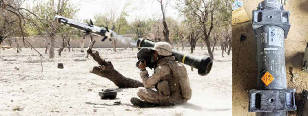

Зображення ліворуч © Мартін Локхед (Martin Lockhead). Зображення праворуч © Шон Мурхаус (Sean Moorhouse)

| СУБКАТЕГОРІЯ ОЗБРОЄННЯ          | Протитанкова керована зброя                                  |
| ------------------------------- | ------------------------------------------------------------ |
| СПОРЯДЖЕННЯ БОЙОВОЇ ЧАСТИНИ (г) | Вибухова речовина PBX на основі октогену (HMX): 220 г — провідний заряд; 2 000 г — основний |
| ПОВНА МАСА (г)                  | 16 кг (тільки ракета, не включаючи вузол пускового контейнера (CLU)) |
| РОЗМІРИ (мм)                    | 1 200 мм у довжину, 127 мм у діаметрі                        |
| КРАЇНА ПОХОДЖЕННЯ               | США                                                          |
| ПІДРИВНИК                       | Невідомий                                                    |

FGM-148 — переносна протитанкова керована ракета з дальністю дії до 4 км. Вона є ефективною проти всіх основних сучасних бойових танків. Ракета Javelin містить тандемну бойову частину, розташовану перед переднім оперенням стабілізатора. Основними компонентами носової частини є відстежна система, провідний заряд, основний кумулятивний заряд, ракетний двигун на твердому паливі й двигун м’якого запуску. Двигун м’якого запуску дозволяє вести вогонь із замкнених приміщень.

У головній частині міститься інфрачервона головка самонаведення. Бойова частина зазвичай застосовується для атаки по верхній площині.

Енергетична речовина, яка застосовується для ініціювання провідного й основного заряду, є нечутливою вибуховою речовиною на основі PBX. Спеціалістам зі знешкодження ВНП рекомендується планувати знищення боєприпасів методом підриву відповідним чином. Також рекомендується застосовувати безпечний період очікування 30 хвилин, перш ніж наблизитися до ракети Javelin, що впала, не розірвавшись. В ідеальному випадку до ракети слід наближатися з боку хвостової частини, а також слід ураховувати фактори небезпеки, характерні для кумулятивної бойової частини.

Існує декілька поколінь ракет Javelin — останнім є FGM-148G. Використовується упакування ракет Javelin HCC 1.2E.

## 9М114 «КОКОН» / AT-6 «SPIRAL»

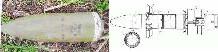

Зображення © Державна служба України з надзвичайних ситуацій

| СУБКАТЕГОРІЯ ОЗБРОЄННЯ          | Протитанкове кероване озброєння           |
| ------------------------------- | ----------------------------------------- |
| СПОРЯДЖЕННЯ БОЙОВОЇ ЧАСТИНИ (г) | 2200 г речовини ОКФОЛ                     |
| ПОВНА МАСА (г)                  | 35 000                                    |
| РОЗМІРИ (мм)                    | 130x2300 мм (ракета з висунутим стрижнем) |
| КРАЇНА ПОХОДЖЕННЯ               | Росія                                     |
| ПІДРИВНИК                       | Електричний контактний                    |

9М114 «Штурм» — це система протитанкового озброєння з радіокеруванням в УКХ-діапазоні та напівавтоматичною системою командного наведення по лінії спостереження, що з’явилась у середині 1970-х років. Система складається з ракети 9М114 і пускової установки 9П135. Назва 9М114 за класифікацією НАТО — AT-6 «Spiral». Для транспортування ракети використовується захищений від зовнішнього впливу пусковий трубчастий контейнер зі скловолокна. Ця ракета використовується на ударних гелікоптерах Мі-24 «Hind-D» та бронемашинах МТ-ЛБ (9П149). На масштабну заміну цій ракеті прийшла ракета AT-9 «Spiral» (9М120 «Атака»). Її активно використовують в Україні. Керування ракетою відбувається за допомогою двох розкривних рулів у передній частині. Для стабілізації в польоті ракету оснащено чотирма вигнутими складаними стабілізаторами. Для викидання з трубчастої напрямної використовується стартовий двигун, що містить 1,1 кг двохосновного ракетного пального. Маршовий двигун містить твердопаливний заряд двохосновного пального масою від 10 кг (AT-6B) до 15 кг (AT-6C). Бойову частину позначено кодом «ГРАУ 9Н132». Вона розташовується в передній частині ракети перед рулями. Бойовий заряд — кумулятивний, 2200 г речовини ОКФОЛ. Спочатку невеликий стартовий двигун виштовхує ракету з пускової напрямної. На відстані приблизно 20 м вмикається твердопаливний маршовий двигун. Після запуску оператор починає керувати польотом ракети до цілі. Секцію двигуна слід визначити та знищити в процесі утилізації. У випадку спрацьовування вона може розігнати ракету до швидкості 345 м/с. Також існує варіант із термобаричною бойовою частиною (9М114Ф).

## 9М116 «МЕТИС» - AT-7 «SAXHORN»

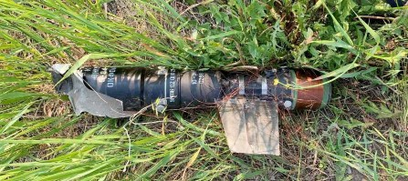

Секція двигуна відстріляної ракети 9М116. Зображення © Державна служба України з надзвичайних ситуацій

| СУБКАТЕГОРІЯ ОЗБРОЄННЯ          | Протитанкове кероване озброєння |
| ------------------------------- | ------------------------------- |
| СПОРЯДЖЕННЯ БОЙОВОЇ ЧАСТИНИ (г) | 1000 г речовини ОКФОЛ           |
| ПОВНА МАСА (г)                  | 4800 г                          |
| РОЗМІРИ (мм)                    | 733x93                          |
| КРАЇНА ПОХОДЖЕННЯ               | Росія / Болгарія                |

9М116 — це ракета протитанкового керованого ракетного комплексу 9К115 «Метис». Цю систему було прийнято на озброєння наприкінці 1970-х років. 9М116 «Метис» — це система протитанкового озброєння з трубчастою напрямною, керуванням по дротах і напівавтоматичною системою командного наведення по лінії спостереження. У ній застосовується система аеродинамічного керування з пневматичним приводом і рулями в носовій частині ракети. Для стабілізації в польоті, ракету оснащено трьома масивними вигнутими складаними стабілізаторами. Ракета має двоступеневу рушійну систему. Стартовий двигун з одноосновного ракетного пального масою 250 г виштовхує ракету на безпечне віддалення від пускової напрямної, а потім вмикається маршовий двигун із 1,2 кг двохосновного ракетного пального. Індекси ГРАУ можуть вводити в оману. На транспортно- пусковому контейнері може бути нанесено маркування ракети 9М115. Ракета містить тільки одну протитанкову кумулятивну бойову частину та тому вважається неефективною проти основних бойових танків із динамічним захистом, але все ще може бути дієвою проти легкоброньованої техніки. Корпус ракети зазвичай має чорний колір. За формою та розмірами ракета дуже схожа на 9М111 / AT-4 «Spigot». Ці дві ракети можна легко переплутати. 9М116 має лише три стабілізатори, а 9М111 — чотири. Секція двигуна в 9М116 менша, ніж у 9М111, і ця ракета легша. Ракету оснащено механізмом самоліквідації з уповільненням, що активується за 20–25 секунд після пуску. Перш ніж наближатися до ракети, рекомендується вичекати

30 хвилин. Через чутливість контактного підривника ракети не слід її струшувати або переміщувати. Знищення слід проводити на місці знахідки.

## 9М117 «БАСТІОН» / AT-10 «STABBER»

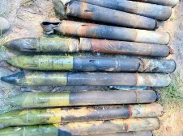

Зображення © Джон Калп (John Culp)

| СУБКАТЕГОРІЯ ОЗБРОЄННЯ          | Протитанкове кероване озброєння |
| ------------------------------- | ------------------------------- |
| СПОРЯДЖЕННЯ БОЙОВОЇ ЧАСТИНИ (г) | 1350 г речовини ОКФОЛ-3,5       |
| ПОВНА МАСА (г)                  | 18 800 г                        |
| РОЗМІРИ (мм)                    | 1092x137 мм (с гільзою)         |
| КРАЇНА ПОХОДЖЕННЯ               | Росія                           |

9М117 «Бастіон» — це вистрілювана з гарматного стволу кумулятивна протитанкова ракета з наведенням за лазерним променем і оптичним каналом відстеження, що з’явилася на початку 1980-х років. Різні варіанти ракети 9М117 можуть відстрілюватися з кількох гармат калібрів 100 мм і 115 мм. Конфігурація стартового двигуна залежить від гармати, у яку заряджається ракета. Постріл 9М117 «Бастіон» у готовому вигляді нагадує інші крупнокаліберні снаряди з гільзами. Ракета 9M117 використовує наведення за лазерним променем: оператор пускової платформи постійно підсвічує ціль, і ракета автоматично наводиться на неї. Секція з рулями управління розміщується перед єдиною кумулятивною протитанковою бойовою частиною. Бойова машина піхоти БМП-3 може нести до восьми 9М117 у калібрі 100 мм (індекс ГРАУ 3УБК10-3) для пуску з нарізної гармати 2А70. Існує сім інших варіантів ракети з різними індексами ГРАУ. Стартовий двигун міститься в решітчастому контейнері в гільзі. На віддаленні приблизно 200 м вмикається маршовий двигун ракети. Маршовий двигун містить приблизно 2 кг двохосновного пального. Дальність польоту ракети складає 4000 м, час польоту — близько 12 секунд. Варіант із тандемною бойовою частиною (9М117М) містить два кумулятивні заряди з речовини ОКФОЛ у мідному облицюванні. Підривник містить самоліквідатор, що спрацьовує за 26-42 секунд після початкового зведення. У хвостовій частині ракети є невеличке віконце. Воно використовується для визначення положення ракети в лазерному промені наведення. Перш ніж наближатися до ракети, рекомендується вичекати 30 хвилин. Через чутливість контактного підривника ракети, розташованого поряд із рулями, не слід її струшувати або переміщувати. Знищення слід проводити на місці знахідки.

## 9М120 «АТАКА» - AT-9/«SPIRAL-2»

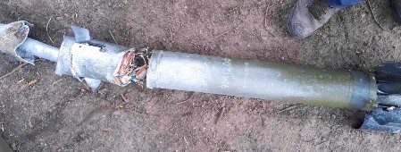

Зображення © Державна служба України з надзвичайних ситуацій

| СУБКАТЕГОРІЯ ОЗБРОЄННЯ          | Протитанкове кероване озброєння           |
| ------------------------------- | ----------------------------------------- |
| СПОРЯДЖЕННЯ БОЙОВОЇ ЧАСТИНИ (г) | 7400 г ОКФОЛ-3,5, тандемна бойова частина |
| ПОВНА МАСА (г)                  | 48 300 г                                  |
| РОЗМІРИ (мм)                    | 1630x130 мм                               |
| КРАЇНА ПОХОДЖЕННЯ               | Росія                                     |

9М120 «Атака» — це наступник ракети 9М114 (AT-6 «Spiral»). Це основне протитанкове кероване озброєння гелікоптера Мі-28 «Нічний мисливець» (кодифікація НАТО: «Havoc»). Також цією ракетою можуть озброюватися сучасні модифікації ударних гелікоптерів Мі-35 (кодифікація НАТО: «Hind-E») і Ка-52 «Алігатор» (кодифікація НАТО: «Hokum»). Ракета 9М120 сумісна із системою радіокомандного керування Мі-24 (кодифікація НАТО: «Hind-D»). Її активно використовують в Україні. Вона має два режими керування: радіокомандний і лазерно- променевий із напівавтоматичною системою командного наведення по лінії спостереження. Система з’явилась у 1980-х. Керування ракетою відбувається за допомогою двох розкривних рулів у передній частині. Для стабілізації в польоті ракету оснащено чотирма вигнутими складаними стабілізаторами. Зазвичай цю ракету використовують на ударних гелікоптерах, хоча її трубчаста пускова напрямна зі скловолокна може встановлюватися на варіант 9П149 машини МТ-ЛБ. У кодифікації НАТО ракета має назву «Spiral-2», а за позначенням МО США —

«AT-9». Протитанковий варіант має тандемну кумулятивну бойову частину. У носовій частині встановлено підпружинений стрижень, що висувається після пуску. Ракета має характерне джерело інфрачервоного світла та відбивач у хвостовій частині. Поряд зі сріблястим відбивачем також розташовано ріжок приймача для радіоканалу, а в сучасніших версіях ракети (9М120-1) також і приймач лазерного променя. 9М120-1 має більшу кумулятивну тандемну бойову частину. Також існують варіанти ракети з термобаричною бойовою частиною (9М120Ф) і зенітно-ракетний варіант з осколковою бойовою частиною стрижневого типу.

## 9М131 «МЕТИС-М» / AT-13 «SAXHORN-2»

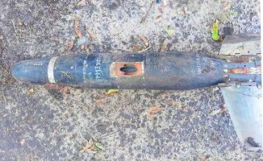

Зображення © Державна служба України з надзвичайних ситуацій

| СУБКАТЕГОРІЯ ОЗБРОЄННЯ          | Протитанкове кероване озброєння |
| ------------------------------- | ------------------------------- |
| СПОРЯДЖЕННЯ БОЙОВОЇ ЧАСТИНИ (г) | Невідомо                        |
| ПОВНА МАСА (г)                  | 4800 г                          |
| РОЗМІРИ (мм)                    | 733x130                         |
| КРАЇНА ПОХОДЖЕННЯ               | Росія / Болгарія                |

9М131 «Метис-М» — це модернізований варіант 9М115 (AT-7 «Saxhorn»). Ракета 9М131 використовується в системах 9К-115-2 «Mетис-М» і «Mетис-М1». У ній реалізовано наведення по дротах і напівавтоматичну систему командного наведення по лінії спостереження. Відмінність між двома варіантами полягає в більшій дальності застосування (через іншу конструкцію котушки дроту) в M1, а також у вдосконаленій бойовій частині з кумулятивним зарядом більшого діаметра (130 мм). Ракети розміщуються в трубчастих напрямних зі скловолокна, які ще іноді називають транспортно-пусковими контейнерами (ТПК). Сама ракета має чорний колір із білим трафаретним маркуванням. На відміну від старіших варіантів «Метиса», 9М131 має узгоджене між собою маркування на ТПК і самій ракеті. Для пострілу зазвичай використовується пускова установка 9П151 на тринозі. Довжина ракети — 733 мм, а довжина ТПК — 980 мм. Ракету оснащено піротехнічним механізмом самоліквідації з уповільненням, що активується після пуску. Перш ніж наближатися до ракети, рекомендується вичекати 30 хвилин. Через чутливість контактного підривника ракети не слід її струшувати або переміщувати. Знищення слід проводити на місці знахідки. Слід зауважити, що основну бойову частину цієї ракети зсунуто в бік хвоста ракети — між крилом і соплами Вентурі маршового двигуна. Імітаційна бойова частина розташовується попереду від передніх рулів. На ракетах, що не вибухнули, вона може від’єднуватися від фюзеляжу основної частини.

## MILAN-2

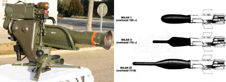

Зображення ліворуч © davric. Зображення праворуч © З відкритих джерел.

| СУБКАТЕГОРІЯ ОЗБРОЄННЯ          | Протитанкове кероване озброєння  |
| ------------------------------- | -------------------------------- |
| СПОРЯДЖЕННЯ БОЙОВОЇ ЧАСТИНИ (г) | 1850 г октолу (октоген / тротил) |
| ПОВНА МАСА (г)                  | 6730 г                           |
| РОЗМІРИ (мм)                    | 769x133 мм                       |
| КРАЇНА ПОХОДЖЕННЯ               | Франція / Німеччина              |

MILAN — це французько-німецька протитанкова ракета. Назва «MILAN» розшифровується як «Missile d'Infantrie Leger Anti-Char» (легка піхотна протитанкова ракета). У ній реалізовано керування по дротах і напівавтоматичну систему командного наведення по лінії спостереження. Перші варіанти цього озброєння з’явились у 1970-х роках. Цю систему інтенсивно розвивали. Зокрема, відбувся перехід на тандемну бойову частину для пробиття динамічного захисту (MILAN 2T). Чиста маса вибухової речовини залежить від варіанта ракети. Існує два варіанти з одинарною бойовою частиною: J103 та K105. В основному заряді, так і в детонаторі використовується склад на основі октолу (октоген / тротил). У J103 бойова частина має менший діаметр (103 мм) та містить 1450 г октолу (75/25) в основному заряді. У K115 бойова частина має діаметр 115 мм, а маса основного заряду (також октол у пропорції 75/25) складає 1850 г. В обох бойових частинах використовується детонатор з октолу в пропорції 85/15 масою 78 г. K115 також має характерний стрижень з контактами, що спрацьовують на здавлювання. Усі варіанти використовують джерело вихлопних газів, що виштовхує ракету з трубчастої напрямної, і тандемний стартово-маршевий ракетний двигун, що містить приблизно 1 кг двохосновного ракетного пального. Механізм зведення на безпечному віддаленні спрацьовує за рахунок тиску газів із секції двигуна. Просто кажучи, тиск відкриває заслінку, що своїм рухом розкорочує електровибухове коло. Ракета приводиться в бойовий стан через 20 м від місця пуску. Усі варіанти ракет містять чутливий контактний підривник у носовій частині, забороняється її струшувати або переміщувати. Знищення слід проводити на місці знахідки. Нагадуємо операторам про потребу застосовувати запобіжні заходи щодо радіочастот під час роботи з будь-якими керованими боєприпасами, що не розірвалися, зокрема з керуванням по дротам.
