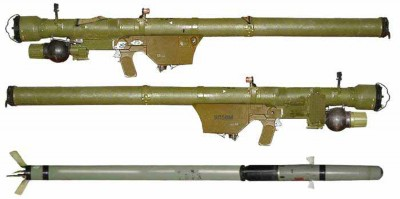

#### ПЗРК

## 9М32/М «СТРІЛА-2» / SA-7B GRAIL

Зображення © Fenix Insight

| СУБКАТЕГОРІЯ ОЗБРОЄННЯ          | Ракета       |
| ------------------------------- | ------------ |
| СПОРЯДЖЕННЯ БОЙОВОЇ ЧАСТИНИ (г) | 370 г A-IX-1 |
| СТАРТОВА МАСА (г)               | 9 150 г      |
| РОЗМІРИ (мм)                    | 1 440 x 72   |
| КРАЇНА ПОХОДЖЕННЯ               | Росія        |

9М32М — це ракета комплексу ПЗРК 9К32 «Стріла-2». За класифікацією НАТО має назву

«SA-7b GRAIL». Була розроблена на початку 1970-х років у складі першого ПЗРК радянського виробництва. На цей час це застаріла модель, і легко уражається сучасними активними засобами протидії. Проте вона залишається ефективною проти незахищених літальних апаратів. Основними компонентами цього ракетного комплексу є пускова труба 9П54М із ракетою 9M32M усередині, термобатарея 9Б17 та пусковий механізм 9П58. Ракета SA-7b значно коротша в порівнянні з SA-16 та не має аеродинамічного штиря на обтічнику інфрачервоної головки самонаведення в носовій частині ракети.

Найпростішою ознакою пускової труби є особлива форма термобатареї 9Б17. На верхню частину корпусу труби між пусковим механізмом і батареєю нанесено чорне ідентифікаційне маркування. Слід зазначити, що цей ракетний комплекс, на відміну від російських ПЗРК пізнішої розробки, оснащений неохолоджуваною інфрачервоною головкою самонаведення, яка не потребує використання блока живлення/охолодження (BCU). Термобатарея застосовується за допомогою змонтованого в передній частині поворотного перемикача; після цього вона нагрівається. Обпалена фарба — це ознака використаної батареї. Термобатарея витягається з пускової труби ракети з використанням важеля, змонтованого на корпусі ракети. Пусковий механізм монтується на пусковій трубі ракети за допомогою шарнірної скоби.

Попри вік та порівняно низькі тактико-технічні характеристики в зіставленні із сучасними стандартами, значна частина комплексів із ракетою SA-7b досі перебуває в обігу й застосовувалася в Україні.

## 9M36 «СТРІЛА-3» / SA-14 GREMLIN

Зображення © war-time.ru

| СУБКАТЕГОРІЯ ОЗБРОЄННЯ          | Ракета                         |
| ------------------------------- | ------------------------------ |
| СПОРЯДЖЕННЯ БОЙОВОЇ ЧАСТИНИ (г) | 370 г вибухової речовини ОКФОЛ |
| СТАРТОВА МАСА (г)               | 10 300 г                       |
| РОЗМІРИ (мм)                    | 1 470 x 72                     |
| КРАЇНА ПОХОДЖЕННЯ               | Росія                          |

Ракета 9К34 «Стріла-3» — це третє покоління російського сімейства ПЗРК ППО «Стріла» для стрільби з плеча, розроблене Конструкторським Бюро Машинобудування (КБМ). Розробка ПЗРК «Стріла-3» дозволила усунути шляхом уведення поліпшеної охолоджуваної головки самонаведення ракети деякі проблеми, з якими прийшлося стикнутися під час використання ПЗРК 9К32М «Стріла-2» (за класифікацією НАТО «SA-7b Grail»). У складі цього комплексу використовується суміщений вузол, до якого входять батарея живлення й газовий резервуар. Цей вузол зветься «блоком живлення/ охолодження» (BCU). BCU, призначений для використання з ракетою 9M36, має індекс 9П51. До складу ПЗРК входить пусковий механізм, ззовні схожий на аналогічний вузол ПЗРК 9К32М «Стріла-2», але їхні пускові механізми НЕ Є взаємозамінними. Пусковий механізм, призначений для використання з ПЗРК «Стріла-3» 9К34, має індекс 9П58М. Пускова труба ракети, яка входить до складу ПЗРК, має індекс 9П59. Бойова частина ракети ПЗРК 9M36 має позначення 9Н129 і оснащена боєзарядом на основі октогену (HMX), який розташовується в попередньо сформованій циліндричній осколковій оболонці.

У складі BCU передбачено балон зі стисненим азотом. Спеціалістам зі знешкодження ВНП слід мати на увазі чинники небезпеки, пов’язані зі стисненими газами. Зняти BCU з пускової труби можна, якщо натиснути на розчіпну заскочку та посунути цей вузол уперед. Якщо важіль зведення обертається під час установлення BCU, це призведе до ініціювання. На верхню частину корпусу труби між пусковим механізмом і BCU нанесено чорне ідентифікаційне маркування. Окрім того, невелике збільшення довжини (на 30 мм) є одним зі способів визначити відмінність від 9M32.

## 9M313 «ІГЛА-1» / SA-16

Зображення © Fenix Insight

| СУБКАТЕГОРІЯ ОЗБРОЄННЯ          | Ракета                         |
| ------------------------------- | ------------------------------ |
| СПОРЯДЖЕННЯ БОЙОВОЇ ЧАСТИНИ (г) | 400 г вибухової речовини ОКФАЛ |
| СТАРТОВА МАСА (г)               | 10 800 г                       |
| РОЗМІРИ (мм)                    | 1 673 x 72                     |
| КРАЇНА ПОХОДЖЕННЯ               | Росія                          |

Ракета 9K310 «Ігла-1» — це друге покоління російського сімейства ПЗРК ППО «Стріла» для стрільби з плеча, розроблене Конструкторським Бюро Машинобудування (КБМ). Ракета 9М313 у складі ПЗРК «Ігла-1» має набагато більшу здатність до протидії та оснащена потужнішим маршовим двигуном, який разом з удосконаленою системою керування й наведення забезпечує значно кращі кінематичні характеристики в порівнянні з ракетами ПЗРК «Стріла» (за класифікацією НАТО SA-7b Grail та SA-14 Gremlin).

У ракетному двигуні 9М313 використовується високоенергетичне сумішеве паливо на основі перхлорату амонію, алюмінію та полімерного сполучного матеріалу, а також вважається, що до цієї суміші додається нітрамінова композиція на основі гексогену (RDX). Додана бризантна вибухова речовина також забезпечує додатковим зарядом бойову частину для детонації невитраченого палива в разі її спрацювання. BCU, призначений для використання з ракетою 9М313, має індекс 9Б238. Пусковий механізм, призначений для використання з ПЗРК

«Ігла» 9К310, має індекс 9П519. BCU на пусковій трубі ПЗРК «Ігла» зорієнтований у нижньому напрямку, а не паралельно пусковій трубі, як на ПЗРК «Стріла-3»/SA-14.

SA-16 має відмітний аеродинамічний штир на дротяній тринозі, установлений над куполоподібним вікном головки самонаведення. Маркування має бути помітним, щоб спростити ідентифікацію, але якщо це не так, слід мати на увазі, що ця ракета на 20 см довше свого еквівалента SA-7b. ОКФАЛ — це пластифікована вибухова речовина на основі октогену (HMX), що відрізняється від речовини ОКФОЛ доданим обсягом алюмінію для збільшення кількості тепла, що виділяється під час вибуху. У складі BCU передбачено балон зі стисненим азотом.

Спеціалістам зі знешкодження ВНП слід мати на увазі відповідні чинники небезпеки. Зняти BCU з пускової труби можна, якщо натиснути на розчіпну заскочку та посунути цей вузол уперед. Якщо важіль зведення обертається під час установлення BCU, це призведе до ініціювання. У дерев’яному пакувальному ящику зазвичай зберігається дві ракети SA-16. На місці стрільби пускова труба може бути покинута. Іншими розпізнавальними ознаками є наявність метального заряду, передньої кришки пускової труби та BCU. Виготовлення SA-16 здійснювалося за ліцензією в кількох країнах, у тому числі в Болгарії, Китаї, Північній Кореї та в Україні. Також може траплятися морський варіант цього ПЗРК, що має індекс і назву SA-N-10 Grouse.

## 9M39 «ІГЛА-2» / SA-18

Зображення © Fenix Insight

| СУБКАТЕГОРІЯ ОЗБРОЄННЯ          | Ракета                         |
| ------------------------------- | ------------------------------ |
| СПОРЯДЖЕННЯ БОЙОВОЇ ЧАСТИНИ (г) | 400 г вибухової речовини ОКФАЛ |
| СТАРТОВА МАСА (г)               | 10 600 г                       |
| РОЗМІРИ (мм)                    | 1 639 x 72,2                   |
| КРАЇНА ПОХОДЖЕННЯ               | Росія                          |

Ракета 9K38 «Ігла-2» — це третє покоління російського сімейства ПЗРК ППО «Стріла» для стрільби з плеча, розроблене Конструкторським Бюро Машинобудування (КБМ). BCU, призначений для використання з ракетою 9М39, має індекс 9Б238. Пусковий механізм, призначений для використання з ПЗРК «Ігла-2» 9К38, має індекс 9П516. BCU на пусковій трубі ПЗРК «Ігла-2» зорієнтований у нижньому напрямку, як і на ПЗРК «Ігла»/SA-16.

Підривник боєзаряду (400 г вибухової речовини ОКФАЛ) подібний до тих, що використовуються в SA-16. Трафаретне маркування ракет 9М39 та 9К38 наноситься чорною фарбою. Конструкція аеродинамічного штиря є ключовою відмітною ознакою. Пускова установка 9К38 має відмітну особливість — носовий наконечник, що розширюється. Підковоподібний корпус, що закриває торець BCU, часто використовується як характерна ознака для розпізнавання, хоча подібна конструкція була помічена на деяких версіях SA-16. Блок живлення/охолодження 9Б238 (BCU) такий самий, як і на SA-16. На нього має бути нанесено відмітне трафаретне маркування чорною фарбою на кінці циліндричної частини. В обігу перебуває варіант для морського застосування. За класифікацією НАТО він має назву «SA-N-10 GROUSE».

Значна кількість ракет «Ігла-2»/SA-18 досі перебуває на озброєнні. Цей ракетний комплекс широко застосовувався в Україні.

## 9M342 IGLA S / SA-24

Зображення © В. Кузьмін

| СУБКАТЕГОРІЯ ОЗБРОЄННЯ          | Ракета       |
| ------------------------------- | ------------ |
| СПОРЯДЖЕННЯ БОЙОВОЇ ЧАСТИНИ (г) | ОКФАЛ        |
| СТАРТОВА МАСА (г)               | 11 300       |
| РОЗМІРИ (мм)                    | 1 690 x 72,2 |
| КРАЇНА ПОХОДЖЕННЯ               | Росія        |

Ракета 9М342 є компонентом ПЗРК 9К338 «Ігла-С», розробленого на початку 2000-х років. Позначення МО США — SA-24. За класифікацією НАТО має назву «GRINCH». У бойовій частині використовується боєзаряд вибухової речовини ОКФАЛ, хоча немає підтверджених точних даних про її обсяг. BCU, призначений для використання з ракетою 9М342, має індекс «9Б238». Пусковий механізм, призначений для використання з ПЗРК «Ігла-С» 9К338, має індекс «9П522». BCU на пусковій трубі ПЗРК «Ігла-С» зорієнтований у нижньому напрямку, як і на ПЗРК «Ігла-1»/ SA-16 та «Ігла-2»/SA-18.

Носовий наконечник пускової установки 9К338 відрізняється від попередньої моделі SA-18. Однак використовується той самий BCU 9Б238. Аеродинамічний штир на ракеті 9М342 той самий, що й на ракеті 9М39. Окрім трафаретного маркування, є ще один спосіб відрізнити згадані ракети: 9М342 довша на 41 мм.

## ПЗРК PIORUN

Зображення © Mesko S. A.

| СУБКАТЕГОРІЯ ОЗБРОЄННЯ          | Ракета     |
| ------------------------------- | ---------- |
| СПОРЯДЖЕННЯ БОЙОВОЇ ЧАСТИНИ (г) | Невідомо   |
| СТАРТОВА МАСА (г)               | 10 250 г   |
| РОЗМІРИ (мм)                    | 1 596 x 72 |
| КРАЇНА ПОХОДЖЕННЯ               | Польща     |

PIORUN — це вдосконалена модель ракети «ГРОМ», яка є польською версією 9К38 SA-18 GROUSE. Piorun у перекладі означає «блискавка». Ця ракета поставлена на озброєння у 2020 році. До її складу входять удосконалені головка самонаведення та безконтактний підривник. Відсутність ребер на носовому наконечнику дозволяє відрізнити цю ракету від SA-18.

## STARSTREAK (ВИСОКОШВИДКІСНА РАКЕТА)

Зображення © Ролі Еванс (Roly Evans)

| СУБКАТЕГОРІЯ ОЗБРОЄННЯ          | Ракета          |
| ------------------------------- | --------------- |
| СПОРЯДЖЕННЯ БОЙОВОЇ ЧАСТИНИ (г) | Невідомо        |
| СТАРТОВА МАСА (г)               | 14 000          |
| РОЗМІРИ (мм)                    | 1 400 x 130     |
| КРАЇНА ПОХОДЖЕННЯ               | Велика Британія |

Ракета K130 Starstreak, або високошвидкісна ракета (HVM), — це ракета, що входить до складу ракетного комплексу типу «земля-повітря», розробленого спеціально для використання проти літальних апаратів, що атакують на низьких висотах. Вона ефективно уражає цілі під будь-яким кутом пуску й може запускатися з броньованої машини (Stormer), з полегшеної багатодульної пускової установки (LML), або з плеча. Ракета оснащена трьома бойовими елементами, доставлення яких до цілі відбувається спочатку носієм із реактивним двигуном. На відміну від інших ракет, ПЗРК Starstreak використовує наведення в промені лазера, а не інфрачервоне самонаведення через поширення засобів протидії інфрачервоним системам. Ракета використовує на активній ділянці траєкторії реактивний двигун першого ступеню Brambling, що доставляє ракету на безпечну відстань від пускової установки, після чого застосовується маршовий двигун другого ступеню. Кожен із трьох стрілоподібних підкаліберних уражальних елементів містить основний боєзаряд на основі гексогену (RDX).

Також цей ракетний комплекс має маркування Thales ForceSHIELD.

## 9М336 «ВЕРБА»

Зображення © warms-expo.ru та nevskii-bastion.ru

| СУБКАТЕГОРІЯ ОЗБРОЄННЯ          | Ракета                                   |
| ------------------------------- | ---------------------------------------- |
| СПОРЯДЖЕННЯ БОЙОВОЇ ЧАСТИНИ (г) | 400 г, імовірно з вмістом октогену (HMX) |
| ПОВНА МАСА (г)                  | 17 250 г                                 |
| РОЗМІРИ (мм)                    | 1447x72                                  |
| КРАЇНА ПОХОДЖЕННЯ               | Росія                                    |

9М336 — це ракетний постріл до ПЗРК 9К333 «Верба». Це озброєння з’явилось у 2010-х роках. Позначення МО США — SA-25. Кодове ім’я НАТО наразі не призначено. Компоненти, з яких складається система 9К333, включають пускову трубу зі скловолокна 9П333, наземний блок живлення (НБЖ) 9Б238, пусковий механізм 9П521 та ракету 9М333. НБЖ містить стиснутий азот, що застосовується для охолодження елемента теплового самонаведення в носовій частині ракети. НБЖ, що використовується в системі 9К333 «Верба», також сумісний з 9К310 («Ігла-1» / SA-16 «Gimlet»), 9К38 («Ігла» / SA-18 «Grouse») і 9К338 («Ігла-С» / SA-24 «Grinch»). Із системою 9К333 «Верба» також може використовуватися наземний радіолокаційний запитувальник 1Л229В і приціл нічного бачення 1ПН97. Система наведення ракети — це модернізація системи, що використовується на 9К338. У ній використовується тридіапазонний датчик, що працює в ультрафіолетовому, ближньому інфрачервоному та середньому інфрачервоному діапазонах. Це дає змогу знизити результативність засобів інфрачервоної протидії літаків і гелікоптерів. Ракету обладнано чотирма розкривними рулями в носовій частині ракети та чотирма вигнутими складаними стабілізаторами польоту в задній частині. Кінематичні характеристики ракети дуже близькі до показників 9К338 («Ігла-С» / SA-24 «Grinch»). SA-25 і SA-24 дуже просто переплутати. Точно ідентифікувати ракету допоможуть чорні трафаретні маркування на секції двигуна. НБЖ містить герметичний резервуар з азотом. Спеціалістам зі знешкодження боєприпасів слід зважати на цю потенційну небезпеку. Щоб від’єднати НБЖ від пускової труби, потрібно натиснути на фіксуючу застібку та подати джерело вперед. Якщо з приєднаним НБЖ повернути важіль наколювання, НДЖ почне охолодження.