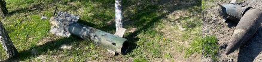

#### ЗЕНІТНІ РАКЕТИ

## РАКЕТА 9М37К «БУК» SA-11 GADFLY / SA-17 GRIZZLY

Зображення © Джон Монтгомері (John Montgomery)

| СУБКАТЕГОРІЯ ОЗБРОЄННЯ          | Ракета класу «земля-повітря» |
| ------------------------------- | ---------------------------- |
| СПОРЯДЖЕННЯ БОЙОВОЇ ЧАСТИНИ (г) | 21 000 г                     |
| СТАРТОВА МАСА (г)               | 690 000 г                    |
| РОЗМІРИ (мм)                    | 5 500 x 400                  |
| КРАЇНА ПОХОДЖЕННЯ               | Росія                        |

Ракетний комплекс «Бук» призначений для запуску ракет класу «земля-повітря» середньої або великої дальності. Він був розроблений на початку 1970-х років. Це був перший російський комплекс ППО з ракетами, що наводяться за допомогою РЛС. Усі компоненти ракетного комплексу розміщені на одній платформі: транспортно-встановлювальному й пусковому агрегаті та РЛС (TELAR). Ракета «Бук» має два ступені з твердопаливними двигунами. Вона запускається по рейкових напрямним із гусеничного броньованого автомобіля. У цій ракеті застосовано метод напівактивного наведення за допомогою РЛС, також вона має головку самонаведення, змонтовану в передній секції ракети. Пізніші варіанти ракетного комплексу «Бук» передбачають запуск ракет із контейнерів. Перші версії ракети «Бук» мають позначення МО США SA-11, а за класифікацією НАТО — GADFLY. Пізніші моделі «Бук-М1-2» та «Бук-М2» мають позначення МО США SA-17, а за класифікацією НАТО — GRIZZLY. Ракета «Бук-M3» має позначення МО США SA-27. Пізніші версії мають тенденцію до трохи збільшеної дальності стрільби: 45 км. Ракети перших версій SA-11 мають індекс ГРАУ 9М38 або 9М38М1. Пізніші версії з позначенням SA-17 GRIZZLY мають індекс ГРАУ 9М317. На всіх ракетах застосовується напівактивна РЛС наведення. На цих ракетах використовуються підривники безконтактного й ударного типу, а також засоби самознищення. На ракетах 9М38/9М38М1 та 9М317 можуть застосовуватися бойові частини різних типів. Бойова частина, яка трапляється найчастіше, — 9Н314М. Вона має наперед сформовану осколкову оболонку, розподілену на фрагменти у вигляді краватки-метелика. Зазвичай увесь корпус ракет пофарбований у зелений колір, а обтічник (носова частина) — у білий. Найменування ракети нанесено трафаретним маркуванням чорною фарбою між набором стабілізаторів, змонтованим безпосередньо перед секцією двигуна приблизно посередині корпусу ракети. Якщо бойова частина спрацювала, тоді задня секція відпрацьованого реактивного двигуна зазвичай перебуватиме на ґрунті. Також може бути знайдений непошкодженим резервуар стисненого повітря для системи наведення ракети разом із циліндричними газовими балонами для керування стабілізаторами. Ракети, які не влучили в ціль та не самоліквідувалися, можуть бути знайдені з непошкодженою бойовою частиною та змонтованими блоками безпеки й запобіжно-виконавчими механізмами. Заявлена вага бойової частини часто дорівнює 50—70 кг, хоча вважається, що маса нетто вибухової речовини становить 21 кг.
