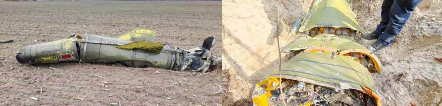
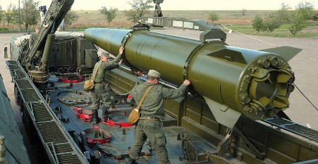

#### БАЛІСТИЧНІ РАКЕТИ

## ОТР-21 9К79/9М79 «ТОЧКА» SS-21 SCARAB

Зображення © Державна служба України з надзвичайних ситуацій

| СУБКАТЕГОРІЯ ОЗБРОЄННЯ          | Балістична ракета малої дальності |
| ------------------------------- | --------------------------------- |
| СПОРЯДЖЕННЯ БОЙОВОЇ ЧАСТИНИ (г) | Різне                             |
| СТАРТОВА МАСА (г)               | 2 000 000 г                       |
| РОЗМІРИ (мм)                    | 6 400 x 650                       |
| КРАЇНА ПОХОДЖЕННЯ               | Росія                             |

ОТР-21 «ТОЧКА» — це балістична ракета малої дальності (БРМД), здатна доставляти певну номенклатуру бойових частин, розроблених у 1970-х роках. За класифікацією НАТО має назву «SCARAB». Позначення МО США — SS-21. ОТР означає «оперативно-тактична ракета». Ця одноступенева ракета, оснащена твердопаливним двигуном, стабілізується з використанням вертикального оперення, а керування в польоті здійснюється за допомогою аеродинамічних поверхонь решітчастої конструкції. Цій ракеті присвоєно індекс Головного ракетно-артилерійського управління РФ (ГРАУ) «9М79». Вона оснащена інерційною системою керування. Ракета 9М79 може комплектуватися різними бойовими частинами: як із моноблочним, так і з касетним боєзарядом. У головці з моноблочним боєзарядом (9Н123Ф) застосовується система з основним лазерним підривником та вторинним ударним підривником. У головці з касетним боєзарядом (9Н123К) застосовується підривник із радіолокаційним висотоміром, запрограмований на скидання касетних боєприпасів на оптимальній висоті, виходячи з потрібної площі ураження зазначеними касетними боєприпасами.

На вищенаведеному зображенні показана зруйнована ракета «Точка» з бойовою частиною 9Н123К. У складі цієї бойової частини передбачено 50 суббоєприпасів 9Н24. Якщо ракета

«ТОЧКА-У» оснащена бойовою частиною 9Н123К, вона може бути визнана касетним боєприпасом відповідно до статті 2 Конвенції про касетні боєприпаси. Головка 9Н123Ф із моноблочним осколково-фугасним боєзарядом містить 162 кг вибухової речовини ТГ-20 (20 % тротилу (TNT)

/ 80 % гексогену (RDX)). Двигун одноступеневої ракети містить приблизно 900 кг композитного ракетного палива (перхлорат амонію, алюміній і сполучний матеріал). Реактивний струмінь пального в суміші з водою є токсичним та має кислотні властивості. Під час виймання фрагментів двигуна ракети 9M79 «Точка-У», що лишилися після ракетного удару, слід проявляти обережність.

Наступні версії ракети ТОЧКА можуть мати назви у вигляді комбінації позначень за класифікацією НАТО та МО США, такі як SS-21a SCARAB A. Були розроблені варіанти ракети ТОЧКА для доставлення бойових частин з оснащенням ядерними та хімічними боєприпасами. Вважається, що ядерний варіант бойового оснащення отримав два види бойових частин із різними величинами тротилового еквівалента. Бойова частина з хімічним оснащенням, як вважається, містить приблизно 250 кг стійкої нервово-паралітичної отруйної речовини, імовірно VX.

## 9M715/9М720/9М728/«ІСКАНДЕР» SS-26 STONE

Зображення © ТASS

| СУБКАТЕГОРІЯ ОЗБРОЄННЯ          | Балістична ракета малої дальності |
| ------------------------------- | --------------------------------- |
| СПОРЯДЖЕННЯ БОЙОВОЇ ЧАСТИНИ (г) | Різне                             |
| СТАРТОВА МАСА (г)               |                                   |
| РОЗМІРИ (мм)                    | Довжина: 7,2 м, діаметр: 920 мм   |
| КРАЇНА ПОХОДЖЕННЯ               | Росія                             |

Кодовим найменуванням «Іскандер» охоплюється сімейство балістичних ракет малої дальності та крилатих ракет, які запускаються за допомогою тих самих самохідних пускових установок (СПУ) (9P78-1). Найменування, яке використовується МО США й НАТО для цього сімейства ракет — SS-26 Stone. Максимальна заявлена дальність ракет Іскандер/ SS-26 Stone становить 500 км, хоча вони здатні доставляти бойові частини на значно більшу відстань. Базова модель сімейства ракет Іскандер, відома як «9М720» або «Іскандер-М», призначена на заміну ракет 9M79 / SS-21 Scarab, які зараз розташовані в Росії на бойовому чергуванні.

Ця двоступенева ракета, оснащена твердопаливним двигуном, стабілізується з використанням вертикального оперення та застосовує систему керування вектором тяги. Система керування ракетою поєднує в собі інерційну систему із системою супутникової навігації ГЛОНАСС та системою наведення на кінцевій ділянці траєкторії на основі цифрових засобів наведення по орієнтирах на місцевості та з використанням кореляційного алгоритму. Ракети Іскандер можуть комплектуватися різними бойовими частинами: як із моноблочним, так і з касетним боєзарядом. Ракета 9M723 оснащується невідокремлюваною бойовою частиною в одному з двох варіантів: 9Н722К1 вважається моноблочною, а 9Н722К5 з касетним боєзарядом. Вважається, що бойові частини обох типів застосовуються за допомогою радіолокаційного неконтактного підривника 9E156. Також вважається, що для ракет Іскандер із ядерними бойовими частинами існує номенклатура варіантів бойового оснащення з різними радіусами ураження.

Варіант Іскандер 9M728 — це крилата ракета наземного базування, розроблена на основі крилатої ракети морського базування 3М14 «Калібр». Ракета 9М728 має у своєму складі твердопаливний розгінний двигун, за допомогою якого відбувається запуск із транспортного контейнера. Після завершення цього етапу для здійснення польоту вмикається турбовентиляторний повітряно-реактивний двигун. Підйом здійснюється з використанням висувних крил ракети. «Гіперзвуковий» варіант ракети Іскандер авіаційного базування часом згадується як «Кинджал» або Х-47М2. Ця ракета може запускатися зі стратегічного бомбардувальника Ту-22 Backfire та з літака МіГ-31.

Деякі варіанти ракети «Іскандер» оснащені скиданими електронними системами протидії (відомими під назвою «засоби прориву ППО»), які застосовуються на кінцевих ділянках траєкторії ракети.
