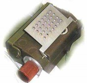

#### ПРИСТРОЇ НЕВИЛУЧЕННЯ

## МС-3

Зображення © Нідерландський центр утилізації вибухових боєприпасів (Dutch EOD Center), Данський центр пошуку та утилізації вибухових боєприпасів (Danish EOD and Search Center)

| СУБКАТЕГОРІЯ ОЗБРОЄННЯ          | Пристрій невилучення |
| ------------------------------- | -------------------- |
| СПОРЯДЖЕННЯ БОЙОВОЇ ЧАСТИНИ (г) | 310 г тротилу        |
| СТАРТОВА МАСА (г)               | 630                  |
| РОЗМІРИ (мм)                    | 110 x 65             |
| КРАЇНА ПОХОДЖЕННЯ               | Росія / Румунія      |

МС-3 — це російський пристрій невилучення. Він спрацьовує за принципом розвантажувальної дії. Цей пристрій призначався для використання з вистрибуючими протипіхотними осколковими мінами, як-от ОЗМ-72, хоча його можна без змін застосовувати з протитранспортними мінами та будь-якими іншими предметами достатньої ваги (4 кг), що використовуються для утримування в навантаженому стані. Цей пристрій можна легко сплутати з ПМН. Найхарактерніша ознака цієї міни — добре помітний виступ розвантажувального механізму на кришці. В інших аспектах цей пристрій виглядає майже ідентично до ПМН із коричневим бакелітовим корпусом і чорною гумовою кришкою. На кришці зазвичай нанесено напис «МС-3», номер партії, рік виробництва та тип вибухової речовини. У цій міні більше тротилу (310 г), ніж у ПМН (220–240 г). Діаметр МС-3 збігається з діаметром ОЗМ-72. Принцип роботи пристрою дуже схожий на принцип роботи ПМН, але є певні ключові відмінності. Пружина штока перебуває в стиснутому стані. У зведеному стані пружині заважає вага на кришці аби подати шток угору, щоб ударний механізм міг наколоти капсуль-детонатор і проміжний детонатор. Якщо міну розвантажити, пружина встановить шток у положення спрацьовування. Бойовий упор виводиться із зачеплення з ударником, і тоді пристрій спрацьовує. У старих рекламних джерелах російських виробників МС-3 називають «міною-сюрпризом». Існує навчальний інертний варіант У-МС-3. На його кришці зазвичай нанесено позначення «У-МС-3». Підтверджені випадки використання МС-3 слід активно та точно реєструвати, щоб поліпшити точність оцінки ризиків для розмінувальників і спеціалістів зі знешкодження ВНП. Працюючи в умовах, коли є підозра використання МС-3, слід діяти надзвичайно обережно. Усі маніпуляції з вилучення зарядів, що утримують пристрій від спрацьовування, слід виконувати лише віддалено або напіввіддалено, наприклад за допомогою набору для дистанційного розмінування, діючи максимально обережно.

## МЛ-7

Зображення © Боб Седдон (Bob Seddon)

| СУБКАТЕГОРІЯ ОЗБРОЄННЯ          | Пристрій невилучення       |
| ------------------------------- | -------------------------- |
| СПОРЯДЖЕННЯ БОЙОВОЇ ЧАСТИНИ (г) | 30 г ПВВ-5А / 10 г тетрилу |
| ПОВНА МАСА (г)                  | 100                        |
| РОЗМІРИ (мм)                    | 110 x 65                   |
| КРАЇНА ПОХОДЖЕННЯ               | Росія                      |
| ПІДРИВНИК                       | ВГМС-1                     |

МЛ-7 — це малий пристрій невилучення. Його виготовлено з пластмаси зеленого кольору. Підривник розміщено по центру. З обох боків від нього розміщено два додаткові детонатори в металевих пласких циліндричних корпусах (по 5 г тетрилу в кожній). Дві темно- зелені бічні коробки містять по 15 г вибухової речовини 40 ПВВ-5А. Підривник ВГМС-1 схожий на той, що використовується в міні ПФМ-1, і містить в’язкісний пристрій затримки зведення. Для зведення підривника використовується запобіжна чека. Після цього, МЛ-7 переведеться в бойовий стан протягом 5 хвилин. До запобіжної чеки часто прив’язано червону стрічку. Викинуті стрічки або чеки можуть вказувати на наявність МЛ-7. У режимі запобігання вертикальному вилученню, міна спрацьовує якщо на кришку діє зусилля не менше ніж 300 г. ПВВ-5А — це російська пластична вибухова речовина на основі гексогену, що використовується в таких мінах, як МОН-50. Найчастіше МЛ-7 встановлюється як пристрій розвантажувальної дії, але його також можна встановлювати на спрацьовування від натяжної дії. Маркування нанесено на одну з менших сторін основних зарядів. Воно складається з назви міни (МЛ-7 або У-МЛ-7), коду виробника, номера партії та року виробництва. Деякі партії пристроїв не мають маркування. Навчальні пристрої У-МЛ-7 позначено написами «Инерт» (інертний) під номером партії. У деяких джерелах МЛ-7 також називають « ВП-11 ». Підтверджені випадки використання МЛ-7 слід активно та точно реєструвати, щоб поліпшити точність оцінки ризиків для розмінувальників і спеціалістів зі знешкодження ВНП. Працюючи в умовах, коли є підозра використання МЛ-7, слід діяти надзвичайно обережно. Усі маніпуляції з вилучення зарядів, що утримують пристрій від спрацьовування, слід виконувати лише віддалено або напіввіддалено, наприклад за допомогою набору для дистанційного розмінування, діючи максимально обережно.

## МЛ-8

Зображення © З відкритих джерел

| СУБКАТЕГОРІЯ ОЗБРОЄННЯ          | Пристрій невилучення |
| ------------------------------- | -------------------- |
| СПОРЯДЖЕННЯ БОЙОВОЇ ЧАСТИНИ (г) | 80 г ПВВ-5А          |
| СТАРТОВА МАСА (г)               | 370                  |
| РОЗМІРИ (мм)                    | 60x40                |
| КРАЇНА ПОХОДЖЕННЯ               | Росія                |

МЛ-8 — це пристрій запобігання вертикальному вилученню, що може використовуватися як із мінами, так і з пересічними предметами. Піротехнічний пристрій затримки зведення приводить підривник у бойовий стан за 120–150 секунд із моменту вилучення червоного ковпачка та капронової нитки довжиною 800 мм. Міна або інший предмет утримують підпружинену металеву кришку з двома простими петлями з кожного боку в натиснутому стані. Ця металева кришка утримує зведений підривник з ударником. У момент розвантаження пружина піднімає кришку, і кришка більше не виконує функцію утримання. ПВВ-5А — це російська пластична вибухова речовина на основі гексогену, що використовується в таких мінах, як МОН-50. Як і МЛ-7, МЛ-8 після зведення не можна перевести в безпечний стан. Наявність викинутої прозорої або білої капронової нитки може вказувати на наявність МЛ-8.

На кришку, що закриває прямокутний корпус МЛ-8, нанесено рельєфне маркування. Воно стандартне та складається з назви міни (МЛ-8 або У-МЛ-8), коду виробника, номера партії та року виробництва. МЛ-8 виконується в зеленому, оливковому та коричневому кольорах. Корпус і пластмасова кришка МЛ-8 можуть відрізнятися за кольором. Підтверджені випадки використання МЛ-8 слід активно та точно реєструвати, щоб поліпшити точність оцінки ризиків для розмінувальників і спеціалістів зі знешкодження ВНП. Працюючи в умовах, коли є підозра використання МЛ-8, слід діяти надзвичайно обережно. Усі маніпуляції з вилучення зарядів, що утримують пристрій від спрацьовування, слід виконувати лише віддалено або напіввіддалено, наприклад за допомогою набору для дистанційного розмінування, діючи максимально обережно. Цей пристрій широко застосовувався в Україні разом із помітнішими протипіхотними мінами, як-от осколковою міною направленої дії МОН-50 і вистрибуючою осколковою міною ОЗМ-72.
