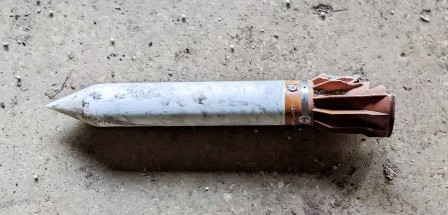
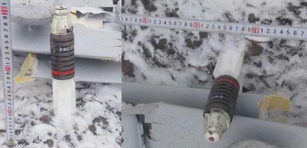
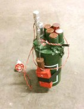

#### ІНШІ

## ХИБНА ЦІЛЬ 9Б899

Зображення © Шон Мурхаус (Sean Moorhouse)

| СУБКАТЕГОРІЯ ОЗБРОЄННЯ          | Хибна ціль |
| ------------------------------- | ---------- |
| СПОРЯДЖЕННЯ БОЙОВОЇ ЧАСТИНИ (г) | Невідомо   |
| СТАРТОВА МАСА (г)               |            |
| РОЗМІРИ (мм)                    |            |
| КРАЇНА ПОХОДЖЕННЯ               | Росія      |
| ПІДРИВНИК                       |            |

9Б899 — це хибна ціль, що розкидається ракетою 9М723 «Іскандер» (SS-26). Схоже, що цей пристрій являється програмованим багатоканальним інгібітором який живиться від теплової батареї, що встановлена в задній частині пристрою. Програмування та керування пристроєм перед розкиданням здійснюється за допомогою семиконтактного порту, що розташовується безпосередньо перед хвостовими стабілізаторами. Антени пристрою, схоже, вбудовані в зовнішні циліндри, що оточують електронні системи. Пристрій, швидше за все, налаштований для роботи як засіб проникнення і викидається ракетою "Іскандер" на середньому та кінцевому етапі траєкторії. Ймовірно, що пристрій налаштований для блокування зв’язку між наземними радарами та ракетними системами класу «земля-повітря». Ракета 9М723 має шість циліндричних портів у своїй основі, які призначені для розміщення пристроїв 9Б899 під час транзиту, запуску та польоту. Пристрої 9Б899, які вийшли з ладу, можуть все ще містити функіцонуючі термобатареї, тому слід поводитися із ними відповідним чином. Відсутність слідів вигоряння на хвостових стабілізаторах може вказувати на те, що термобатарея не спрацювала.

## АВІАЦІЙНА ОСКОЛКОВО-ФУГАСНА БОМБА ОФС

Зображення © З приватних джерел

| СУБКАТЕГОРІЯ ОЗБРОЄННЯ          | Авіаційна бомба |
| ------------------------------- | --------------- |
| СПОРЯДЖЕННЯ БОЙОВОЇ ЧАСТИНИ (г) | Невідомо        |
| СТАРТОВА МАСА (г)               |                 |
| РОЗМІРИ (мм)                    | 200 x 40        |
| КРАЇНА ПОХОДЖЕННЯ               | Росія           |
| ПІДРИВНИК                       |                 |

Цей виріб отримав локальну назву «ОФС». Осколкова оболонка має діаметр 40 мм.

Підривник не ідентифіковано, але є припущення, що це простий механічний ударний інерційний підривник, який належить застосувати й звести. За оцінками, вибухова речовина — це 100—150 г осколково-фугасного заряду.

## АВІАЦІЙНА БОМБА РКГ-1600

Зображення © З відкритих джерел

| СУБКАТЕГОРІЯ ОЗБРОЄННЯ          | Авіаційна бомба |
| ------------------------------- | --------------- |
| СПОРЯДЖЕННЯ БОЙОВОЇ ЧАСТИНИ (г) | 440 г, ТГ-50    |
| СТАРТОВА МАСА (г)               | 1 115           |
| РОЗМІРИ (мм)                    | 387 x 76        |
| КРАЇНА ПОХОДЖЕННЯ               | Росія           |
| ПІДРИВНИК                       |                 |

Очевидно, це видозмінена граната РКГ-ЕМ, яка скидається з БПЛА. Деякі джерела стверджують, що цей виріб був спроєктований виробником звичайного озброєння в Україні, де отримав назву РКГ-1600. Бойова частина призначена для ураження тонкої броні у верхній частині броньованої машини.

Унаслідок цього підривник відрізняється від стандартного, що використовується в РКГ-ЕМ. Можлива наявність обмеженого вибору характеристик підривників для убезпечення боєприпасів, тобто будь-який знайдений предмет слід вважати активованим і зведеним.

## ДИМОВА ШАШКА УДШ

Зображення © Шон Мурхаус (Sean Moorhouse)

| СУБКАТЕГОРІЯ ОЗБРОЄННЯ          | Димова шашка |
| ------------------------------- | ------------ |
| СПОРЯДЖЕННЯ БОЙОВОЇ ЧАСТИНИ (г) | Невідомо     |
| СТАРТОВА МАСА (г)               | 13 500       |
| РОЗМІРИ (мм)                    | 318 x 139    |
| КРАЇНА ПОХОДЖЕННЯ               | Росія        |
| ПІДРИВНИК                       |              |

Димогенератор / димову шашку УДШ можна легко сплутати з протитранспортною міною ТМ-62М. Основними відмітними особливостями є підривник, що виступає, та зелений пластиковий ковпак підривника. Також є незначні відмінності в конструкції корпусу пристрою. Зазвичай трафаретний напис чорною фарбою наноситься на бокову поверхню УДШ ("уніфікована димова шашка"). Деякі джерела стверджують, що ці пристрої здебільшого використовуються військовими підрозділами захисту від зброї масового ураження.

## ДИМОВА ШАШКА ДМ-11

Зображення © Джон Монтгомері (John Montgomery)

| СУБКАТЕГОРІЯ ОЗБРОЄННЯ          | Димова шашка |
| ------------------------------- | ------------ |
| СПОРЯДЖЕННЯ БОЙОВОЇ ЧАСТИНИ (г) | Невідомо     |
| СТАРТОВА МАСА (г)               | 3 100        |
| РОЗМІРИ (мм)                    | 159 x 106    |
| КРАЇНА ПОХОДЖЕННЯ               | Росія        |
| ПІДРИВНИК                       |              |

ДМ-11 — це димогенератор, який іноді називають димовою шашкою. Під кришкою з тонкою ручкою розташовано десять отворів для виходу диму, герметизованих за допомогою фольги. Вважається, що в цьому пристрої використовується склад «гексахлоретан»

ДМ-11 має вигляд схожий на моделі димових шашок НДШ та ШД-ММ. Спеціалістам зі знешкодження ВНП рекомендується переконатися в правильності визначення моделі, звернувши увагу на трафаретне маркування, нанесене на бокову поверхню. Деякі джерела стверджують, що ці пристрої здебільшого використовуються військовими підрозділами захисту від зброї масового ураження.

## КОНТАКТ-5

Зображення © Джон Монтгомері (John Montgomery)

| СУБКАТЕГОРІЯ ОЗБРОЄННЯ          | Боєприпаси спеціального призначення |
| ------------------------------- | ----------------------------------- |
| СПОРЯДЖЕННЯ БОЙОВОЇ ЧАСТИНИ (г) | 34 г речовини PDX                   |
| ПОВНА МАСА (г)                  | Невідомо                            |
| РОЗМІРИ (мм)                    | 250x130x10                          |
| КРАЇНА ПОХОДЖЕННЯ               | Росія                               |

Контакт-5 — це модернізований варіант динамічного захисту в коробчастих контейнерах, що використовується на більшості основних бойових танків і багатьох бойових броньованих машинах в Україні. Існує припущення, що захист Контакт-5 ефективний не лише проти тандемних кумулятивних протитанкових бойових частин, а й проти підкаліберних бронебійних снарядів із відокремлюваним піддоном і хвостовим стабілізатором. Розмір пластин відрізняється та залежить від розташування на техніці. На основних бойових танках використовуються: фронтальні пластини, що встановлюються на лобовій частині корпусу танка біля місця механіка-водія, бортові пластини, розміщені над гусеницями, і V-подібні пластини, що захищають башту. Пластини з вибухової речовини містяться в сталевих коробках. Деякі коробки можуть містити до чотирьох таких пластин. Елементи динамічного захисту не оснащуються підривниками, але все одно становлять вибухову загрозу. Динамічний захист необхідно вилучати за допомогою ручних інструментів (наприклад, розсувного або торцевого гайкового ключа), а не ацетиленовим різаком. Елементи динамічного захисту необхідно знімати з ББМ, перш ніж передавати ці ББМ персоналу, що займається металоломом.

## КЗ-6

Зображення ліворуч © t.me/razved. Зображення праворуч © Лекс Певереллі (Lex Peverelli)

| СУБКАТЕГОРІЯ ОЗБРОЄННЯ          | Підривний заряд |
| ------------------------------- | --------------- |
| СПОРЯДЖЕННЯ БОЙОВОЇ ЧАСТИНИ (г) | 1800 г ТГ-40    |
| ПОВНА МАСА (г)                  | 3000 г          |
| РОЗМІРИ (мм)                    | 292x112 мм      |
| КРАЇНА ПОХОДЖЕННЯ               | Росія           |

КЗ-6 — це підривний заряд із конічним кумулятивним зарядом. Він використовується для прорізання металу та бетону або пророблення отворів у них. У застосуваннях за призначенням у гніздо з різьбою M10 можуть встановлюватися запали, що використовуються в підривниках МУВ або НМ, наприклад МД-5М. Біля нижньої частини заряду нанесено чорне трафаретне маркування. ТГ-40 — це суміш тротилу (Т) та гексогену (Г) в пропорції 40/60. Існують свідчення того, що КЗ-6 перероблено під використання в якості саморобних авіабомб. Якщо це дійсно так, то цей заряд є одним із найбільших пристроїв такого типу в цьому конфлікті на даний момент. Залишається невідомим, як саме реалізовано засоби підривання, хоча логічним виглядає припущення, що використовується лінійно суміщений реакційно-інерційний підривник. Як і у випадку інших саморобних авіабомб, з такими пристроями слід поводитись обережно.

## МД-5М

Зображення © Швейцарський центр утилізації вибухових боєприпасів (Swiss EOD Center)

| СУБКАТЕГОРІЯ ОЗБРОЄННЯ          | Запал                                 |
| ------------------------------- | ------------------------------------- |
| СПОРЯДЖЕННЯ БОЙОВОЇ ЧАСТИНИ (г) | Азид свинцю / стифнат свинцю / тетрил |
| ПОВНА МАСА (г)                  | 9,7 г                                 |
| РОЗМІРИ (мм)                    | 50x13                                 |
| КРАЇНА ПОХОДЖЕННЯ               | Росія                                 |

МД-5М — це стандартний російський ударний запал, що зазвичай використовується в підривниках механічного зведення з ударником. Запал має дві різьби: одна використовується для вкручування в нижню частину підривника, зазвичай МУВ, а інша — для вкручування в корпус міни, як-от МОН-50, або в заряд вибухової речовини. МД-5М оснащується ударним капсулем-запалювачем КВ-11, що містить азид свинцю та стифнат свинцю, а також капсулем-детонатором № 8 із тетрилом. Підривник МД-5М також можна використовувати з електромеханічними пристроями, наприклад ініціюючим пристроєм НМ.

## МВЕ-72

Зображення © Швейцарський центр утилізації вибухових боєприпасів (Swiss EOD Center)

| СУБКАТЕГОРІЯ ОЗБРОЄННЯ          | Підривний пристрій |
| ------------------------------- | ------------------ |
| СПОРЯДЖЕННЯ БОЙОВОЇ ЧАСТИНИ (г) | Немає              |
| ПОВНА МАСА (г)                  | 600 г              |
| РОЗМІРИ (мм)                    | 150x65             |
| КРАЇНА ПОХОДЖЕННЯ               | Росія              |

МВЕ — це електронний підривний пристрій, що спрацьовує за обривом дроту (розрив електричного кола). Пристрій складається з металевого циліндричного корпусу та бакелітового стакана. Бакелітове дно відкручується, щоб до нього можна було приєднати батарею на 1,5 В. У верхній частині пристрій має два гнізда — для під’єднання обривного дроту та для під’єднання дроту до простого електродетонатора або, найчастіше, до ініціюючого пристрою НМ. В останньому варіанті МВЕ-72 часто використовується із засобами суцільного ураження площі, як-от із вистрибуючою міною ОЗМ-72 або мінами направленої дії МОН. Металевий корпус зазвичай пофарбовано в оливковий зелений колір. Трафаретне маркування нанесено чорним кольором. У деяких джерелах цей пристрій називають МВЗ-72. Існують схожі модернізовані варіанти МВЕ-НС, МВЕ-92 та МВЕ-08. Пристрій залишається функціональним, поки батарея зберігає напругу. Щойно батарея втрачає заряд, МВЕ-72 має повністю деактивуватися. Приведення в бойовий стан здійснюється шляхом висмикування елемента тертя. Зведення відбувається із затримкою в 50–180 секунд. Обривний дріт надзвичайно важко побачити неозброєним оком. Такі пристрої становлять значну небезпеку, якщо з моменту встановлення в розташуванні міни виросла рослинність, що закрила дріт.

## ІНІЦІЮЮЧИЙ ПРИСТРІЙ НМ

Зображення © Швейцарський центр утилізації вибухових боєприпасів (Swiss EOD Center)

| СУБКАТЕГОРІЯ ОЗБРОЄННЯ          | Підривний пристрій                    |
| ------------------------------- | ------------------------------------- |
| СПОРЯДЖЕННЯ БОЙОВОЇ ЧАСТИНИ (г) | Азид свинцю / стифнат свинцю / тетрил |
| ПОВНА МАСА (г)                  | 9,7 г                                 |
| РОЗМІРИ (мм)                    | 54x39                                 |
| КРАЇНА ПОХОДЖЕННЯ               | Росія                                 |

Ініціюючий пристрій НМ — це стандартний російський електромеханічний підривник. Зазвичай він використовується разом із запалом МД-5М, що вкручується в нижню частину НМ. Також можливе застосування запалу МД-2. Якщо казати точніше, то НМ — це електромеханічний пристрій. Ударник і пружинний механізм розташовуються на одній лінії із капсулем-запалювачем приєднаного МД-5М. Утримує ударник лише тонкий кільцевий зрізний запобіжник. Струм достатньої напруги спалює електрозапальник, і утворений від цього газ під тиском руйнує кільцевий зрізний запобіжник. Циліндрична пружина штовхає ударник у капсуль-запалювач запалу МД-5М. Ініціюючий пристрій має характерний бакелітовий корпус. Цей пристрій зазвичай використовується з вистрибуючою міною ОЗМ-72 або мінами направленої дії МОН. Для приведення його в дію можна використовувати пристрої ВП-13 і МВЗ-72.

## НВУ-ПМ / ВП-13

 

Зображення © Данський центр пошуку та утилізації вибухових боєприпасів (Danish EOD and Search Center)

| СУБКАТЕГОРІЯ ОЗБРОЄННЯ          | Підривний пристрій |
| ------------------------------- | ------------------ |
| СПОРЯДЖЕННЯ БОЙОВОЇ ЧАСТИНИ (г) | Немає              |
| ПОВНА МАСА (г)                  | 2000 г             |
| РОЗМІРИ (мм)                    | 250x110            |
| КРАЇНА ПОХОДЖЕННЯ               | Росія              |

НВУ — це сейсмічна підривна система, яку можна підключити до кількох (максимум до п’яти одиниць) вибухових боєприпасів — зазвичай осколкових мін направленої дії та ненаправлених мін. У верхній частині пристрою розташовано п’ять роз’ємів для дротів, зазвичай від ініціюючого пристрою НМ. Пристрій обладнано сейсмоприймачем, здатним виявляти вібрації ґрунту в радіусі 15 метрів. Іноді цей пристрій називають словом «Колода» (колода карт).

Для живлення пристрою використовуються шість батарей на 1,5 В, розташованих у нижній частині. Корпус датчика зелений із чорними трафаретними маркуваннями. Сейсмоприймач СВ-20-П має сріблястий колір і червону з’єднувальну верхню частину. Приведення пристрою в бойовий стан здійснюється підривником МУВ-4. Ударник замикає електричне коло, що встановлює пристрій на бойове зведення за шість хвилин після контакту.

Спеціалістам зі знешкодження ВНП не слід наближатися до таких виявлених пристроїв, якщо є підстави вважати, що батареї все ще не розрядилися. Слід зазначити, що у випадку перерізання дротів до ВП-13 спрацює наступна міна в послідовності з п’яти. Цей пристрій зазвичай має підривний заряд самоліквідації, що спрацьовує, коли рівень напруги в батареї падає нижче за мінімально припустимий. Заряд самоліквідації зазвичай складається з ініціюючого пристрою НМ, запалу МД-5М та підривного заряду з тротилу.

## СИГНАЛЬНА МІНА СМ-320

 

Зображення © Юрій Шахраманьян та радянський технічний посібник

| СУБКАТЕГОРІЯ ОЗБРОЄННЯ          | Сигнальна ракета натяжної дії |
| ------------------------------- | ----------------------------- |
| СПОРЯДЖЕННЯ БОЙОВОЇ ЧАСТИНИ (г) | 400 г                         |
| РОЗМІРИ (мм)                    | 278x25 мм                     |
| КРАЇНА ПОХОДЖЕННЯ               | Росія                         |

Сигнальна міна СМ-320 на озброєнні ЗС РФ не є ані протипіхотною, ані протитранспортною. Найкращий опис цієї міни — «сигнальна розтяжка». Сигнальна ракета має гніздо з різьбою М10, у яке можна вставляти будь-які підривники МУВ. Зазвичай для ініціювання СМ-320 використовується натяжний дріт. Корпус сигнальної міни виконано зі сталі. Міна містить піротехнічну речовину, що в момент приведення в дію викидає 12–15 освітлювальних зірок на висоту 5–15 м. Звук спрацьовування чутно на відстані до 500 м. Колір відстрілюваних сигнальних ракет зазначено фарбою в нижній частині корпуса міни. У комплекті з СМ-320 постачається кілок для встановлення в ґрунт. СМ-320 можна легко закріплювати (зокрема, клейкою стрічкою) на будівлях або малих архітектурних формах під час операцій в міських умовах. Цю міну часто використовують із вистрибуючими мінами (ОЗМ-72), осколковими мінами направленої дії (МОН) і протипіхотними осколковими мінами ручного встановлення ПОМ-2Р, поставленими на спрацьовування від натяжного дроту. На оливково-зелений корпус сигнальної ракети чорним кольором нанесено виробника, партію та рік виробництва.

## СЗ-6

Зображення © Лекс Певереллі (Lex Peverelli)

| СУБКАТЕГОРІЯ ОЗБРОЄННЯ          | Підривний заряд     |
| ------------------------------- | ------------------- |
| СПОРЯДЖЕННЯ БОЙОВОЇ ЧАСТИНИ (г) | 5900–6100 г тротилу |
| ПОВНА МАСА (г)                  | 7300 г              |
| РОЗМІРИ (мм)                    | 395x142x98 мм       |
| КРАЇНА ПОХОДЖЕННЯ               | Росія / Болгарія    |

СЗ-6 — це підривний заряд. Він найчастіше використовується в морських підривних роботах, але відоме його застосування й на суші. Зокрема, його застосовували в спробах диверсій і для знищення залізничного полотна. «СЗ» означає «сосредоточенный заряд», тобто «зосереджений заряд». Зазначена чиста кількість вибухової речовини в зарядах СЗ-6 — від 5900 до 6100 грамів, залежно від встановленого проміжного детонатора. Число «6» вказує на номінальну масу основного вибухового заряду — 6 кг. Основний заряд — тротил, проміжний детонатор — гексоген. У деяких джерелах стверджується, що в основному заряді використовується речовина ТГ-50, що має дещо вищу бризантність у пробиванні товстого металу. У підводних роботах може використовуватися підривний пристрій ВПЗ-1. Крім того, у гніздо під підривники з різьбою M10 можна встановлювати замикачі, сумісні із запалами МД-2 та МД-5.

## ОЗ-1

Зображення ліворуч © Ролі Еванс (Roly Evans). Зображення праворуч © Радянський посібник

| СУБКАТЕГОРІЯ ОЗБРОЄННЯ          | Окопний заряд          |
| ------------------------------- | ---------------------- |
| СПОРЯДЖЕННЯ БОЙОВОЇ ЧАСТИНИ (г) | 1100 г речовини А-IX-1 |
| ПОВНА МАСА (г)                  | 3500 г                 |
| РОЗМІРИ (мм)                    | 900x420 мм             |
| КРАЇНА ПОХОДЖЕННЯ               | Росія                  |

ОЗ-1 призначено для розрихлювання ґрунту, зокрема промерзлого, щоб пришвидшити риття вручну. Залежно від стану ґрунту, ця система може зсовувати його на глибину до 2,5 м. Вибухова речовина А-IX-1 міститься не лише в кумулятивній частині в бакелітовому конусі, а й у подовженні зеленого кольору. Вважається, що кумулятивний заряд містить 450 г речовини А-IX-1, а подовження містить 650 г цієї ж ВР. З боку бакелітового конуса має міститися чорне маркування «КЗ-ОЗ». З боку подовження має міститися чорне маркування «ФЗ-ОЗ». Заряд у бакелітовому корпусі встановлюється на металеву зелену стійку з вісьмома ніжками. Потрібно більше інформації про те, як влаштовано весь механізм і в якій послідовності спрацьовують обидва заряди. Заряди можна використовувати разом або окремо. Заряди ОЗ-1 також застосовувалися для пророблення проходів у конструкціях в умовах міських боїв.