#### ПРОТИПІХОТНІ МІНИ

## МОН-50

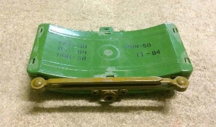

Зображення © Данський центр розвідки й утилізації вибухових боєприпасів (Danish EOD and Search Center)

| СУБКАТЕГОРІЯ ОЗБРОЄННЯ          | Протипіхотна осколкова міна направленої дії |
| ------------------------------- | ------------------------------------------- |
| СПОРЯДЖЕННЯ БОЙОВОЇ ЧАСТИНИ (г) | 700 г, вибухова речовина ПВВ-5A             |
| ПОВНА МАСА (г)                  | 2 000 г                                     |
| РОЗМІРИ (мм)                    | 226 x 156 x 66                              |
| КРАЇНА ПОХОДЖЕННЯ               | Росія/Болгарія                              |
| ПІДРИВНИК                       | МУВ/ВПФ/ЕПДр/НМ із МД-5                     |

МОН означає «міна осколкова направленої дії». Вона була розроблена як радянська версія міни М18 Claymore. Це протипіхотна осколкова міна направленої дії. Вона має пластиковий корпус зеленого або коричневого кольору. На ввігнутому боці надруковано «МОН-50» з відповідним заводським маркуванням. У російській версії міни з іншого опуклого боку на пластику чорною фарбою нанесена фраза «К ПРОТИВНИКУ» («до противника»). Міна містить 700 г пластичної вибухової речовини 5А (ПВВ-5А) на основі гексогену з 20 % пластифікатора.

Два гнізда для детонаторів забезпечують два різних способи ініціювання. Наприклад, міна може бути налаштована на ініціювання за командою оператора в одному гнізді підривника, а також ініціюватися жертвою через розтяжку в іншому гнізді підривника. Для ініціації команди ця міна часто використовується з електричним підривником НМ. Для ініціювання розтяжкою найчастіше використовують механічні підривники серії МУВ.

Нещодавно з’явилися повідомлення про те, що протипіхотні міни МОН-50 і МОН-90 були виявлені в Україні з пристроями для захисту від перекидання (нахилу) або захищені протипіхотними фугасними мінами-«сторожами». Міни МОН-50 в Україні також були розміщені поверх ініціювального елемента невилучення МЛ-8. Слід розглянути можливість витягання цих пристроїв за допомогою гачка й мотузки, якщо є підозра щодо міни-пастки.

## МОН-90

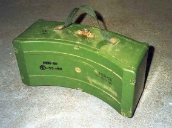

Зображення © Fenix Insight

| СУБКАТЕГОРІЯ ОЗБРОЄННЯ          | Протипіхотна осколкова міна направленої дії |
| ------------------------------- | ------------------------------------------- |
| СПОРЯДЖЕННЯ БОЙОВОЇ ЧАСТИНИ (г) | 6 200 г, вибухова речовина ПВВ-5A           |
| ПОВНА МАСА (г)                  | 12 100 г                                    |
| РОЗМІРИ (мм)                    | 345 x 202 x 153                             |
| КРАЇНА ПОХОДЖЕННЯ               | Росія/Болгарія                              |
| ПІДРИВНИК                       | МУВ/ВПФ/ЕПДр/НМ із МД-5                     |

Це більша за розміром версія МОН-50 із більшою дистанцією ураження. Позначення «МОН-90» вказує на ефективну дальність ураження 90 м.

На відміну від МОН-50, МОН-90 не оснащена опорами-ножицями. Вона оснащена лише кріпленням на кілок.

МОН-90 постачається в характерному упакуванні (такого ж розміру, як упакування для мінометної міни калібру 82 мм) із заглибленням для прицільного маркера на кришці, яка скріплює міну. Іноді МОН-90 можна знайти встановленою на цьому ящику для зберігання.

Як і МОН-50, вона має два гнізда для підривників з різьбою М10, що дозволяє використовувати два різних типи підривників. Частина, з якої формуються уламки міни, складається з 2 000 елементів із рубаної сталі, кожен довжиною 7 мм. Для ініціації команди ця міна часто використовується з електричним підривником НМ. Для ініціювання розтяжкою найчастіше використовують механічні підривники серії МУВ.

Міна зазвичай зеленого кольору з трафаретним маркуванням, нанесеним чорною фарбою. На зворотній частині корпусу трафаретом наноситься напис «МОН-90» і номер партії.

## МОН-100

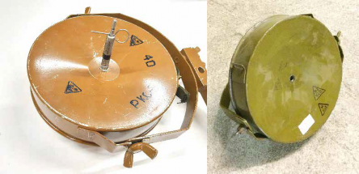

Ліворуч: інертна міна МОН-100 з інертним підривником МУВ-1. Зображення праворуч © Kdo Kamir Зображення праворуч © Данський центр розвідки й утилізації вибухових боєприпасів (Danish EOD and Search Center)

| СУБКАТЕГОРІЯ ОЗБРОЄННЯ          | Протипіхотна осколкова міна направленої дії |
| ------------------------------- | ------------------------------------------- |
| СПОРЯДЖЕННЯ БОЙОВОЇ ЧАСТИНИ (г) | 2 000 г, тротил                             |
| ПОВНА МАСА (г)                  | 5 000 г                                     |
| РОЗМІРИ (мм)                    | 236 x 83                                    |
| КРАЇНА ПОХОДЖЕННЯ               | Росія                                       |
| ПІДРИВНИК                       | МУВ/ВПФ/ЕПДр/НМ із МД-5                     |

МОН-100 є другою найбільшою міною серії МОН. Число «100» вказує на дистанцію смертельного ураження: 100 метрів. МОН-100 й МОН-200 є великими циліндричними осколковими мінами направленої дії, які значно відрізняються від менших за розмірами МОН-50 і МОН-90. Міна має одне гніздо для підривника в центрі ввігнутої сторони корпусу. У нього може вставлятися як електричний, так і неелектричний детонатор. Міна має форму літери U, металеву раму з кілком для встановлення. Металевий каркас має 2 шарніри, які дозволяють орієнтувати міну в певному напрямку. Міна також оснащена брезентовою ручкою на боковій поверхні корпусу для носіння. Частина, з якої формуються уламки міни, складається з 400 елементів із рубаної сталі, кожен довжиною 10 мм. Фрагментувальний елемент поміщається в епоксидну смолу, безпосередньо за опуклою стороною корпусу міни. Завдяки своєму розміру міна зазвичай ініціюється командою за допомогою підривника типу НМ, але вона також може бути ініційована розтяжкою, що зазвичай оснащена механічним підривником типу МУВ.

## МОН-200

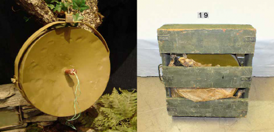

Зображення ліворуч © Fenix. Зображення праворуч © Роберт Фрідель (Robert Friedel)

| СУБКАТЕГОРІЯ ОЗБРОЄННЯ          | Протипіхотна осколкова міна направленої дії |
| ------------------------------- | ------------------------------------------- |
| СПОРЯДЖЕННЯ БОЙОВОЇ ЧАСТИНИ (г) | 12 000 г, тротил                            |
| ПОВНА МАСА (г)                  | 25 000 г                                    |
| РОЗМІРИ (мм)                    | 434 x 130                                   |
| КРАЇНА ПОХОДЖЕННЯ               | Росія                                       |
| ПІДРИВНИК                       | МУВ/ВПФ/ЕПДр/НМ із МД-5                     |

МОН-200 — це одна з найбільших (якщо не найбільша) звичайних протипіхотних мін за повною масою вибухової речовини й повною масою боєприпаса, а також найбільша міна серії МОН. Заряд тротилу масою 12 000 г уважався б великим для протитранспортної міни, не кажучи вже про протипіхотну міну. Число «200» вказує на те, що смертельна дистанція ураження становить 200 метрів. Великі розміри міни означають, що вона, на додаток до ураження особового складу, може бути ефективною проти легкоброньованих цілей. Як і МОН-100, МОН-200 має один підривник із різьбою M10 у центрі ввігнутої поверхні корпусу. У нього може вставлятися як електричний, так і неелектричний детонатор. Міна також оснащена брезентовою ручкою на боковій поверхні корпусу для носіння. Уражальні елементи міни — це 900 шматків рубаного сталевого прута. Кожен шматок прута має діаметр 10 мм і довжину 12 мм. Фрагмент поміщається в епоксидну смолу безпосередньо за опуклою стороною корпусу міни.

## ОЗМ-72

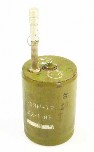 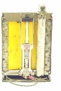

Зображення © Нідерландський центр утилізації вибухових боєприпасів (Dutch EOD Center)

| СУБКАТЕГОРІЯ ОЗБРОЄННЯ          | Протипіхотна міна, що вистрибує |
| ------------------------------- | ------------------------------- |
| СПОРЯДЖЕННЯ БОЙОВОЇ ЧАСТИНИ (г) | 660 г, тротил                   |
| ПОВНА МАСА (г)                  | 5 000 г                         |
| РОЗМІРИ (мм)                    | 172 x 108                       |
| КРАЇНА ПОХОДЖЕННЯ               | Росія                           |
| ПІДРИВНИК                       | Ініціатор: МУВ/ВПФ/НМ           |

ОЗМ-72 (осколково-загороджувальна міна 72) є осколковою міною, що вистрибує, з більшим зарядом бризантної вибухової речовини, ніж її попередні версії ОЗМ-3 й ОЗМ-4.

Чавунний внутрішній корпус міни міститься в зовнішньому корпусі з листової сталі. Верхня частина міни має зміщене гніздо з різьбою для підривника й центральне гніздо для детонатора, закрите сталевою пробкою. Уражальні елементи цієї міни мають вигляд попередньо сформованих фрагментів рубаного сталевого прута. Міна зазвичай ініціюється розтяжкою, частіше за все механічним підривником МУВ, але її також можна ініціювати електричним ініціатором типу НМ. Міна також може бути ініційована підривником МВУ-П (пов’язаним із вимикачем ВП 12/13 із сейсмічним ініціюванням). Міна також може бути оснащена підривником МВЕ-72 з обривним датчиком кола. Коли ініціюється підривник, вибивний заряд чорного пороху в основі міни виштовхує внутрішню частину боєприпаса в повітря. Коли міна досягає висоти 1 м, натягується дріт троса, що тягне ударник донизу, стискаючи його пружину. Стиснення пружини дозволяє фіксувальним кулькам вийти й випустити ударник у чутливий до удару детонатор, тим самим ініціюючи основний заряд. ОЗМ-72 зазвичай постачається в комплектах по шість мін у дерев’яній коробці з пінопластовими пакувальними вкладишами, які, якщо викинуті поблизу місця розташування мін, можуть бути індикатором їхньої наявності.

Після ініціювання, корпус ОЗМ-72 з великою долею ймовірності залишиться в ґрунті з під’єднаним до нього шнуром. Хоча він може здаватися нешкідливим, під цим корпусом може залишатися будь-який елемент невилучення. Відомо, що дана міна використовувалася разом з елементами невилучення МС-3, МЛ-7 і МЛ-8. Рекомендується проявляти обережність.

## ПФМ-1

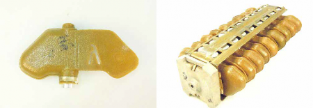

Зображення © Нідерландський центр утилізації вибухових боєприпасів (Dutch EOD Center)

| СУБКАТЕГОРІЯ ОЗБРОЄННЯ          | Протипіхотна фугасна міна для дистанційного мінування (SCATMINE) |
| ------------------------------- | ------------------------------------------------------------ |
| СПОРЯДЖЕННЯ БОЙОВОЇ ЧАСТИНИ (г) | 37 г, ВС-6Д                                                  |
| ПОВНА МАСА (г)                  | 75 г                                                         |
| РОЗМІРИ (мм)                    | 120 x 61 x 20                                                |
| КРАЇНА ПОХОДЖЕННЯ               | Росія                                                        |
| ПІДРИВНИК                       | ВГМ-6                                                        |

ПФМ-1 — це протипіхотна міна, яка розкидається за допомогою артилерійських реактивних засобів або скидається з літальних апаратів. Ці міни також можуть установлюватися сухопутними військами. Дана міна є копією міни BLU-43 Dragon’s Tooth. Вона містить порівняно невеликий заряд — 37 г рідкої вибухової речовини. Міна відома під назвою «Лепесток» («пелюсток»). У розмовній мові міни цього типу також мають назву «міни-метелики», хоча це не офіційне позначення. Літера «У», нанесена трафаретом на крилі, означає навчально- тренувальну версію У-ПФМ-1.

Ця міна може розкидатися з диспенсерів КМГУ авіаційного базування або встановлюватися сухопутними військами з використанням ручних метальних контейнерів ПКМ. Вона також може доставлятися за допомогою 122-міліметрових реактивних снарядів 9М22К «Град» або 220-мм реактивних снарядів 9М27К3 «Ураган». Контейнер КСФ-1 містить 8 ярусів по 9 ПФМ-1С на кожному (зображення праворуч зверху). Якщо доцільно, спеціалістам зі знешкодження ВНП слід спробувати виявити засоби доставки, щоб оцінити ймовірний розмір мінного поля. Алюмінієві затискачі КСФ-1 іноді є хорошим візуальним індикатором наявності мін ПФМ.

Міну можна порівняно легко виявити, і хоча підривник виготовляється переважно з алюмінію, в ньому присутні сталеві компоненти (пружини, стопорні кульки й т. ін.). Як різновид мін для дистанційного мінування, ці вироби зазвичай знаходять на поверхні. Підривник ініціюється гідравлічним тиском рідкої вибухової речовини ВС-6Д в замкненому просторі. Підривник спрацьовує, коли на корпус міни діє зусилля в діапазоні приблизно 5-25 кг.

Міна не розрахована на збереження функціональних можливостей протягом багатьох років, оскільки має легкий корпус, який може руйнуватися під дією ультрафіолету. Через токсичний уміст міни слід докласти всіх зусиль, щоб уникнути контакту зі шкірою та вдихання парів у разі розриву пакета із зарядом вибухової речовини ВС-6Д. Існує також модель ПФМ-1С, яка оснащена механізмом самознищення. Механізм самознищення не є дуже надійним, і через нього міна може залишитися в чутливому стані.

## ПМН

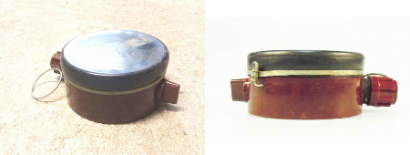

Зображення ліворуч © Данський центр розвідки й утилізації вибухових боєприпасів (Danish EOD and Search Center).

Зображення праворуч © Нідерландський центр утилізації вибухових боєприпасів (Dutch EOD Center)

| СУБКАТЕГОРІЯ ОЗБРОЄННЯ          | Протипіхотна фугасна міна                                    |
| ------------------------------- | ------------------------------------------------------------ |
| СПОРЯДЖЕННЯ БОЙОВОЇ ЧАСТИНИ (г) | Основний заряд: 220—240 г, тротил. Проміжний детонатор: 9 г, тетрил. |
| ПОВНА МАСА (г)                  | 600 г                                                        |
| РОЗМІРИ (мм)                    | 112 x 57                                                     |
| КРАЇНА ПОХОДЖЕННЯ               | Росія                                                        |
| ПІДРИВНИК                       | МД-9                                                         |

ПМН, імовірно, найпоширеніша протипіхотна міна з будь-яких створених за всі часи. Як для протипіхотної фугасної міни, вона містить відносно великий заряд. До складу підривника МД-9 входить зведений ударник. Після видалення запобіжної зрізної чеки ініціюється затримка зведення міни. Зазвичай затримка переведення в бойове положення становить 12-15 хвилин, але цей час може змінюватися в разі екстремальної температури. Як тільки різак у вигляді стальної струни перерізає свинцевий елемент, ударник утримується від контакту з капсулем-детонатором тільки фіксатором барабана. Фіксатор барабана утримується на місці вертикальною циліндричною пружиною. Якість пружини може погіршитися із часом, що зменшить зусилля утримання фіксатора барабана, і тим самим зробить міну чутливішою до впливу. Підривник сконструйований таким чином, що спрацьовує, коли на натискну пластину діє зусилля приблизно 8—25 кг.`

Якщо металева стрічка все ще знаходиться на кришці, міна може бути легко виявлена. Навіть без металевої стрічки в міні присутня достатня кількість металевих компонентів, які роблять цю міну порівняно легкою для виявлення.

У більшості випадків міна має коричневий бакелітовий корпус, однак також вироблялися версії в зеленому пластиковому корпусі. Копіювання даної міни було поширено в різних країнах, іноді з невеликими змінами в конструкції. ПМН є дуже схожою за конструкцією з елементом невилучення МС-3, і потрібно бути дуже уважним, щоб не переплутати МС-3 з ПМН.

Рекомендується не чіпати ці міни й знищувати їх на місці.

## ПМН-2

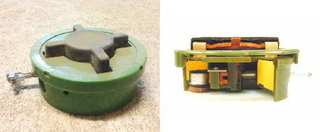

Зображення ліворуч © Данський центр розвідки й утилізації вибухових боєприпасів (Danish EOD and Search Center).

Зображення праворуч © Нідерландський центр утилізації вибухових боєприпасів (Dutch EOD Center)

| СУБКАТЕГОРІЯ ОЗБРОЄННЯ          | Протипіхотна фугасна міна                         |
| ------------------------------- | ------------------------------------------------- |
| СПОРЯДЖЕННЯ БОЙОВОЇ ЧАСТИНИ (г) | 100 г TG-40 (гексоген (RDX) / тротил (TNT) 60/40) |
| ПОВНА МАСА (г)                  | 420 г                                             |
| РОЗМІРИ (мм)                    | 120 x 53                                          |
| КРАЇНА ПОХОДЖЕННЯ               | Росія                                             |

ПМН-2 є протипіхотною фугасною міною. Ця міна має характерну хрестоподібну гумову натискну пластину, призначену для обмеження чутливості міни до надлишкового тиску вибухової хвилі. Корпус міни виготовлений із пластику методом лиття під тиском і зазвичай має зелений колір. Є деякі неофіційні свідчення того, що пластиковий корпус цієї міни може утворювати пластикові уламки, які хірургам дуже важко видалити, що часто призводить до інфекцій і можливих подвійних ампутацій нижніх кінцівок. Міна містить менше половини вибухової речовини, яка присутня в ПМН, хоча використовується більш потужна вибухова речовина ТГ-40 на основі гексогену (RDX).

Як і в ПМН, у ПМН-2 використовується поперечна система підривника, хоча реальна система підривника помітно відрізняється. Підривник ПМН-2 містить зведений ударник і вбудований детонатор. На відміну від відносно простої свинцевої зрізної чеки, яка ініціює затримку зведення в ПМН, у ПМН-2 передбачено набагато складніший механізм зведення. До його складу входить пневматичний сильфон і пружинний детонатор. Для зведення міни повертають і витягують із корпусу Т-подібний ключ для зведення на бічній поверхні корпусу. Коли до натискної пластини докладається вагове зусилля приблизно 15 кг, вона тисне на центральний поршень, що дозволяє детонатору переміститися в одну лінію з ударником.

Міна часто зберігається в білому упакуванні з пінополістиролу і, якщо її викинули поблизу місця встановлення міни, це може бути індикатором присутності міни десь поблизу. Викинуті ключі зведення міни також можуть бути добрим візуальним індикатором.

## ПМН-4

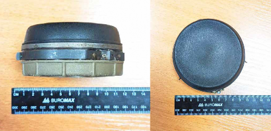

Зображення © Шон Мурхаус (Sean Moorhouse)

| СУБКАТЕГОРІЯ ОЗБРОЄННЯ          | Протипіхотна фугасна міна |
| ------------------------------- | ------------------------- |
| СПОРЯДЖЕННЯ БОЙОВОЇ ЧАСТИНИ (г) | 52—60 г, тротил / ТГ-40   |
| ПОВНА МАСА (г)                  | 300 г                     |
| РОЗМІРИ (мм)                    | 95 x 42                   |
| КРАЇНА ПОХОДЖЕННЯ               | Росія                     |

ПМН-4 є протипіхотною фугасною міною. Міна складається з пластикового корпусу з неопреновою кришкою, яка закриває натискну пластину, виготовлену з нержавіючої сталі. Механізм запалу вміщений у литий алюмінієвий кожух усередині корпусу міни й оточений основним зарядом вибухової речовини. Міна оснащена сталевою запобіжною чекою, яка приєднана до дроту, закріпленого, своєю чергою, на механізмі зведення. Видалення запобіжної чеки призводить до того, що приєднаний дріт обертає механізм зведення підривника. Це, своєю чергою, вивільняє пружинний поршень у в’язкому гелі. Затримка зведення міни залежить від температури й становить приблизно від 1 до 40 хвилин. Після повного зведення, прикладення тиску до натискної пластини підійме блок, і підпружинений ударник зможе наколоти детонатор міни. Підривник сконструйований таким чином, що спрацьовує, коли на натискну пластину діє зусилля приблизно 5—10 кг.

Заряд тротилу відносно невеликий у порівнянні з попередніми моделями — його маса дорівнює 60 г. Деякі джерела стверджують, що для заряду вибухової речовини використовується ТГ-40.

ПМН-4 не є міною з мінімальною присутністю металу, і її відносно легко виявити.

Ця міна може встановлюватися разом з елементами невилучення МС-3, МЛ-7 і МЛ-8. Рекомендується проявляти обережність.

## ПОМ-2С

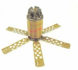 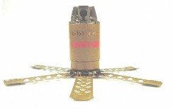

Зображення © Нідерландський центр утилізації вибухових боєприпасів (Dutch EOD Center)

| СУБКАТЕГОРІЯ ОЗБРОЄННЯ          | Протипіхотна осколкова міна (дистанційного мінування) |
| ------------------------------- | ----------------------------------------------------- |
| СПОРЯДЖЕННЯ БОЙОВОЇ ЧАСТИНИ (г) | 140 г, тротил                                         |
| ПОВНА МАСА (г)                  | 1 600 г                                               |
| РОЗМІРИ (мм)                    | 180 x 63                                              |
| КРАЇНА ПОХОДЖЕННЯ               | Росія                                                 |
| ПІДРИВНИК                       | Механічний із натяжними датчиками цілі.               |

ПОМ-2С є протипіхотною осколковою міною дистанційного мінування, яка може доставлятися до цілі різними засобами, у тому числі з вертольота, літака з фіксованою геометрією крила й із використанням реактивних систем залпового вогню. Міна також може бути доставлена вручну методом подібним до використовуваного системою доставки ПКМ. Міна може входити до складу комплекту із чотирьох мін в одному контейнері КПОМ-2. 122-мм реактивні снаряди 9М18 «Град» можуть нести 5 мін. 220-мм реактивні снаряди 9M59 «Ураган» можуть нести дев’ять мін ПОМ-2С. Повний залп 16 ракетами з однієї пускової установки «Ураган» може створити мінне поле зі 144 мін. Якщо знайдено одну міну, можна припустити наявність і інших. Інша версія цієї міни ПОМ-2Р, яка використовується спецназом, також може встановлюватися вручну. Цей варіант міни має піротехнічний запальний шнур.

Корпус являє собою литий сталевий циліндр, оснащений диспенсером із нержавіючої сталі, який викидає натяжні датчики цілі (дроти) з верхньої частини. Диспенсер дротів містить чотири підпружинених дроти, кожен з яких має довжину 9,5 м. Система підривника розташована у вертикальному гнізді, що проходить через середину корпусу міни. У верхній частині підривника міститься зведений ударник з основним детонатором і проміжним детонатором під ним. До основи міни приєднано шість підпружинених ребер.

Підривник надзвичайно чутливий, і для його спрацювання потрібна дія лише приблизно 300 г ваги на один із 4 дротів. Уважається, що механізм самознищення спрацьовує в період від 4 до 100 годин після зведення підривника. Якщо міна знайдена після закінчення цього періоду, вона може бути в чутливому й небезпечному стані. Цю міну неможливо ані знешкодити, ані перевести в безпечний стан.

## ПОМ-3

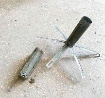

Зображення © SESU

| СУБКАТЕГОРІЯ ОЗБРОЄННЯ          | Протипіхотна осколкова міна (дистанційного мінування)        |
| ------------------------------- | ------------------------------------------------------------ |
| СПОРЯДЖЕННЯ БОЙОВОЇ ЧАСТИНИ (г) | 100 г, вибухова речовина A-IX-1                              |
| ПОВНА МАСА (г)                  | 1 200 г                                                      |
| РОЗМІРИ (мм)                    | 183 x 60                                                     |
| КРАЇНА ПОХОДЖЕННЯ               | Росія                                                        |
| ПІДРИВНИК                       | Електричний підривник із сейсмічними датчиками й мікропроцесорним управлінням |

ПОМ-3 є новим типом протипіхотної міни, призначеної для дистанційного мінування, яка до цього часу доставлялася до цілі інженерною системою дистанційного мінування «Земледелие» («Землеробство»). Міну іноді називають «Медальон» («Медальйон»). Уважається, що ця міна також може бути доставлена за допомогою гелікоптерів або касетних систем КПОМ, розміщених на вантажних автомобілях. Зовні міна схожа на ПОМ-2С тим, що основний корпус — циліндричний і має шість підпружинених опор. Є ознаки того, що ПОМ-3 містить певний тип сейсмічного датчика, який установлюється в землю під міною, що знаходиться у вертикальному положенні. На відміну від ПОМ-2С, ПОМ-3 не оснащена розтяжками. Повідомляється, що міна містить сейсмічний датчик на основі електронного мікропроцесора, який здатен розрізняти амплітуду кроків звичайної людини й запобігати іншим хибним спрацюванням, наприклад, у випадку дикої тварини або транспортних засобів.

У разі спрацювання, міна діє так само як і осколкова міна, що вистрибує, бо бойова частина перед детонацією підіймається на висоту 1-1,5 м над землею. Уважається, що ПОМ-3 здатна до програмованого самознищення, але доступні періоди затримки невідомі. Невідомо, чи містить ця міна будь-який елемент невилучення, а також чи залежить підривник від терміну служби батареї або конденсатора.

Ураховуючи, що ця міна спрацьовує на сейсмічні сигнали переміщення людини, ручні методи нейтралізації не рекомендуються. Доречним може бути дистанційне застосування підривних зарядів або стрільба зі стрілецької зброї з безпечної відстані. Рекомендується поводитися із цією міною вкрай обережно.

## M18A1 «КЛЕЙМОР»/CLAYMORE

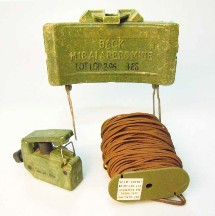

Image © Dutch EOD Center

| СУБКАТЕГОРІЯ ОЗБРОЄННЯ          | Протипіхотна осколкова міна направленої дії   |
| ------------------------------- | --------------------------------------------- |
| СПОРЯДЖЕННЯ БОЙОВОЇ ЧАСТИНИ (г) | 680 г вибухової речовини C4                   |
| ПОВНА МАСА (г)                  | 1590 г                                        |
| РОЗМІРИ (мм)                    | 216x172x35 мм                                 |
| КРАЇНА ПОХОДЖЕННЯ               | США                                           |
| ПІДРИВНИК                       | Запальний пристрій M57 і капсуль-детонатор M4 |

М18A1 «Клеймор» — це перша у світі осколкова міна направленої дії, що виготовлялася фабрично. Її призначено для керованого приведення в дію. Корпус міни M18A1 має форму вигнутого прямокутника оливково-сірого кольору, відлитого з пластмаси армованої скловолокном. Лицева поверхня вкрита стальними кульками, розташованими в пластмасовій матриці. Тильна частина корпусу за матрицею містить вибухову речовину C4. Поверхня утворення осколків опукла по горизонталі, що дає змогу спрямовувати осколки в межах 60-градусної дуги, і ввігнута по вертикалі, щоб обмежувати розліт осколків у вертикальному напрямку. Вбудоване прицільне приладдя та дві пари складаних ніжок-ножиць дають змогу встановлювати міну прицільно. У верхній частині міни розташовано два гнізда для підривників. Завдяки цьому міну можна приводити в дію з двох різних розташувань. Гнізда запечатано глухим кінцем пакувальної запобіжної пробки/запальної з’єднувальної муфти. Коли міна зводиться в бойовий стан, муфта встановлюється іншим кінцем. Тоді кінець із прорізями використовується для утримання капсуля-детонатора. Відомо про випадки, коли аналогічні осколкові міни направленої дії використовувалися з мінами-пастками або встановлювалися разом із прихованими протипіхотними фугасними мінами. Рекомендується проявляти обережність. Якщо використовується керований спосіб приведення в дію, ця міна не порушує Конвенцію про заборону застосування, накопичення запасів, виробництва і передачі протипіхотних мін та про їхнє знищення.