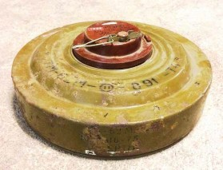
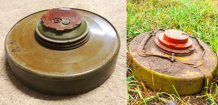
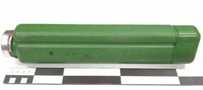
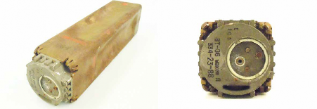
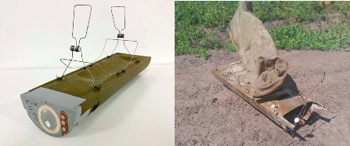
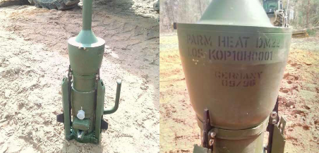
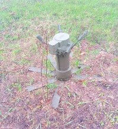
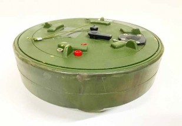
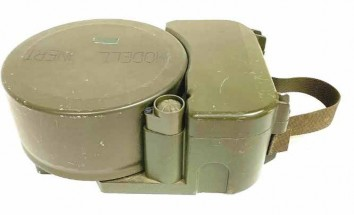

#### ПРОТИТРАНСПОРТНІ МІНИ
## ТМ-62M

Зображення © Данський центр розвідки й утилізації вибухових боєприпасів (Danish EOD and Search Center)

| СУБКАТЕГОРІЯ ОЗБРОЄННЯ          | Протитранспортна міна                      |
| ------------------------------- | ------------------------------------------ |
| СПОРЯДЖЕННЯ БОЙОВОЇ ЧАСТИНИ (г) | 7 500-8 500 г, тротил або морська суміш    |
| ПОВНА МАСА (г)                  | 9 500 г                                    |
| РОЗМІРИ (мм)                    | 320 x 128                                  |
| КРАЇНА ПОХОДЖЕННЯ               | Росія                                      |
| ПІДРИВНИК                       | МВЧ-62/МВП-62/МВП-62М/МВН-72/МВН-80/МВД-62 |

TM-62M — це протитранспортна фугасна міна в металевому корпусі, яка була розроблена на основі попередньої моделі TM-57. У міні передбачено одне велике металеве центральне гніздо для підривника, застосовується проміжний детонатор у металевому корпусі, який розташовується на дні гнізда для підривника. Як і всі інші міни серії TM-62, міна моделі TM-62M може споряджатися будь-якими підривниками, розробленими для серії мін ТМ-62, TM-72 та TM-80. Таким чином, ця міна може потенційно бути споряджена різними магнітними підривниками певної номенклатури. Міна TM-62M зазвичай споряджається підривником МВЧ-62 натискної дії, який містить зведений ударник, утримуваний кульками. Міна переводиться в бойове положення шляхом видалення запобіжної чеки з кнопки зведення. Таким чином запускається годинниковий механізм затримки переведення в бойове положення, коли підпружинений ударник переміщується з горизонтального положення у вертикальне, утворюючи єдину лінію з детонатором. Після переведення в бойове положення дія ваги більш ніж 150 кг ініціюватиме підривник.

Зображення угорі показує міну зі встановленим підривником МВП-62 з мінімальним умістом металу. Якщо міна встановлена в полі в такий спосіб, це буде марною тратою підривника й указуватиме на потенційну недостатню підготовку або відсутність підривників інших типів у тих, хто встановив міну.

Згідно з підтвердженими даними, ТМ-62М широко використовується в Україні з 2014 року. Відомо, що серед інших місць, ТМ-62М установлюється також на блок-постах.

## TM-62ПЗ

Зображення ліворуч © Данський центр розвідки й утилізації вибухових боєприпасів (Danish EOD and Search Center).

Зображення праворуч © Ролі Еванс (Roly Evans)

| СУБКАТЕГОРІЯ ОЗБРОЄННЯ          | Протитранспортна міна                                        |
| ------------------------------- | ------------------------------------------------------------ |
| СПОРЯДЖЕННЯ БОЙОВОЇ ЧАСТИНИ (г) | 6 500-7500 г, тротил, морська суміш                          |
| ПОВНА МАСА (г)                  | 8 000 г                                                      |
| РОЗМІРИ (мм)                    | 310 x 85                                                     |
| КРАЇНА ПОХОДЖЕННЯ               | Росія/Болгарія                                               |
| ПІДРИВНИК                       | МВЧ-62 (угорі ліворуч)МВП-62 (мінімальний уміст металу) (угорі праворуч) |

TM-62ПЗ — це велика протитранспортна фугасна міна у поліетиленовому корпусі, яка була розроблена на основі попередньої моделі TM-62M. Міна має одне велике центральне гніздо для підривника й проміжний детонатор, установлений в основу міни. Проміжний детонатор містить 180 г пресованого тротилу. Міна ТМ-62ПЗ має характерний брезентовий ремінь, який обертається навколо корпусу міни. (Див. зображення вгорі праворуч). Як і всі інші міни серії ТМ-62, міна моделі ТМ-62ПЗ може споряджатися будь-якими підривниками, розробленими для серії мін ТМ-72 й ТМ-80. Таким чином, ця міна може бути споряджена різними магнітними підривниками певної номенклатури. Міна моделі ТМ-62ПЗ може вважатися міною з мінімальною присутністю металу коли споряджена підривником МВП. Існують різні точки зору щодо того, наскільки легко можна виявити таку міну, оснащену підривником МВП.

## ПТМ-1

Зображення © Kdo Kamir

| СУБКАТЕГОРІЯ ОЗБРОЄННЯ          | Протитранспортна міна                |
| ------------------------------- | ------------------------------------ |
| СПОРЯДЖЕННЯ БОЙОВОЇ ЧАСТИНИ (г) | 1 100 г, вибухова речовина ПВВ-12С-1 |
| ПОВНА МАСА (г)                  | 8 000 г                              |
| РОЗМІРИ (мм)                    | 310 x 85                             |
| КРАЇНА ПОХОДЖЕННЯ               | Росія                                |
| ПІДРИВНИК                       | МВДМ-Г                               |

ПТМ-1 — це протитранспортна міна дистанційного мінування. Зазвичай мінування здійснюється із застосуванням 122-мм та 220-мм снарядів реактивних систем залпового вогню. ПТМ-1 не призначена для встановлення вручну. Для ПТМ-1 застосовується підривник МВДМ, який містить гідромеханічний механізм самознищення й піротехнічний елемент взведення. Підривник МВДМ спрацьовує, коли на корпус міни діє зусилля в діапазоні приблизно 150-400 кг. Переведення в бойове положення міни ПТМ-1 починається, коли вона викидається з диспенсера й спрацьовує піротехнічний елемент взведення. Міна переводиться в бойове положення із затримкою 60—100 секунд. Після зазначеної затримки підпружинений стрижень вирівнює осі детонатора, ударника й гідравлічного підривника із запалом. Після того як міна перейшла в бойове положення, а до її корпусу було прикладено достатнє вагове зусилля, рідка вибухівка проштовхується через отвори в корпусі підривника. Це піднімає діафрагму та внутрішні компоненти підривника, поки дві фіксувальні кульки не змістяться й тим самим не звільнять зведений ударник та підірвуть міну. Механізм самознищення складається з іншого зведеного ударника й запалу. На заводі його можуть встановити на спрацювання після 6, 12 або 20 годин. Такі міни не можна перевести зі зведеного в безпечне положення або нейтралізувати за допомогою ручних засобів. До мін ПТМ-1 не слід наближатися протягом періоду їх самознищення. Якщо такі міни виявляються за межами ракети-носія, вони повинні вважатися мінами у зведеному положенні. ПТМ-1 попередньо була відома як ПГМДМ, отже абревіатуру ПГМДМ не слід і надалі використовувати для позначення цієї моделі міни.

## ПТМ-3

Зображення © Нідерландський центр утилізації вибухових боєприпасів (Dutch EOD Center)

| СУБКАТЕГОРІЯ ОЗБРОЄННЯ          | Протитранспортна міна                                        |
| ------------------------------- | ------------------------------------------------------------ |
| СПОРЯДЖЕННЯ БОЙОВОЇ ЧАСТИНИ (г) | 1 800 г, вибухова речовина ТГ-40 (гексоген (RDX) / тротил (TNT) 60/40) |
| ПОВНА МАСА (г)                  | 4 900 г                                                      |
| РОЗМІРИ (мм)                    | 330 x 84 x 84                                                |
| КРАЇНА ПОХОДЖЕННЯ               | Росія                                                        |
| ПІДРИВНИК                       | Магнітний підривник БТ-06                                    |

ПТМ-3 — це протитранспортна міна дистанційного мінування з магнітним підривником. Міни, зазвичай, розкидаються з контейнера КПТМ-3 (у кожному контейнері по дві міни), який може бути встановлений на транспортних засобах і гелікоптерах. Розкидання може проводитися за допомогою снарядів калібру 122 мм до реактивних систем залпового вогню «Град» (9М22К), снарядів БМ-27 калібру 220 мм РСЗВ «Ураган» (9M59) і снарядів калібру 300 мм РСЗО «Смерч» (9M55K4). Також можливо встановлювати ці міни вручну за допомогою системи запуску з контейнера ПКМ/КПТМ. Міна призначена для ураження броньованого днища танку. Ця міна споряджена кумулятивним зарядом вибухової речовини ТГ-40 (гексоген (RDX) / тротил (TNT) 60/40) масою 1 800 г. В якому б напрямку не приземлилася міна, кумулятивний заряд буде орієнтований угору, оскільки на кожному боці знаходиться мідна подовжена ввігнута виїмка із зарядом ТГ-40 масою 1 800 г.

Коли міна ПТМ-3 викидається з касети, відбувається запалювання послідовності піротехнічних зарядів, які переводять підривник у бойове положення приблизно за 60 секунд. ПТМ-3 містить установлений магнітний підривник БТ-06 із батареєю живлення. Якщо ціль самостійно не натрапить на міну, ця міна, теоретично, має здійснити самознищення за період 16-24 години після встановлення.

У зв’язку з магнітним принципом спрацювання, будь-яка спроба переміщення зведеної міни може призвести до детонації. Як і у випадку з будь-якими чутливими підривниками, слід уживати запобіжних заходів, передбачених у разі мінімальної присутності металу. До мін ПТМ-3 не слід наближатися протягом періоду їх самознищення. Для знищення мін ПТМ-3, знайдених у касетах КПТМ-3, слід використовувати значні заряди, оскільки застосування невідповідної маси заряду може призвести до переведення мін ПТМ-3 в бойове положення, якщо вони будуть викинуті з касети під час знищення методом підриву.

## ПТМ-4

Зображення © Fenix

| СУБКАТЕГОРІЯ ОЗБРОЄННЯ          | Протитранспортна міна                              |
| ------------------------------- | -------------------------------------------------- |
| СПОРЯДЖЕННЯ БОЙОВОЇ ЧАСТИНИ (г) | 1 400 г                                            |
| ПОВНА МАСА (г)                  | 3 250 г                                            |
| РОЗМІРИ (мм)                    | 350 x 110 x 55                                     |
| КРАЇНА ПОХОДЖЕННЯ               | Росія                                              |
| ПІДРИВНИК                       | Магнітний підривник ВТ-14, що живиться від батареї |

ПТМ-4 — це протитранспортна міна дистанційного мінування з магнітним підривником. Міни, зазвичай, розкидаються з контейнера КПТМ-4 (у кожному контейнері по дві міни), який може бути встановлений на транспортних засобах і вертольотах. За оцінками, ця міна може бути доставлена до цілі реактивними системами залпового вогню великого калібру (220 і 300 мм). Також ця міна може бути встановлена вручну за допомогою системи запуску з контейнера ПКМ/КПТМ. ПТМ-4 відрізняється тканинним парашутом, який розкривається під дією пружини після викидання з контейнера. На зображенні вище показано міни із частково від’єднаним тканинним парашутом і видимими пружинами. ПТМ-4 містить установлений магнітний підривник ВТ-14 із батареєю живлення. Якщо ціль самостійно не натрапить на міну, ця міна, теоретично, має здійснити самознищення наприкінці запрограмованого періоду. Цей період може становити: 8, 12, 24, 48 годин або до 120 діб.

Відносно мало відомо про цю міну, зокрема про рівень магнітного впливу, необхідний для ініціювання системи підривника. Будь-який рух зведеної міни може з високою ймовірністю призвести до детонації. Як і у випадку з будь-якими чутливими підривниками, персоналу, що здійснює розвідку чи очищення, слід уживати запобіжних заходів, передбачених у разі мінімальної присутності металу. До мін ПТМ-4 не слід наближатися протягом періоду їх самознищення. Для знищення мін ПТМ-4, знайдених у касетах КПТМ-4, слід використовувати значні заряди, оскільки застосування невідповідної маси заряду може призвести до переведення мін ПТМ-4 в бойове положення, якщо вони будуть викинуті з касети під час знищення методом підриву.

## PARM 2/DM-22

Зображення © З відкритих джерел

| СУБКАТЕГОРІЯ ОЗБРОЄННЯ          | Протитранспортна позашляхова міна |
| ------------------------------- | --------------------------------- |
| СПОРЯДЖЕННЯ БОЙОВОЇ ЧАСТИНИ (г) | Невідомо. За оцінками: 1 900 г    |
| ПОВНА МАСА (г)                  | 20 000 г                          |
| РОЗМІРИ (мм)                    |                                   |
| КРАЇНА ПОХОДЖЕННЯ               | Німеччина                         |

Про DM-22 відомий невеликий обсяг даних. Міна була розроблена на основі попередньої версії DM-12. Її німецьке позначення перекладається як «міна для ураження бронезахисту», DM-22, з кумулятивним зарядом, напрямної дії. Вважається, що ця міна містить ракету з хвостовим стабілізатором і кумулятивною бойовою частиною.

Міна може використовувати інфрачервоний датчик SAPIR і бути активною до 30 днів після застосування. Міна має самонейтралізуватися після запрограмованого періоду. Вона також може бути ініційована за командою.

## ПТКМ-1Р

Зображення © З приватних джерел

| СУБКАТЕГОРІЯ ОЗБРОЄННЯ          | Протитранспортна |
| ------------------------------- | ---------------- |
| СПОРЯДЖЕННЯ БОЙОВОЇ ЧАСТИНИ (г) | Невідомо         |
| ПОВНА МАСА (г)                  | 19 900 г         |
| РОЗМІРИ (мм)                    | 510 x 220        |
| КРАЇНА ПОХОДЖЕННЯ               | Росія            |
| ПІДРИВНИК                       | Невідомо         |

Ця протитранспортна міна, яка встановлюється вручну, була показана лише на ярмарках зброї у 2021 році. Про неї існує порівняно мало інформації.

Міна оснащена чотирма акустичними й двома сейсмічними датчиками. Виробники стверджують, що міна може класифікувати й вибирати цілі з пріоритетом для бронетехніки. Після ініціації боєприпас/суббоєприпас із сенсорним підривником (SFM/SFS) запускається в повітря, щоб уразити ціль зверху за допомогою ударного ядра (EFP). Ударне ядро скеровується інфрачервоними сенсорами, які вистрілюються в повітря як частина бойової частини. Імовірно, що така міна буде застосовуватися поблизу маршрутів або ймовірних зон із високою інтенсивністю руху.

ПТКМ-1Р оснащена механізмом самознищення, найбільший період затримки в якого становить 10 діб. Спеціалістам зі знешкодження ВНП слід ураховувати стандартний період очікування під час роботи з такою міною. Інформація щодо того, чи містить міна будь-який елемент невилучення відсутня.

## DM-31

Зображення © Швейцарський центр утилізації вибухових боєприпасів (Swiss EOD Center)

| СУБКАТЕГОРІЯ ОЗБРОЄННЯ          | Протитранспортна міна — ударне ядро |
| ------------------------------- | ----------------------------------- |
| СПОРЯДЖЕННЯ БОЙОВОЇ ЧАСТИНИ (г) | 3900—4000 г тротилу / гексогену     |
| ПОВНА МАСА (г)                  | 8400 г                              |
| РОЗМІРИ (мм)                    | 254x134 мм                          |
| КРАЇНА ПОХОДЖЕННЯ               | Швеція / Німеччина                  |

DM-31 (Panzerabwehrverlegemine DM31 – протитанкова міна DM-31) — це сенсорна протитранспортна міна повної ширини дії, розроблена в 1970-х роках. Це німецький варіант шведської міни FFV 028. Завдяки ефекту Мізнея-Шардіна в момент спрацьовування формується ударне ядро, що наносить удар у донну частину броньованого транспортного засобу. Підривник спрацьовує через магнітний вплив. Зведення відбувається із затримкою в 60 хвилин.

Через такий принцип роботи підривника міна схильна до передчасного спрацьовування у випадку наближення до неї з ручними або встановленими на транспорт міношукачами. Як наслідок, цей виріб слід вважати джерелом високого ризику для спеціалістів зі знешкодження ВНП і розмінування. Якщо в районі дій є ознаки застосування таких мін, слід застосовувати такі методи обстеження та розмінування, які не спричинять спрацьовування підривника.

## HPD-2A2

Зображення © Швейцарський центр утилізації вибухових боєприпасів (Swiss EOD Center)

| СУБКАТЕГОРІЯ ОЗБРОЄННЯ          | Протитранспортна міна — ударне ядро               |
| ------------------------------- | ------------------------------------------------- |
| СПОРЯДЖЕННЯ БОЙОВОЇ ЧАСТИНИ (г) | 2800 г речовини Composition B (гексоген / тротил) |
| ПОВНА МАСА (г)                  | 7000 г                                            |
| РОЗМІРИ (мм)                    | 278x189x104 мм                                    |
| КРАЇНА ПОХОДЖЕННЯ               | Франція                                           |

HPD-2 — це сенсорна протитранспортна міна повної ширини дії. У ній використовується кумулятивний заряд форми Мізнея-Шардіна. Повна назва міни французькою — MI AC HPD F2. Вона означає «Mine Antichar à Haut Pouvoir de Destruction Modèle F2» — «протитанкова міна великої потужності, модель F2». Спрацьовування міни забезпечує датчик взаємної індукції. Міна HPD-2 складається з двох основних вузлів. Перший — це електронний вузол підривника, що містить датчик, електроніку управління, блок запобіжника та зведення, а також джерело живлення. Другий — це бойова частина міни, що містить заряд вибухової речовини. Міну обладнано перемикачем незнешкоджуваності. Також її можна запрограмувати на самоліквідацію або самостійне зняття з бойового зведення за певний період часу. Через такий принцип роботи підривника міна схильна до передчасного спрацьовування у випадку наближення до неї з ручними або встановленими на транспорт міношукачами. Як наслідок, цей виріб слід вважати джерелом високого ризику для спеціалістів зі знешкодження ВНП і розмінування. Якщо в районі дій є ознаки застосування таких мін, слід застосовувати такі методи обстеження та розмінування, які не спричинять спрацьовування підривника. Період активного стану міни після встановлення — 90 днів.