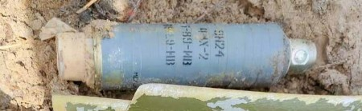

#### СУББОЄПРИПАСИ

## 3B30

Зображення © Державна служба України з надзвичайних ситуацій

| СУБКАТЕГОРІЯ ОЗБРОЄННЯ          | Удосконалений звичайний касетний боєприпас подвійного призначення (кумулятивно-осколковий) |
| ------------------------------- | ------------------------------------------------------------ |
| СПОРЯДЖЕННЯ БОЙОВОЇ ЧАСТИНИ (г) | 46 г, вибухова речовина OMA (на основі октогену (HMX))       |
| ПОВНА МАСА (г)                  | 240 г                                                        |
| РОЗМІРИ (мм)                    | 128 x 43                                                     |
| КРАЇНА ПОХОДЖЕННЯ               | Росія                                                        |
| ПІДРИВНИК                       | Ударно-інерційний із механізмом самознищення                 |

3Б30 — це сучасний удосконалений звичайний касетний боєприпас подвійного призначення (DPICM), який доставляється за допомогою реактивних систем залпового вогню. Цей суббоєприпас також називають «КОБЕ», що означає «кумулятивно-осколковий бойовий елемент».

У разі розміщення в касеті, нижня частина корпусу 3Б30 облягає верхню частину. Після виходу з касети нижня частина бойового елементу виштовхується пружиною вниз, створюючи необхідну відстань від дна кумулятивної виїмки до поверхні, що піддається ураженню. Донний підривник переходить у зведений стан, коли стрічка відкручує механізм постановки в бойове положення під час руху боєприпаса траєкторією спуску. Після зіткнення із землею ударник наколює чутливий до удару детонатор, який ініціює основний заряд. Підривник має вторинний механізм самознищення, який спрацьовує за 130-260 секунд. Касетний бойовий елемент має довжину 62,5 мм коли знаходиться в боєприпасі-носії. Після виходу з касети, під дією пружини, бойовий елемент висувається до своєї робочої довжини 118 мм. 3Б30 містить потужну вибухову речовину OMA на основі октогену (HMX) і мідну кумулятивну виїмку діаметром приблизно 40 мм. Звичайним засобом доставки до цілі є 122-мм ракети 9М218/9М541 РСЗО «Град», що містять 45 касетних бойових елементів, або 300-мм ракети 9М55К РСЗО «Смерч», що містять від 588 до 646 касетних бойових елементів. Також повідомлялося про артилерійський снаряд калібру 152 мм (3-O-33), який містить 42 касетні бойові елементи. Бойові елементи, розкриті на повну довжину, слід уважати як такі, що переведені в бойове положення. Їх слід знищувати на місці.

## 9Н24

Зображення © Державна служба України з надзвичайних ситуацій

| СУБКАТЕГОРІЯ ОЗБРОЄННЯ          | Осколково-фугасний суббоєприпас                              |
| ------------------------------- | ------------------------------------------------------------ |
| СПОРЯДЖЕННЯ БОЙОВОЇ ЧАСТИНИ (г) | 1 480 г вибухової речовини A-IX-2 (гексоген (RDX) із додаванням алюмінію) |
| ПОВНА МАСА (г)                  | 7 450 г                                                      |
| РОЗМІРИ (мм)                    | 373 x 88                                                     |
| КРАЇНА ПОХОДЖЕННЯ               | Росія                                                        |
| ПІДРИВНИК                       | 9E237 ударно-інерційний із механізмом самознищення           |

9Н24 — це осколково-фугасний касетний суббоєприпас, призначений для доставки керованими ракетами. 9Н24 використовувався в Україні й доставлявся балістичними ракетами малого радіуса дії 9M79 «Точка» (класифікація НАТО - SS-21 Scarab). 9Н24 використовує довгу білу стрічку, щоб стабілізувати себе в польоті й орієнтувати боєприпас в його оптимальному положенні, аби забезпечити спрацювання підривника ударної дії. Кожен підривник містить елемент самознищення, який, як повідомляється, спрацьовує за 30-60 секунд після запуску.

Ракета 9M79 «Точка» може бути оснащена бойовими частинами кількох типів. Найпоширенішим варіантом є касетний варіант 9Н123К, що містить 50 суббоєприпасів 9Н24. Характерною рисою ракетних ударів із застосуванням 9Н24 зазвичай є металеві торцеві кришки з маркуванням 9Н24, що виявляють за межами зони ракетного удару. Також у зоні ракетного удару знаходять боєприпаси 9Н24, а основний двигун і корпус ракети 9М79 — за межами зони удару. Аналіз положення виявлених предметів також може допомогти у визначенні напрямку місця з якого був здійснений пуск ракети.

У 9M714 «Ока» (класифікація НАТО - SS-23 Spider) також використовується суббоєприпас 9Н24. Існують докази, що бойова частина 9Н722К5, пов’язана з «Іскандер-М» (класифікація НАТО — SS-26 Stone), може нести 54 великих суббоєприпаси, подібні за типом до 9Н24.

Суббоєприпаси 9Н24, які знаходяться за межами касети, слід уважати як такі, що перебувають у зведеному положенні й підлягають знищенню на місці. Білі стрічки є важливим індикатором того, що було завдано удару касетними боєприпасами. Відмінні ознаки завданого удару, в тому числі на твердих поверхнях, не обов’язково повинні вважатися достатнім доказом такого удару без підкріплення доказів у вигляді стрічок, уламків і металевих торцевих кришок.

## ПТАБ-1M

Зображення © Джон Монтгомері (John Montgomery)

| СУБКАТЕГОРІЯ ОЗБРОЄННЯ          | Кумулятивний суббоєприпас                                 |
| ------------------------------- | --------------------------------------------------------- |
| СПОРЯДЖЕННЯ БОЙОВОЇ ЧАСТИНИ (г) | 110 г, вибухова речовина K991 (на основі гексогену (RDX)) |
| ПОВНА МАСА (г)                  | 934 г                                                     |
| РОЗМІРИ (мм)                    | 260 x 42                                                  |
| КРАЇНА ПОХОДЖЕННЯ               | Росія                                                     |
| ПІДРИВНИК                       | Ударно-інерційний із механізмом самознищення              |

ПТАБ-1M — це кумулятивний касетний протитанковий боєприпас із хвостовим стабілізатором, який доставляється до цілі касетною бомбою РБК-500 ПТАБ 1-M (263 суббоєприпаси), або диспенсером КМГУ, використовуючи БКФ ПТАБ-1М. Донний підривник ударної дії містить піротехнічний елемент самоліквідації із затримкою 20-40 секунд. З огляду на те, як суббоєприпаси розкидаються з РБК, вважається, що цей підривник переходить у бойове положення, принаймні частково, під дією відцентрової сили. Є деякі припущення, що цей суббоєприпас споряджений головним ініціювальним і донним детонувальним підривником ударної дії (PIBD) та схожий на ВП-7 за конструкцією.

У РБК-500 є три секції, які містять 80 суббоєприпасів, а четверта — у хвостовій частині касети — містить 28 суббоєприпасів. Боєприпас РБК-500 містить центральний розривний метальний заряд, який ініціюється попередньо налаштованим підривником із годинниковим механізмом. У разі виходу з ладу підривника бомби або розривного заряду, бомба вдариться об землю, і її корпус буде зруйнований, що призведе до розкидання суббоєприпасів. Абревіатура «ПТАБ» розшифровується як «протитанкова авіабомба». Дана версія була розроблена в 1980-х роках НВО «Базальт». Існує удосконалений варіант ПТАБ-1У. Невідомо, які модифікації передбачені для даної моделі.

Суббоєприпаси ПТАБ-1М, які знаходяться за межами бомбової касети або диспенсера, слід уважати такими, що знаходяться у зведеному положенні й підлягають знищенню на місці.

## СПБЕ

Зображення © З відкритих джерел

| СУБКАТЕГОРІЯ ОЗБРОЄННЯ          | Суббоєприпас із сенсорним підривником — ударне ядро (EFP)  |
| ------------------------------- | ---------------------------------------------------------- |
| СПОРЯДЖЕННЯ БОЙОВОЇ ЧАСТИНИ (г) | 4 500 г                                                    |
| ПОВНА МАСА (г)                  | 15 500 г                                                   |
| РОЗМІРИ (мм)                    | 384 x 185                                                  |
| КРАЇНА ПОХОДЖЕННЯ               | Росія                                                      |
| ПІДРИВНИК                       | Зондування в інфрачервоному/міліметровому діапазонах хвиль |

СПБЕ є протитранспортним суббоєприпасом із парашутом для сповільнення падіння й сенсорним підривником. СПБЕ найчастіше асоціюється з касетними авіабомбами РБК-500, хоча також можуть існувати варіанти доставки боєприпаса реактивними системами залпового вогню. Абревіатура СПБЕ російською означає «Самоприцеливающийся боевой элемент» («бойовий елемент самостійного прицілювання»).

Суббоєприпас СПБЕ має конструкцію бойової частини на основі ударного ядра, і це дає боєприпасу здатність пробити броньовані цілі на значній відстані між дном кумулятивної виїмки й поверхнею, що піддається ураженню (70 мм броні на відстані до 100 метрів). У суббоєприпасі використовується датчик на основі принципу інфрачервоного зондування або в міліметровому діапазоні хвиль. Це забезпечує для суббоєприпаса можливість діяти як протитранспортна міна, якщо під час спуску на парашуті не буде виявлено жодної цілі. Дворежимний інфрачервоний/міліметровий датчик установлений збоку великої бойової частини типу ударного ядра й використовується для виявлення великих металевих об’єктів, таких як броньовані машини. Спуск СПБЕ сповільнюється трьома невеликими парашутами, завдяки чому можна легко ідентифікувати територію, уражену СПБЕ. Суббоєприпаси СПБЕ зазвичай доставляються авіаційною бомбою. Водночас касетна бомба РБК-500 СПБЕ містить 15 суббоєприпасів. Боєприпас РБК-500 містить центральний розривний метальний заряд, який ініціюється попередньо налаштованим підривником із годинниковим механізмом. Уважається, що існують модифіковані версії СПБЕ-Д й СПБЕ-К, хоча неясно, які модифікації внесені до їхньої конфігурації. Настійно рекомендується застосовувати відповідний період очікування перед наближенням до місць, які можливо були уражені СПБЕ. Після ідентифікації не слід наближатися до суббоєприпасів СПБЕ з боку датчика цілі, а в ідеальному випадку слід використовувати дистанційні засоби нейтралізації.

## 9Н210

Зображення © Державна служба України з надзвичайних ситуацій

| СУБКАТЕГОРІЯ ОЗБРОЄННЯ          | Суббоєприпас — осколково-фугасний |
| ------------------------------- | --------------------------------- |
| СПОРЯДЖЕННЯ БОЙОВОЇ ЧАСТИНИ (г) | 270 г А-IX-10                     |
| ПОВНА МАСА (г)                  | 1850 г                            |
| РОЗМІРИ (мм)                    | 265x65                            |
| КРАЇНА ПОХОДЖЕННЯ               | Росія                             |
| ПІДРИВНИК                       | 9Е246 / 9Е246М                    |

9Н210 — це оперені осколково-фугасні суббоєприпаси. Засобом доставки 9Н210 виступає реактивний артилерійський снаряд 9М27К калібру 220 мм. Одна касета містить 30 суббоєприпасів. У 9Н210 використовується 270 г вибухової речовини на основі А-IX-10 і гексогену та готові елементи ураження тільки одного розміру (2 г). Цей суббоєприпас використовується з двома типами підривників — 9Е246 і вдосконаленою версією 9Е246М. Підривник 9Е246 не має піротехнічного засобу самоліквідації відкладеної дії. Точне позначення підривника зазвичай наноситься на його металевий корпус, що виступає з корпусу суббоєприпаса. Модель суббоєприпаса зазвичай указується чорним трафаретним написом на корпусі бойової частини. Осколки, що утворюються від удару як 9Н210, так і 9Н235, дуже характерні. Зазвичай після кожного удару такими боєприпасами можна знайти характерні чорні стабілізатори. Ці боєприпаси не можна переміщувати та необхідно знищувати на місці.

## 9Н235

Зображення © Ролі Еванс (Roly Evans)

| СУБКАТЕГОРІЯ ОЗБРОЄННЯ          | Суббоєприпас — осколково-фугасний |
| ------------------------------- | --------------------------------- |
| СПОРЯДЖЕННЯ БОЙОВОЇ ЧАСТИНИ (г) | 310 г речовини К-991              |
| ПОВНА МАСА (г)                  | 1850 г                            |
| РОЗМІРИ (мм)                    | 265x65                            |
| КРАЇНА ПОХОДЖЕННЯ               | Росія                             |
| ПІДРИВНИК                       | 9E272                             |

9Н235 — це осколково-фугасні суббоєприпаси, що стабілізуються за допомогою вертикального оперення. Засобом доставки таких боєприпасів виступає реактивний артилерійський снаряд 9М27К1 калібру 220 мм (30 суббоєприпасів в одній касеті) або реактивний артилерійський снаряд 9М55К калібру 300 мм (72 суббоєприпаси в одній касеті). На відміну від 9Н210, у 9Н235 використовується не 270 г складу А-IX-10, а 310 г складу К-991. У 9Н235 використовуються готові елементи ураження двох розмірів (0,5 г і 4,5 г) і механічний підривник. У ньому ударник виконує роль утримувача на рушії під тиском поперечної пружини. Суббоєприпас оснащується підривником ударної дії 9Е272 (9Э272), що містить механізм самоліквідації з круговим піротехнічним уповільнювачем на 110 секунд. Цей підривник відрізняється від підривника, що використовується на 9Н210. Позначення підривника нанесено на видиму частку його нижньої частини. Як і на 9Н210, підривник на 9Н235 досить часто не спрацьовує. Модель суббоєприпаса вказується чорним трафаретним написом на корпусі бойової частини. Групи знешкодження до цього часу дуже часто натрапляють на ці суббоєприпаси. 9Н235 (і 9Н210) утворюють деякі характерні осколки. Зазвичай після кожного удару такими боєприпасами можна знайти характерні чорні стабілізатори. Хвостова частина реактивного носія завжди вилітає далі за місце нанесення удару та з певною силою занурюється в землю або пробиває стіну чи підлогу будівлі. Ці боєприпаси не можна переміщувати та необхідно знищувати на місці.

## 3-O-10

Зображення © Державна служба України з надзвичайних ситуацій

| СУБКАТЕГОРІЯ ОЗБРОЄННЯ          | Суббоєприпас — осколково-фугасний. |
| ------------------------------- | ---------------------------------- |
| СПОРЯДЖЕННЯ БОЙОВОЇ ЧАСТИНИ (г) | 640 г речовини А-IX-2              |
| ПОВНА МАСА (г)                  | 3900 г                             |
| РОЗМІРИ (мм)                    | 300x65                             |
| КРАЇНА ПОХОДЖЕННЯ               | Росія                              |

3-О-10 — це осколково-фугасний суббоєприпас, яким споряджаються боєприпаси до російського самохідного міномета 2С4 «Тюльпан». Засобом доставки є активно-реактивна касетна артилерійська міна 3-О-8. Вона містить чотирнадцять суббоєприпасів 3-О-10. Суббоєприпаси 3-О-10 стабілізуються парашутами ПС-69, що є характерною ознакою цього бойового елемента. Спеціалістам зі знешкодження ВНП, імовірно, удасться побачити парашут раніше, ніж сам суббоєприпас.

Суббоєприпас 3-О-10 можна переплутати з 3-О-16. Це схожий бойовий елемент, що відрізняється лише довжиною та маркуванням. 3-О-10 довший, ніж 3-О-16, більш як на 100 мм. Також 3-О-16 для стабілізації використовує стрічку, а не парашут.

## 3-O-16

Зображення © Ролі Еванс (Roly Evans)

| СУБКАТЕГОРІЯ ОЗБРОЄННЯ          | Суббоєприпас — осколково-фугасний |
| ------------------------------- | --------------------------------- |
| СПОРЯДЖЕННЯ БОЙОВОЇ ЧАСТИНИ (г) | 230 г речовини А-IX-2             |
| ПОВНА МАСА (г)                  | 1375 г                            |
| РОЗМІРИ (мм)                    | 193x52 мм                         |
| КРАЇНА ПОХОДЖЕННЯ               | Росія                             |
| ПІДРИВНИК                       | 9E246M1                           |

3-О-16 — це осколково-фугасний суббоєприпас. Його доставка здійснюється удосконаленим звичайним артилерійським снарядом 3-О-13 калібру 152 мм (вісім бойових елементів) або удосконаленим звичайним снарядом 3-О-14 калібру 203 мм (двадцять чотири бойових елементи). Снаряд 3-О-13 калібру 152 мм може відстрілюватися всіма російськими гаубицями цього калібру. Снаряд 3-О-14 калібру 203 мм використовується лише самохідною гаубицею 2С7 «Піон». Підтверджено застосування снарядів 3-О-13 у Харківській області у квітні 2022 року. Суббоєприпас 3-О-16 стабілізується чотирма стрічками. Спеціалістам зі знешкодження ВНП, імовірно, ці білі стрічки удасться побачити раніше, ніж сам суббоєприпас. Підривник 9Е246М1 оснащується механізмом самоліквідації з піротехнічним уповільненням, однак існують ознаки того, що цей механізм ненадійний. Спостерігалися випадки від’єднання підривників від удару. Основний спосіб зведення підривника 9Е246М1 — осідання в момент викидання з касети. Суббоєприпас 3-О-16 можна переплутати зі схожим 3-О-10. Суббоєприпас 3-О-16 приблизно на 100 мм коротший і в якості стабілізатора використовує стрічки, а не парашут. Наявність стрічок є характерним для суббоєприпаса 9Н24, де вони також використовуються для стабілізації. Якщо маркування на суббоєприпасі важко ідентифікувати, найпростіше встановити його тип за довжиною, формою підривника та наявністю перфорації в осколковій сорочці.