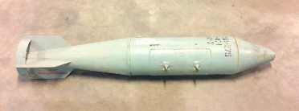
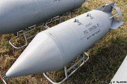
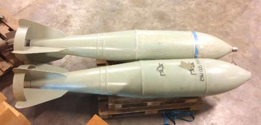
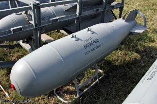

#### АВІАЦІЙНІ БОМБИ

## РБК-250-275

Зображення © Данський центр розвідки й утилізації вибухових боєприпасів (Danish EOD and Search Center)

| СУБКАТЕГОРІЯ ОЗБРОЄННЯ          | Авіаційна бомбова касета |
| ------------------------------- | ------------------------ |
| СПОРЯДЖЕННЯ БОЙОВОЇ ЧАСТИНИ (г) | Невідомо                 |
| ПОВНА МАСА (г)                  | 250 000—275 000 г        |
| РОЗМІРИ (мм)                    | 2 150 x 325              |
| КРАЇНА ПОХОДЖЕННЯ               | Росія                    |
| ПІДРИВНИК                       | АТК-ЕТ                   |

РБК-250/275 — це бомбова касета, яка часто комплектується різними типами бойових уражальних елементів (суббоєприпасів). Скорочення РБК розшифровується як «разова бомбова касета». Якщо касета споряджається уражальними бойовими елементами вибухової дії, РБК може вважатися касетною бомбою згідно зі статтею 2 Конвенції про касетні боєприпаси. Числа 250 або 275 означають вагу боєприпаса (приблизну). Існує низка конфігурацій боєприпасів РБК-250 і РБК-250/275. Незалежно від бойового спорядження, у серії боєприпасів РБК зазвичай використовується електромеханічний дистанційний підривник АТК-ЕБ. Спеціалістам зі знешкодження ВНП слід пам’ятати, що до складу непошкодженого РБК входить не тільки підривник і бойове спорядження, але також метальний вибивний заряд. Уражальними бойовими елементами вибухової дії, якими комплектується такий касетний боєприпас, можуть бути АО-1, ПТАБ-2,5, ПТАБ-2,5М і АО-2,5РТ.

РБК-250/275 також може комплектуватися запалювальними бойовими елементами ЗАБ-2,5. Хоча таке бойове спорядження, безумовно, є значним фактором небезпеки, за даних обставин РБК-250-275 не відповідає юридичному визначенню касетного боєприпаса.

Компоненти корпусу боєприпаса, що виготовляються зі сталі й алюмінію, іноді отримують значні пошкодження внаслідок удару до такої міри, що може бути важко розпізнати нанесене на них трафаретне маркування чорного кольору. Хвостовий блок боєприпаса є міцнішим. Під час типового застосування, якщо припустити, що боєприпас спрацював належним чином, хвостовий блок упаде на землю першим протягом руху вздовж траєкторії польоту, потім впаде бойове спорядження, і далі за все впаде носова частина. Усі компоненти боєприпаса є ключовими доказами, положення яких слід чітко фіксувати для подальшого кращого їхнього відображення на мапі, а потім — для ефективного очищення від наслідків удару.

## РБК-500

Зображення © Віталій В. Кузьмін

| СУБКАТЕГОРІЯ ОЗБРОЄННЯ          | Авіаційна бомбова касета |
| ------------------------------- | ------------------------ |
| СПОРЯДЖЕННЯ БОЙОВОЇ ЧАСТИНИ (г) | Невідомо                 |
| ПОВНА МАСА (г)                  | 500 000 г                |
| РОЗМІРИ (мм)                    | 1 955 x 450              |
| КРАЇНА ПОХОДЖЕННЯ               | Росія                    |
| ПІДРИВНИК                       | АТК-ЕТ                   |

РБК-500 — це бомбова касета, яка часто комплектується різними типами бойових уражальних елементів (суббоєприпасів). Скорочення РБК розшифровується як «разова бомбова касета». Якщо касета споряджається уражальними бойовими елементами вибухової дії, РБК може вважатися касетною бомбою згідно зі статтею 2 Конвенції про касетні боєприпаси. Число

500 означає вагу боєприпаса (приблизну). Існує низка конфігурацій боєприпаса РБК-500. Незалежно від бойового спорядження, у серії боєприпасів РБК зазвичай використовується електромеханічний дистанційний підривник АТК-ЕБ. Операторам слід пам’ятати, що до складу непошкодженого РБК-500 входить не тільки підривник і бойове спорядження, але також метальний вибивний заряд.

Уражальними бойовими елементами вибухової дії, якими комплектується такий касетний боєприпас, можуть бути ПТАБ-1М (див. вище) й СПБЕ. РБК-500 СПБЕ та РБК-ПТАБ-1М мають чітку форму із загостреним носовим конусом і закритою конфігурацією стабілізаторів. Існує більш ніж п’ятнадцять версій РБК-500.

Компоненти корпусу боєприпаса, що виготовляються зі сталі й алюмінію, часто отримують значні пошкодження внаслідок удару до такої міри, що може бути важко розпізнати нанесене на них трафаретне маркування чорного кольору. Хвостовий блок боєприпаса є міцнішим. Під час типового застосування, якщо припустити, що боєприпас спрацював належним чином, хвостовий блок упаде на землю першим протягом руху вздовж траєкторії польоту, потім впаде бойове спорядження, і далі за все впаде носова частина. Усі компоненти боєприпаса є ключовими доказами, положення яких слід чітко фіксувати для подальшого кращого їхнього відображення на мапі, а потім — для ефективнішого очищення від наслідків удару.

## ФАБ-500 М62

Зображення © Данський центр розвідки й утилізації вибухових боєприпасів (Danish EOD and Search Center)

| СУБКАТЕГОРІЯ ОЗБРОЄННЯ          | Авіабомба         |
| ------------------------------- | ----------------- |
| СПОРЯДЖЕННЯ БОЙОВОЇ ЧАСТИНИ (г) | 209 000 г, тротил |
| ПОВНА МАСА (г)                  | 497 000 г         |
| РОЗМІРИ (мм)                    | 2 470 x 400       |
| КРАЇНА ПОХОДЖЕННЯ               | Росія             |
| ПІДРИВНИК                       | АВУ-ЕТ            |

ФАБ-M62 — це типова фугасна авіабомба. Зазвичай на неї встановлюється електромеханічний контактний підривник, такий як АВУ-ЕТ. Гнізда для підривників знаходяться в носовій частині боєприпаса й під хвостовим відсіком. Підривник у носовій частині зазвичай оснащується перехідником підривника. Корпус у носовій частині боєприпаса посилюється для ефективнішого проникнення в перешкоду.

Корпус має більш обтічну форму, ніж попередні моделі ФАБ-500.

Хоча в багатьох версіях цієї авіабомби основний заряд — тротил, у пізніших версіях боєприпаса може застосовуватися ТГАФ (59 % тротилу, 19 % гексогену (RDX), 17 % алюмінію та 5 % парафіну).

## ОФЗАБ-500

Зображення © Віталій В. Кузьмін

| СУБКАТЕГОРІЯ ОЗБРОЄННЯ          | Авіабомба                                                    |
| ------------------------------- | ------------------------------------------------------------ |
| СПОРЯДЖЕННЯ БОЙОВОЇ ЧАСТИНИ (г) | 37 500 г — вибухівка;250 000 г — вогнеметна суміш ОМ-100МІ-3Л |
| ПОВНА МАСА (г)                  | 500 000 г                                                    |
| РОЗМІРИ (мм)                    | 2 500 x 450                                                  |
| КРАЇНА ПОХОДЖЕННЯ               | Росія                                                        |
| ПІДРИВНИК                       | АВУ-ЕТ                                                       |

ОФЗАБ-500 поєднує в собі елементи як запалювального, так і осколково-фугасного призначення. Скорочення ОФЗАБ розшифровується як «осколково-фугасна-запалювальна авіаційна бомба». Можливо, її можна класифікувати як певну форму термобаричної бомби, але це спірне твердження. ОФЗАБ-500 зазвичай споряджена електромеханічним контактним підривником, таким як АВУ-ЕТ. Він установлюється тільки в носовій частині.

Немає підтверджених даних про тип бризантної вибухової речовини, яка використовується в ОФЗАБ. Використовується запалювальний/термобаричний склад ОМ-100МІ-3Л.

Ця бомба зазвичай має трафаретне маркування чорним кольором біля скоб.