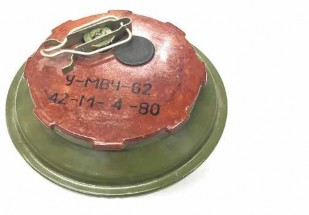
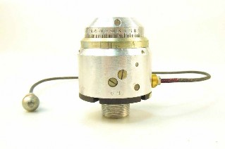
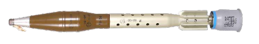

#### ПІДРИВНИКИ

## МВЧ-62

Зображення © Kdo Kamir

| СУБКАТЕГОРІЯ ОЗБРОЄННЯ          | Підривник                                                    |
| ------------------------------- | ------------------------------------------------------------ |
| СПОРЯДЖЕННЯ БОЙОВОЇ ЧАСТИНИ (г) | Проміжний детонатор — 15 г тетранітрату пентаерітріту, плюс детонатор міни |
| ПОВНА МАСА (г)                  | Невідомо                                                     |
| РОЗМІРИ (мм)                    | 144                                                          |
| КРАЇНА ПОХОДЖЕННЯ               | Росія/Болгарія/Румунія                                       |

МВЧ-62M є найпоширенішим підривником із мінімальною присутністю металу й різьбою 85 мм для мін серії TM-62, TM-72 та TM-80. Корпус виготовлений із бакеліту/пластику. Підривник містить годинниковий механізм зведення. Зняття запобіжної чеки й натискання зеленої кнопки ініціює механізм зведення із затримкою. Годинниковий механізм утримує детонатор від установлення в одну лінію з бойком. Підривник сконструйований таким чином, що спрацьовує, коли на натискну пластину діє зусилля приблизно 200 кг.

Хоча спочатку було заявлено, що МВЧ-62 містить мінімальну кількість металу, його відносно легко виявити, попри те, що частини годинникового механізму є пластиковими. Запобіжна чека дещо відрізняється від тієї, що встановлена на МВП.

Префікс «У» на вищезазначеному виробі вказує, що це є навчально-тренувальна версія.

## МВП-62M

Зображення © Ролі Еванс (Roly Evans)

| СУБКАТЕГОРІЯ ОЗБРОЄННЯ          | Підривник      |
| ------------------------------- | -------------- |
| СПОРЯДЖЕННЯ БОЙОВОЇ ЧАСТИНИ (г) | Невідомо       |
| ПОВНА МАСА (г)                  | Невідомо       |
| РОЗМІРИ (мм)                    | 122 x 80       |
| КРАЇНА ПОХОДЖЕННЯ               | Росія/Болгарія |

МВП-62M — це підривник із мінімальною присутністю металу й різьбою 85 мм для мін серії TM-62, TM-72 та TM-80. Корпус виготовлений із бакеліту. Підривник зводиться шляхом зняття металевої запобіжної чеки, а потім натисканням на кнопку зведення, що виступає на зовнішній поверхні. Підривник має сильфонну систему, яка сповільнює рух у лінії детонатора на 300 секунд. Підривник сконструйований таким чином, що спрацьовує, коли на натискну пластину діє зусилля приблизно 120 кг. Хоча підривник містить мінімальну кількість металу, наявність ударника, бойової пружини, більшої бічної пружини й капсули детонатора дозволяють виявити цю міну за допомогою більшості сучасних електромагнітних індукційних детекторів. Запобіжна чека даного підривника дещо відрізняється від чеки МВЧ-62 з круглим контуром для утримання кнопки зведення. Викинуті запобіжні чеки можуть бути хорошим індикатором наявності протитранспортних мін.

Болгарські версії зазвичай мають маркування «46 Dunarit» у подвійному колі, яке легко вирізняється. Російські версії виготовлені на заводі 583, або на російських державних заводах, позначаються двома півколами або колами, що перекриваються, як показано на зображенні вище.

## M-6

Зображення © Ролі Еванс (Roly Evans)

| СУБКАТЕГОРІЯ ОЗБРОЄННЯ          | Підривник       |
| ------------------------------- | --------------- |
| СПОРЯДЖЕННЯ БОЙОВОЇ ЧАСТИНИ (г) | 6-10 г, тетрил. |
| ПОВНА МАСА (г)                  | 168 г           |
| РОЗМІРИ (мм)                    | 51 x 83 x 40    |
| КРАЇНА ПОХОДЖЕННЯ               | Росія/Болгарія  |

М-6 — це підривник ударної дії, який має традиційну радянську конструкцію. Він не оснащується установчим болтом і працює лише в режимі миттєвої дії. Внутрішній механізм містить низку запобіжних пристроїв, зокрема контрзапобіжну пружину, інерційно-реакційну гільзу й стопорні кульки. Ударник діє як захватний пристрій на повзунку до моменту зведення. Підривник зводиться під дією інерції. Є припущення, що ковпачок підривника залишається на місці, щоб спробувати штучно створити затримку спрацювання підривника, хоча це не підтверджено.

Підривник зазвичай знаходяться в герметично закритих круглих банках, які зберігаються в бічній частині коробки з десятьма мінометними пострілами калібру 82 мм. Для балістичного ковпачка у більшості російських або болгарських версій цього підривника використовується алюміній. У китайських версіях використовується бакеліт коричневого кольору. Невистріляні мінометні міни, оснащені цим підривником і викинуті з місця вибуху (наприклад, у транспортному засобі чи складі для зберігання вибухонезпечних речовин), можуть бути зведеними, і з ними слід поводитися відповідним чином.

## M-12

Зображення © Ролі Еванс (Roly Evans)

| СУБКАТЕГОРІЯ ОЗБРОЄННЯ          | Підривник    |
| ------------------------------- | ------------ |
| СПОРЯДЖЕННЯ БОЙОВОЇ ЧАСТИНИ (г) | 23 г, тетрил |
| ПОВНА МАСА (г)                  | 535 г        |
| РОЗМІРИ (мм)                    | 117 x 40 мм  |
| КРАЇНА ПОХОДЖЕННЯ               | Росія/Китай  |

M-12 — це стандартний підривник ударної дії для 120-мм фугасних мінометних пострілів. Він був розроблений наприкінці 1950-х років. Версії, які можна побачити в Україні, зазвичай мають чорний колір. Відомо, що в застосуванні перебуває модифікована версія (майже ідентична), позначена як «3В35».

У конструкції підривника використовується стандартний механізм підривника інерційно- реакційної дії, який умикає запобіжні механізми, включно з контрзапобіжною пружиною, інерційно-реакційною гільзою та стопорними кульками. Ударник діє як захватний пристрій на повзунку до моменту зведення. Основний механізм цього підривника відрізняється від підривника М-6 мінометної міни, який використовується на менших калібрах. Різниця полягає у вбудованому установчому болті, який дає змогу вибирати миттєву дію чи затримку. Це здійснюється шляхом розміщення в одну лінію відповідного вогневого каналу з піротехнічною затримкою. Проміжний детонатор містить тетриловий заряд трохи менший ніж 23 г. Низка країн більше не використовує тетрил для проміжних детонаторів. Не рекомендується контакт тетрилу зі шкірою. У разі масового знищення цих предметів, слід враховувати потенційний вплив на навколишнє середовище.

Невистріляні мінометні міни, оснащені цим підривником і викинуті з місця вибуху (наприклад, у транспортному засобі чи складі для зберігання вибухонезпечних речовин), можуть бути зведеними, і з ними слід поводитися відповідним чином.

## ПІДРИВНИКИ РГМ-2/В-429 ДЛЯ СНАРЯДІВ

Зображення © Данський центр пошуку та утилізації вибухових боєприпасів (Danish EOD and Search Center)

| СУБКАТЕГОРІЯ ОЗБРОЄННЯ          | Підривник      |
| ------------------------------- | -------------- |
| СПОРЯДЖЕННЯ БОЙОВОЇ ЧАСТИНИ (г) | 12,5 г, тетрил |
| ПОВНА МАСА (г)                  | 438 г          |
| РОЗМІРИ (мм)                    | 106 x 40       |
| КРАЇНА ПОХОДЖЕННЯ               | Росія          |

РГМ-2 — це підривник провідного заряду або підривник ударної дії для артилерійських снарядів російського виробництва. Установчий болт змінює піротехнічну затримку й забезпечує вибір варіанта миттєвої дії або із затримкою. Механізм підривника схожий на багато інших застарілих радянських механічних підривників ударної дії та включає інерційно- реакційну гільзу, контрзапобіжну пружину й стопорні кульки. РГМ-2 зазвичай використовують із 122-мм осколково-фугасними артилерійськими боєприпасами, такими як ОФ-462 або 3ОФ56. Підривник В-429, хоча й виглядає ззовні майже ідентичним, зазвичай використовується з боєприпасами до гладкодульних гармат, такими як ОФ-19 або ОФ-26.

Як і багато інших підривників, РГМ-2 виготовляється на російському заводі 50.

## ГПВ-3

Зображення © Шон Мурхаус (Sean Moorhouse)

| СУБКАТЕГОРІЯ ОЗБРОЄННЯ          | Підривник |
| ------------------------------- | --------- |
| СПОРЯДЖЕННЯ БОЙОВОЇ ЧАСТИНИ (г) |           |
| ПОВНА МАСА (г)                  |           |
| РОЗМІРИ (мм)                    | 125 x 40  |
| КРАЇНА ПОХОДЖЕННЯ               | Росія     |

Підривник ГПВ-3 використовується для 152-мм кумулятивних протитанкових боєприпасів. Застосовуючи такі боєприпаси, гаубиця Д-20 або подібна стріляє прямим наведенням. Даний електромеханічний підривник зводиться під дією інерції, попри те, що нарізне дуло калібру 152 мм створює значну відцентрову силу, що впливає на снаряд. Підривник містить пристрій, що маскує ротор. Підривник не містить жодних піротехнічних механізмів затримкою в часі. Під час удару, подрібнення п'єзоелемента ініціює основний кумулятивний заряд у бойовій частині із застосування вогневого каналу.

Уважається, що ГПВ розшифровується російською мовою як «головной пьезоэлектрический взрыватель» («головний п’єзоелектричний підривник»). Як і в багатьох російських підривників до снарядів, діаметр різьби становить 36 мм.

## AR-5

Зображення © Шон Мурхаус (Sean Moorhouse)

| СУБКАТЕГОРІЯ ОЗБРОЄННЯ          | Підривник |
| ------------------------------- | --------- |
| СПОРЯДЖЕННЯ БОЙОВОЇ ЧАСТИНИ (г) | Тетрил    |
| ПОВНА МАСА (г)                  | 500 г     |
| РОЗМІРИ (мм)                    | 130 x 44  |
| КРАЇНА ПОХОДЖЕННЯ               | Росія     |

АР-5 — це стандартний підривник неконтактної дії, який використовується для артилерійських снарядів калібру 122 й 152 мм. Він може іменуватися «Сигнал». Датується кінцем 1970-х років. Зводиться під дією інерції та відцентровою силою.

Пластиковий балістичний ковпачок підривника зазвичай зеленого кольору. Установче кільце із червоним написом знаходиться біля основи зеленого балістичного ковпака. Як і в багатьох російських підривників до снарядів, діаметр різьби становить 36 мм.

Існують певні свідчення того, що цей підривник знаходиться в дефіциті, оскільки в більшості вогневих завдань проти укріплених позицій використовуються неоптимальні механічні підривники ударної дії.

Як і у випадку з будь-яким неконтактним підривником, спеціалістам зі знешкодження ВНП слід бути обережними під час наближення до підривника, якщо існує реальна ймовірність залишкового заряду в конденсаторі.

## T-7

Зображення © Данський центр пошуку та утилізації вибухових боєприпасів (Danish EOD and Search Center)

| СУБКАТЕГОРІЯ ОЗБРОЄННЯ          | Дистанційна трубка |
| ------------------------------- | ------------------ |
| СПОРЯДЖЕННЯ БОЙОВОЇ ЧАСТИНИ (г) | 7 г                |
| ПОВНА МАСА (г)                  | 626 г              |
| РОЗМІРИ (мм)                    | 157 x 64           |
| КРАЇНА ПОХОДЖЕННЯ               | Росія              |

T-7 – це дистанційна трубка сповільненої дії (PTTF) із функцією миттєвої ударної дії. Вона використовується снарядами-носіями касет, наприклад у 122-мм освітлювальному пострілі С-463. Вона також може застосовуватися із застарілими способами доставки листівок, такими як базовий метальний снаряд А1 калібру 122 мм, який був помічений в Україні.

## ПІДРИВНИК МРВ/МРВ-У ДО РЕАКТИВНИХ СНАРЯДІВ

 

Ліворуч: підривник МРВ. Праворуч: підривник МРУ-У в розрізі. Зображення © Нідерландський центр утилізації вибухових боєприпасів (Dutch EOD Center)

| СУБКАТЕГОРІЯ ОЗБРОЄННЯ          | Підривник                                         |
| ------------------------------- | ------------------------------------------------- |
| СПОРЯДЖЕННЯ БОЙОВОЇ ЧАСТИНИ (г) | 29 г, тетрил або пентаеритролу тетранітрат (PETN) |
| ПОВНА МАСА (г)                  | 746 г                                             |
| РОЗМІРИ (мм)                    | 195 x 64                                          |
| КРАЇНА ПОХОДЖЕННЯ               | Росія                                             |

МРВ-У — це стандартний підривник ударної дії, яким комплектуються 122-мм фугасні реактивні снаряди 9М22У. Він був спроєктований на початку 1970-х років. Основною відмінністю від попередніх версій МРВ є форма носового обтічника. Основна конструкція підривника схожа за принципом на конструкцію підривника М-12 до мінометних мін. Основна конфігурація інерційно-реакційної гільзи доповнена установчим болтом, що керує пристроєм маскування повзунка. Установчий болт передбачає вибір опції встановлення підривника: на затримку спрацювання або на миттєву дію. Підривник зводиться під дією інерції. Підривники МРВ зазвичай упаковуються в герметичні металеві коробки. Даний підривник широко виробляється не тільки в країнах колишнього СРСР, але також на Балканах, в Ірані й Індії. Хоча цей підривник застарів, він все ще виробляється й широко застосовується. Даний підривник має інші позначення залежно від країни-виробника, наприклад MJ-4 (Китай).

Нестріляні реактивні снаряди, оснащені цим підривником і відкинуті з місця вибуху (наприклад, у транспортному засобі чи складі для зберігання вибухонезпечних речовин), можуть перейти у зведене положення. Отже, з ними слід поводитися відповідно. Проміжним детонатором може бути тетрил для старих версій МРВ або PETN для нових версій МРВ-У.

## ДИСТАНЦІЙНА ТРУБКА TM-120 ДЛЯ РЕАКТИВНИХ СНАРЯДІВ

Зображення © Данський центр пошуку та утилізації вибухових боєприпасів (Danish EOD and Search Center)

| СУБКАТЕГОРІЯ ОЗБРОЄННЯ          | Дистанційна трубка                                          |
| ------------------------------- | ----------------------------------------------------------- |
| СПОРЯДЖЕННЯ БОЙОВОЇ ЧАСТИНИ (г) | Маса чорного пороху чи іншої піротехнічної суміші не відома |
| ПОВНА МАСА (г)                  | 694 г                                                       |
| РОЗМІРИ (мм)                    | 196 x 64                                                    |
| КРАЇНА ПОХОДЖЕННЯ               | Росія                                                       |

TM-120 — стандартна механічна дистанційна трубка із годинниковим механізмом для 122-мм реактивних снарядів 9M22 «Град». Дана дистанційна трубка також може використовуватися з 220-мм реактивними снарядами з касетною головною частиною для 9М27К «Ураган».

Ця дистанційна трубка зводиться під дією інерції та містить часовий механізм

Корпус дистанційної трубки маркується написом «TM-120» і «42.M» трохи вище різьби дистанційної трубки. Час спрацювання обирається шляхом обертання градуйованого кільця на балістичному ковпаку. Затримка спрацювання може становити від 4 до 120 секунд.

Якщо ця дистанційна трубка була помилково встановлена на реактивний снаряд, оснащений моноблочною фугасною бойовою частиною, вона не зможе ініціювати заряд бойової частини.

## СЕРІЯ ПІДРИВНИКІВ АТК МТ

Зображення © Нідерландський центр утилізації вибухових боєприпасів (Dutch EOD Center)

| СУБКАТЕГОРІЯ ОЗБРОЄННЯ          | Підривник                 |
| ------------------------------- | ------------------------- |
| СПОРЯДЖЕННЯ БОЙОВОЇ ЧАСТИНИ (г) | 100 г, піротехнічна суміш |
| ПОВНА МАСА (г)                  | Невідомо                  |
| РОЗМІРИ (мм)                    | 64 x 86                   |
| КРАЇНА ПОХОДЖЕННЯ               | Росія                     |

Серія підривників ATK (MT) зазвичай використовується для спорядження нефугасних російських авіаційних бомб, таких як носії РБК для касетних боєприпасів, парашутної освітлювальної серії авіабомб САБ і фотоосвітлювальної авіабомби ФОТАБ. Підривник часто називають електромеханічним за своєю конструкцією, оскільки він зводиться ініціюванням електричної запальної трубки, яка, своєю чергою, ініціює піротехнічні гранули, що служать захватним пристроєм на механічному годинниковому механізмі. Підривник ATK може розміщатися в гніздах у носовій або хвостовій частині бомбової касети. Немає зовнішніх ознак того, чи підривник перебуває у зведеному положенні. Якщо знайдена скинута авіабомба, підривник повинен уважатися зведеним. Зазвичай ATK закріплюється на місці фіксатором. Існує три моделі: ATK-ЕБ, ATK-EA та ATK-Б. АТК-ЕБ — це більш поширена версія, яка зустрічається найчастіше.

«E» (Э) указує на електропіротехнічний принцип зведення.

Підривник містить підпружинений ударник, отже підривники на скинутих бомбах не слід струшувати або переміщувати.

## СЕРІЯ ПІДРИВНИКІВ АВУ

Зображення © Нідерландський центр утилізації вибухових боєприпасів (Dutch EOD Center)

| СУБКАТЕГОРІЯ ОЗБРОЄННЯ          | Підривник                                               |
| ------------------------------- | ------------------------------------------------------- |
| СПОРЯДЖЕННЯ БОЙОВОЇ ЧАСТИНИ (г) | 60 г, проміжний детонатор плюс інші піротехнічні заряди |
| ПОВНА МАСА (г)                  | 1 970 г                                                 |
| РОЗМІРИ (мм)                    | 658 x 598 x 191                                         |
| КРАЇНА ПОХОДЖЕННЯ               | Росія/Болгарія                                          |

АВУ — це поширений підривник для авіабомб російського виробництва. Він може встановлюватися в носовій або у хвостовій частині авіабомби. Як і у випадку з ATK, цей підривник зводиться за допомогою електричної запальної трубки, що ініціює піротехнічний захватний пристрій. Цей підривник має ударно-інерційний всюдебійний принцип дії. Слід очікувати, що удар під будь-яким кутом ініціюватиме спрацювання підривника. Час спрацювання цього підривника можна встановлювати (миттєва дія, коротка затримка й тривала затримка).

Навпроти коаксіального кабелю знаходиться запобіжний гвинт/чека. Перед польотом він змінює положення на протилежне, а червоний запобіжний прапорець видаляється. Дехто вважає, що наявність гвинта свідчить про те, що підривник не зведений. Це неправильно. Якщо видно довшу запобіжну чеку, а не гвинт, підривник слід уважати зведеним. Електропіротехнічний ініціювальний кабель, що виступає з хвостової частини, є ознакою наявності електропіротехнічного підривника, опис якого надається.

Цей підривник, зазвичай, установлюють на авіаційні бомби серії ФАБ, ОФАБ, БЕТАБ-500, ХАБ, ОФЗАБ і ЗАБ.

## УЗРГМ-2

Інертний зразок. Зображення © Kdo Kamir

| СУБКАТЕГОРІЯ ОЗБРОЄННЯ | Запал до гранати                        |
| ---------------------- | --------------------------------------- |
| РОЗМІРИ (мм)           | 104 (39 мм виступає з корпусу гранати). |
| КРАЇНА ПОХОДЖЕННЯ      | Росія/Болгарія                          |

УЗГРМ і УЗРГМ-2 є, можливо, найпоширенішими механічними запалами до гранат, що існують. Вони використовуються в будь-якій гранаті з різьбою М10 (10 мм). Ними регулярно оснащуються звичайні гранати, як то Ф-1 і РГД-5.

Абревіатура УЗРГМ означає «Универсальный Запал, Ручная Граната, Модернизированный» та перекладається як «уніфікований запал ручної гранати модернізований».

Цей запал застосовується стандартним способом, передбаченим для простих механічних запалів гранат. Після того як запобіжна чека з кільцем витягнута й спусковий важіль звільнено, немає нічого, що могло б утримувати підпружинений ударник від удару по капсулю для ініціювання піротехнічного сповільнювача, а потім і детонатора.

Капсуль-детонатор містить азид свинцю. Корпус запалу виготовлений з алюмінію. Заявлена піротехнічна затримка запалів гранат становить 3,2—4,0 секунди. Було виявлено варіант запалу УЗРГМ миттєвої дії, спроєктований для використання в мінах-пастках. Тому з гранатами із запалами УЗРГМ, які були знайдені як залишені вибухові боєприпаси (ЗВП), слід поводитися з обережністю.

## A-670M

Зображення ліворуч © Державна служба України з надзвичайних ситуацій. Зображення праворуч © Arcus

| СУБКАТЕГОРІЯ ОЗБРОЄННЯ          | Підривник |
| ------------------------------- | --------- |
| СПОРЯДЖЕННЯ БОЙОВОЇ ЧАСТИНИ (г) | Невідомо  |
| ПОВНА МАСА (г)                  | 49 г      |
| РОЗМІРИ (мм)                    | 69x20 мм  |
| КРАЇНА ПОХОДЖЕННЯ               | Росія     |

А-670М — це головний контактний підривник, що використовується з осколково-фугасними запалювальними та осколково-фугасними трасуючими патронами калібру 30x165 мм. Такі гарматні боєприпаси часто використовуються для стрільби з гармат 2А38, 2А42 та 2А72, що встановлюються на різні бойові броньовані машини (БМП-2, БМП-3, БМД-2, БМД-3, БТР-80А та БТР-90) та ударні гелікоптери, як-от Ка-50, Ка-52 та Мі-28.

Ці підривники найчастіше знаходили в залишеному стані на гарматних боєприпасах, такі як 3УОР6. У підривнику є піротехнічний механізм самоліквідації, що ініціюється осіданням.

## 9E246M

Зображення © Державна служба України з надзвичайних ситуацій

| СУБКАТЕГОРІЯ ОЗБРОЄННЯ          | Підривник ударної дії |
| ------------------------------- | --------------------- |
| СПОРЯДЖЕННЯ БОЙОВОЇ ЧАСТИНИ (г) | Невідомо              |
| ПОВНА МАСА (г)                  | Невідомо              |
| РОЗМІРИ (мм)                    | Невідомо              |
| КРАЇНА ПОХОДЖЕННЯ               | Росія                 |

9Е246М — це модернізований варіант підривника ударної дії, що використовується в суббоєприпасах 9Н210. На відміну від попередника 9Е246, підривник 9Е246M оснащено піротехнічним елементом самоліквідації. Підривник дещо менший за 9Е246М1, що використовується в суббоєприпасах 3-О-16, але конструкції цих двох підривників вважаються аналогічними. Цей підривник оснащено компактним поперечним повзунком. Ударник виступає в ролі стопора цього повзунка, доки після викидання з реактивного снаряда не запуститься процес ініціювання. Незважаючи на елемент самоліквідації, ці підривники мають високий відсоток неспрацьовування. У деяких джерелах зазначається, що квадратний відбиток на сферичній частині на боку суббоєприпаса свідчить про переміщення стопорного пристрою від ударника та про зведений стан підривника. У деяких випадках підривники також відламуються від суббоєприпасів 9Н210 у момент удару. Якщо такий підривник знайдено окремо, слід пам’ятати, що він усе ще містить капсулі-запалювачі, піротехнічний ланцюг і невеликий запал. Поводитися з ними слід обережно. Засобом доставки 9Н210 виступає реактивний артилерійський снаряд 9М27К установки «Ураган».

## 9E272

Зображення © Ролі Еванс (Roly Evans)

| СУБКАТЕГОРІЯ ОЗБРОЄННЯ          | Підривник ударної дії |
| ------------------------------- | --------------------- |
| СПОРЯДЖЕННЯ БОЙОВОЇ ЧАСТИНИ (г) | Невідомо              |
| ПОВНА МАСА (г)                  | Невідомо              |
| РОЗМІРИ (мм)                    | Невідомо              |
| КРАЇНА ПОХОДЖЕННЯ               | Росія                 |

The 9Е272 — це модернізований варіант підривника ударної дії, що використовується в суббоєприпасах 9Н235. Як і 9Е246M, цей підривник оснащено піротехнічним елементом самоліквідації. Щодо точних відмінностей між цими підривниками потрібна додаткова інформація, хоча ці відмінності вважаються незначними. Незважаючи на елемент самоліквідації, у цих підривників у поточному конфлікті спостерігається високий відсоток неспрацьовування. У деяких випадках підривники також відламуються від суббоєприпасів 9Н235 у момент удару. Якщо такий підривник знайдено окремо, слід пам’ятати, що він усе ще містить капсулі-запалювачі, піротехнічний ланцюг і невеликий запал. Поводитися з ними слід обережно.

Засобами доставки 9Н235 виступають реактивні артилерійські снаряди системи «Ураган» калібру 220 мм і системи «Смерч» калібру 300 мм.

## ПІДРИВНИК ПОСТРІЛУ ДО БЕЗВІДКАТНОГО ГРАНАТОМЕТА ГО-2

Зображення © VMZ Sopot

| СУБКАТЕГОРІЯ ОЗБРОЄННЯ          | Механічний головний контактний підривник |
| ------------------------------- | ---------------------------------------- |
| СПОРЯДЖЕННЯ БОЙОВОЇ ЧАСТИНИ (г) | 10 г тетрилу / пентриту                  |
| ПОВНА МАСА (г)                  | 204 г                                    |
| РОЗМІРИ (мм)                    | 131x40 мм                                |
| КРАЇНА ПОХОДЖЕННЯ               | Росія / Болгарія                         |

ГО-2 — це простий механічний головний контактний підривник. Він встановлюється на осколково-фугасних гранатах ОГ-9 і ОГ-15, що використовуються для стрільби з безвідкатної гармати СПГ-9 і гармати 2А28 із БМП-1. Слід зауважити, що цей підривник не збувається як «безпечний у службовому положенні». Навіть якщо його знайдено в залишеному стані, спеціалістам зі знешкодження ВНП потрібно брати до уваги, що запалювач перебуває на одній лінії з ударником. Інерційна гільза, що осідає, має забезпечувати спрацьовування від дотичного удару в ціль.

Із підривників, підготовлених до пострілу, знімаються носові ковпачки з білими тканинними бірками. У старіших варіантах підривника використовується проміжний детонатор із тетрилу, у новіших варіантах — проміжний детонатор із пентриту. Один болгарський варіант (компанії

«Арсенал») ГО-2 має позначення АФ71, а другий варіант від ВМЗ Сопот продається під назвою ГО-2. ГО-2 також встановлюється на сучасніші гранати ОГ-7.

Постріли ОГ-9 і ОГ-15 із підривниками ГО-2, що піддавалися впливу пожежі та які було викинуто з епіцентру вибуху (наприклад, із бойової броньованої машини або тимчасового складу боєприпасів), слід вважати приведеними в бойовий стан. Діяти з ними слід обережно.

## АРТИЛЕРІЙСЬКИЙ ПІДРИВНИК ДТМ-75

Зображення ліворуч © Ролі Еванс (Roly Evans). Зображення правуорч © Радянський посібник

| СУБКАТЕГОРІЯ ОЗБРОЄННЯ          | Механічний дистанційної дії |
| ------------------------------- | --------------------------- |
| СПОРЯДЖЕННЯ БОЙОВОЇ ЧАСТИНИ (г) | Чорний порох                |
| ПОВНА МАСА (г)                  | 580 г                       |
| РОЗМІРИ (мм)                    | 140x63 мм                   |
| КРАЇНА ПОХОДЖЕННЯ               | Росія                       |

ДТМ-75 — це поширений механічний підривник дистанційної дії, що використовується на спеціальних снарядах калібрів 122 і 152 мм та інших снарядах нефугасної дії. Це озброєння з’явилось у 1970-х. Як і більшість артилерійських підривників, цей приводиться в бойовий стан під впливом сили осідання та доцентрової сили. Повзунок утримує запал у несуміщеному положенні, доки гільза, що осідає, не відпустить запобіжний стрижень у момент пострілу. Якщо ДТМ-75 знайдено в покинутому стані, він усе ще може бути з транспортним ковпачком. На відміну від німецького підривника ZtZ.S30, з якого було скопійовано ДТМ-75, цей підривник не має вогневого ланцюга самоліквідації.

## ПІДРИВНИК АРТИЛЕРІЙСЬКИХ МІН M49

Зображення © Данський центр пошуку та утилізації вибухових боєприпасів (Danish EOD and Search Center) і Forsvarets Krigsmateriel Forvaltning (Управління військового забезпечення Збройних Сил)

| СУБКАТЕГОРІЯ ОЗБРОЄННЯ          | Головний контактний підривник для артилерійських мін |
| ------------------------------- | ---------------------------------------------------- |
| СПОРЯДЖЕННЯ БОЙОВОЇ ЧАСТИНИ (г) | Невідомо                                             |
| ПОВНА МАСА (г)                  | Невідомо                                             |
| РОЗМІРИ (мм)                    | Невідомо                                             |
| КРАЇНА ПОХОДЖЕННЯ               | Швеція                                               |

M49 — це підривник ударної дії виробництва Управління військового забезпечення Збройних Сил Швеції. У якості додаткового стопорного пристрою використовується латунна чека. Її та сріблястий ковпачок знімають перед пострілом. Зведення підривника відбувається під впливом сили осідання. Обертально-шестерневий механізм утримується в несуміщеному положенні запобіжним стрижнем.

## ПІДРИВНИК М-5М

 

Зображення праворуч © Нідерландський центр утилізації вибухових боєприпасів (Dutch EOD Center).

Зображення ліворуч © Державна служба України з надзвичайних ситуацій

| СУБКАТЕГОРІЯ ОЗБРОЄННЯ          | Підривник   |
| ------------------------------- | ----------- |
| СПОРЯДЖЕННЯ БОЙОВОЇ ЧАСТИНИ (г) | 7 г тетрилу |
| ПОВНА МАСА (г)                  | 77 г        |
| РОЗМІРИ (мм)                    | 68x39 мм    |
| КРАЇНА ПОХОДЖЕННЯ               | Росія       |

М-5М — це простий головний контактний підривник для артилерійських мін. Він часто використовується на артилерійських мінах загального призначення калібру 60 мм, але також сумісний із мінами калібру 82 мм. Оскільки балістичний наконечник виконано з бакеліту, цей підривник можна переплутати з поширеними головними контактними підривниками китайського виробництва, хоча цей і російський. Як і в багатьох старіших російських підривниках, у цьому міститься проміжний детонатор із тетрилу. Приведення М-5М у бойовий стан відбувається під дією сили осідання в простій системі з гільзи та контрзапобіжної пружини. У цьому підривнику використовується менше стопорних засобів, ніж в інших російських підривниках із механічним осіданням. Поводитися з ним слід обережно. Підривник спрацьовує миттєво. Установити затримку не можна. Болгарський підривник М-5А має алюмінієвий, а не бакелітовий балістичний наконечник. В інших аспектах ці підривники ідентичні. Широкого застосування таких підривників не спостерігається, але воно могло б свідчити про нестачу підривників для артилерійських мін у певних районах.

## АРТИЛЕРІЙСЬКИЙ ПІДРИВНИК M557

Зображення © Данський центр утилізації вибухових боєприпасів (Danish EOD Center) і Міністерство оборони США TM 43-001-28 МО США

| СУБКАТЕГОРІЯ ОЗБРОЄННЯ          | Головний підривник ударної дії                         |
| ------------------------------- | ------------------------------------------------------ |
| СПОРЯДЖЕННЯ БОЙОВОЇ ЧАСТИНИ (г) | Проміжний детонатор — 15 г пентриту, а також запал M55 |
| ПОВНА МАСА (г)                  | 976 г                                                  |
| РОЗМІРИ (мм)                    | 151x61                                                 |
| КРАЇНА ПОХОДЖЕННЯ               | США                                                    |

M557 – головний контактний підривник, поширений на артилерійських снарядах загального призначення калібру 155 мм, що використовуються в НАТО. Він використовується з 1960-х років. Цей механічний підривник M739 має ударник і запал в окремому носовому ковпачку. Стопор ударника утримує його на відстані від запала M24. Вогнепередавальний канал веде до розмикача. Установочний болт / гільза на балістичному наконечнику приводять у дію розмикач, встановлений на затримку або миттєву дію. Елемент забезпечення затримки містить піротехнічний склад на запобіжному пристрої, який переключається установочним болтом. Як і більшість артилерійських підривників, М557 приводиться в бойовий стан під впливом сили осідання та відцентрової сили. Спеціалістам із знешкодження ВНП слід пам’ятати, що якщо цей підривник знайдено в покинутому стані, його спалювання не гарантує спрацьовування елемента затримки запала миттєвої дії. У деяких старіших версіях використовується тетрильний проміжний детонатор. Підривник M557 легко переплутати з модернізованим головним контактним підривником M739. Код моделі часто наноситься на балістичний наконечник опуклими трафаретними літерами та цифрами одразу над різьбою. Також він може наноситися цифровим друком на корпус підривника. Підривник M572 також майже ідентичний до M557. Основна відмінність у тому, що перший має виїмку, заповнену епоксидною смолою. Це робить конструкцію підривника жорсткішою, підвищуючи стійкість до інерційних сил, що діють на балістичний наконечник.

## АРТИЛЕРІЙСЬКИЙ ПІДРИВНИК M739

 

Зображення © Міністерство оборони США TM 43-001-28

| СУБКАТЕГОРІЯ ОЗБРОЄННЯ          | Головний контактний підривник артилерійських снарядів    |
| ------------------------------- | -------------------------------------------------------- |
| СПОРЯДЖЕННЯ БОЙОВОЇ ЧАСТИНИ (г) | Проміжний детонатор — 19 г A5, а також забійка та запали |
| ПОВНА МАСА (г)                  | 976 г                                                    |
| РОЗМІРИ (мм)                    | 152x61                                                   |
| КРАЇНА ПОХОДЖЕННЯ               | США                                                      |

M739 – головний контактний підривник, поширений на артилерійських снарядах загального призначення калібру 155 мм, що використовуються в НАТО. Цей підривник аналогічний до M557, але є ключові відмінності. Ці відмінності мають значення для процедур приведення в безпечний стан. Механічний підривник M739 має ударник і запал, але останній розташовано в корпусі підривника, а не в окремому носовому ковпачку. Ударник утримується стопорним дротом. Вогнепередавальний канал веде до розмикача. Установочний болт / гільза на балістичному наконечнику приводять у дію розмикач, встановлений на затримку або миттєву дію. Між гранулою затримки та проміжним детонатором розташовано механізм зведення на безпечному віддаленні. Як і більшість артилерійських підривників, M739 приводиться в бойовий стан під впливом сили осідання та відцентрової сили. Спеціалістам із знешкодження ВНП слід пам’ятати, що якщо цей підривник знайдено в покинутому стані, його спалювання не гарантує спрацьовування елемента затримки запала миттєвої дії. Підривник M739 легко переплутати з модернізованим головним контактним підривником M557. Відрізнити його можна за характерним глянцевим зеленим покриттям. Код моделі часто наноситься на балістичний наконечник опуклими трафаретними літерами та цифрами одразу над різьбою. Також він може наноситися цифровим друком на корпус підривника.

## АРТИЛЕРІЙСЬКИЙ ПІДРИВНИК M782 MOFA

 

Зображення © Mil-Spec Industries і Міністерство оборони США TM 43-001-28

| СУБКАТЕГОРІЯ ОЗБРОЄННЯ          | Багаторежимний артилерійський підривник                      |
| ------------------------------- | ------------------------------------------------------------ |
| СПОРЯДЖЕННЯ БОЙОВОЇ ЧАСТИНИ (г) | Проміжний детонатор — 19 г PBXN-5, а також забійка та запали |
| ПОВНА МАСА (г)                  | 748 г                                                        |
| РОЗМІРИ (мм)                    | 151x61                                                       |
| КРАЇНА ПОХОДЖЕННЯ               | США                                                          |

Багаторежимний артилерійський підривник M782 (MOFA) може спрацьовувати в режимі ударної дії, дистанційної дії та радіопідривника. Ударна дія може бути миттєвою та уповільненою. За дистанційне спрацьовування відповідає електронний таймер. За роботу радіодатчика в носовій частині відповідає електронний мікрокомп’ютер. У режимі ударної дії ініціюючим пристроєм є замикач, що спрацьовує на здавлювання.

У конструкції підривника передбачено питання знешкодження. Напруга на резисторі розряджання батареї та процесорі має зникнути протягом 30 хвилин після приведення в бойовий стан і неспрацьовування. У конструкції в якості резервного передбачено ще одне коло для розряджання батареї.

Підривники пакуються партіями по вісім одиниць в одному контейнері M2A1.

## МУВ-4

Зображення © Боб Седдон (Bob Seddon)

| СУБКАТЕГОРІЯ ОЗБРОЄННЯ          | Замикач / підривник для мін / мін-пасток |
| ------------------------------- | ---------------------------------------- |
| СПОРЯДЖЕННЯ БОЙОВОЇ ЧАСТИНИ (г) | Немає                                    |
| ПОВНА МАСА (г)                  | Немає                                    |
| РОЗМІРИ (мм)                    | 117x17                                   |
| КРАЇНА ПОХОДЖЕННЯ               | Росія                                    |

МУВ-4 — це механічний підривник, що спрацьовує від натяжної дії. Зазвичай його використовують із натяжними дротами на мінах-пастках або в якості ініціюючого пристрою, що приводиться в дію жертвою. Різьба М10 на детонаторі МД-5 надає можливість використання з будь-якою міною, найчастіше з осколковою. МУВ-4 зазвичай встановлюється в міни ОЗМ-72, МОН-50 і МОН-90, хоча також можливе використання з МОН-100 і МОН-200. Приведення в бойовий стан відбувається шляхом вилучення великої тонкої круглої чеки. При цьому вивільняється підпружинений поршень, який повільно продавлює каучук. У зведеному стані викидаються дві стопорні кульки та зелений пластмасовий ковпачок підривника. Якщо пластмасового ковпачка на підривнику немає, він у бойовому стані. Підривник МУВ-4 зазвичай спрацьовує від зусилля натягу менше ніж 1 кг.

МУВ-4 — це вдосконалена версія МУВ-4 із гідромеханічним елементом дальнього зведення. Підривник маркується різними кольорами, що позначають тривалість затримки зведення: зелений — 130 хвилин, чорний — 85 хвилин, червоний — 60 хвилин, білий — 45 хвилин. Якщо кольорового маркування немає, затримка становить 25 хвилин.

Навіть якщо підривник не приєднано до запала, його зведений ударник становить ризик. Не направляйте його на людей.

## АРТИЛЕРІЙСЬКИЙ ПІДРИВНИК KZ-984

 

Зображення © MSM Group

| СУБКАТЕГОРІЯ ОЗБРОЄННЯ          | Багаторежимний артилерійський підривник |
| ------------------------------- | --------------------------------------- |
| СПОРЯДЖЕННЯ БОЙОВОЇ ЧАСТИНИ (г) | 21,5 г гексогену                        |
| ПОВНА МАСА (г)                  | 700 г                                   |
| РОЗМІРИ (мм)                    | 141x60 мм                               |
| КРАЇНА ПОХОДЖЕННЯ               | Словаччина                              |

KZ-984 — це головний контактний підривник, сумісний із гніздами під підривники з різьбою 2” зразків НАТО. Його виготовляє Konstrukta-Defence у Словаччині. Зведення підривника відбувається під впливом сили осідання та доцентрової сили. Механізм зведення осіданням включає гільзу, що осідає, у носовій частині, і запобіжний стрижень на обертально- шестерневому елементі поряд із різьбою підривника. Установочний болт дає змогу вибирати між миттєвим спрацьовуванням і спрацьовуванням із затримкою. Підривник має просту конструкцію, але відповідну до STANAG НАТО.

Застосування КЗ-984 підтверджено в словацьких артилерійських боєприпасах M107 калібру 155 мм.

## АРТИЛЕРІЙСЬКИЙ ПІДРИВНИК RALEC F3

Зображення © Міністерство оборони США

| СУБКАТЕГОРІЯ ОЗБРОЄННЯ          | Артилерійські радіопідривники |
| ------------------------------- | ----------------------------- |
| СПОРЯДЖЕННЯ БОЙОВОЇ ЧАСТИНИ (г) | Невідомо                      |
| ПОВНА МАСА (г)                  | 626 г                         |
| РОЗМІРИ (мм)                    | 151x61                        |
| КРАЇНА ПОХОДЖЕННЯ               | Франція                       |

RALEC F3 — це головний радіопідривник із контактною дією, що використовується в стандартних для НАТО боєприпасах загального призначення калібру 155 мм. Вибір режиму дії підривника здійснюється за допомогою білого поворотного перемикача в носовій частині. Зведення підривника відбувається під впливом сили осідання та доцентрової сили. У момент пострілу лопається ампула з електролітом, що дає змогу зарядити конденсатор. Відцентрова сила розподіляє електроліт і пересуває контакт, готуючи електровибухове коло, а також встановлює обертально-шестерневий елемент у суміщене положення.

## ПІДРИВНИК Т-90

Зображення © Шон Мурхаус (Sean Moorhouse)

| СУБКАТЕГОРІЯ ОЗБРОЄННЯ          | Механічні підривники дистанційної дії |
| ------------------------------- | ------------------------------------- |
| СПОРЯДЖЕННЯ БОЙОВОЇ ЧАСТИНИ (г) | 2 г запалювального складу             |
| ПОВНА МАСА (г)                  | 482 г                                 |
| РОЗМІРИ (мм)                    | 108x41 мм                             |
| КРАЇНА ПОХОДЖЕННЯ               | Росія / Китай                         |

Т-90 — це механічний дистанційний підривник миттєвої дії для спеціальних артилерійських снарядів калібрів 122 мм та 152 мм. Зазвичай Т-90 встановлюється на освітлювальні снаряди, наприклад на С-4 калібру 122 мм і 3ВС17 калібру 152 мм. Зведення підривника Т-90 відбувається під впливом сили осідання та доцентрової сили.

Цей підривник дуже легко переплутати з В-90. Основна відмінність В-90 — це наявність проміжного детонатора з 15 г тетрилу. В-90 має впресоване маркування «B-90» над різьбою підривника. Т-90 має маркування «Т-90» в аналогічному розташуванні. В-90 найчастіше використовується у фугасних снарядах калібрів 122 мм та 152 мм. Підривники обох типів оснащуються металевими транспортними ковпачками.

## ПІДРИВНИК РЕАКТИВНОГО СНАРЯДА В-24А

Зображення © Ролі Еванс (Roly Evans)

| СУБКАТЕГОРІЯ ОЗБРОЄННЯ          | Головний контактний підривник реактивних снарядів |
| ------------------------------- | ------------------------------------------------- |
| СПОРЯДЖЕННЯ БОЙОВОЇ ЧАСТИНИ (г) | 55 г тетрилу                                      |
| ПОВНА МАСА (г)                  | 2650 г                                            |
| РОЗМІРИ (мм)                    | 229x80                                            |
| КРАЇНА ПОХОДЖЕННЯ               | Росія                                             |

В-24А — це досить застарілий електромеханічний головний контактний підривник, що використовується в реактивних снарядах класу «повітря — земля» С-24 калібру 240 мм. Зведення відбувається під дією осідання. Гільза, що осідає, виконує роль інерційного елемента забезпечучи дотичну інерційну дію підривника. Аеродромний персонал зазвичай видаляє транспортний ковпачок безпосередньо перед польотом. Установочний болт розташовано біля запального стакана підривника. Після встановлення в С-24 його закриває гніздо підривника.

Цей підривник надзвичайно чутливий. Відстріляні ракети, що не спрацювали, не можна струшувати або впускати на поверхню. Їх бажано знищувати на місці.

## ПІДРИВНИК РЕАКТИВНОГО СНАРЯДА РВ-25

Зображення © Міністерство оборони США

| СУБКАТЕГОРІЯ ОЗБРОЄННЯ          | Радіопідривник реактивного снаряда |
| ------------------------------- | ---------------------------------- |
| СПОРЯДЖЕННЯ БОЙОВОЇ ЧАСТИНИ (г) | 20 г тетрилу                       |
| ПОВНА МАСА (г)                  | 4820 г                             |
| РОЗМІРИ (мм)                    | 454x170                            |
| КРАЇНА ПОХОДЖЕННЯ               | Росія                              |

РВ-25 — це радіопідривник, що використовується в реактивних снарядах класу «повітря — земля» С-25 калібру 266 мм. У підривнику використовується комбінація механічних і електричних засобів приведення в бойовий стан. Його можна встановити на спрацьовування від удару або в момент наближення до цілі.

Корпус підривника виконано з бакеліту. Час, протягом якого ініціюючий конденсатор у підривнику зберігає заряд, невідомий. Спеціалістам зі знешкодження ВНП слід вичікувати протягом розумного часу та діяти обережно.

## ПІДРИВНИК ВП-7М

 

Зображення © Данський центр пошуку та утилізації вибухових боєприпасів (Danish EOD and Search Center)

| СУБКАТЕГОРІЯ ОЗБРОЄННЯ          | Підривник        |
| ------------------------------- | ---------------- |
| СПОРЯДЖЕННЯ БОЙОВОЇ ЧАСТИНИ (г) | 10 г пентриту    |
| ПОВНА МАСА (г)                  | 96 г             |
| РОЗМІРИ (мм)                    | 96x76 мм         |
| КРАЇНА ПОХОДЖЕННЯ               | Росія / Болгарія |

ВП-7М — це підривник реактивної гранати ПГ-7М до безвідкатного гранатомету. Він складається з двох частин — п’єзоелемента в носовій частині БЧ та основного елемента підривника в донній частині БЧ. Зведення підривника відбувається під впливом сили осідання. У момент пострілу мале інерційне жало запалює піротехнічну гранулу, що виконує роль стопора затвора. Коли гранула згоряє, дві поперечні пружини зсувають рушій із положення, у якому в електричному колі є коротке замикання, у положення, у якому коло замикається через стиснення п’єзоелемента в носовій частині. Навіть якщо реактивна граната ні в що не вдаряється, самоліквідатор має спрацювати приблизно після 900 м польоту. Ці підривники, імовірно, траплятимуться спеціалістам зі знешкодження ВНП, тільки якщо реактивна граната ПГ-7 не здетонувала. З бойовими частинами типу ПГ-7, що не спрацювали, слід поводитись обережно. Їх бажано знищувати на місці.

## ПІДРИВНИК ВП-22

Зображення © Данський центр пошуку та утилізації вибухових боєприпасів (Danish EOD and Search Center)

| СУБКАТЕГОРІЯ ОЗБРОЄННЯ          | Підривник        |
| ------------------------------- | ---------------- |
| СПОРЯДЖЕННЯ БОЙОВОЇ ЧАСТИНИ (г) | 10 г пентриту    |
| ПОВНА МАСА (г)                  | 80 г             |
| РОЗМІРИ (мм)                    | 96x76 мм         |
| КРАЇНА ПОХОДЖЕННЯ               | Росія / Болгарія |

Підривник ВП-22 — це модернізований варіант ВП-7М. За своєю основою конструкція дуже схожа, однак існують і відмінності, наприклад напруження пружин, спрямовані на зменшення кількості неспрацьовувань. Корпус підривника виконано з алюмінію та пластмаси, а не з бакеліту, як ВП-7М. Носовий п’єзоелемент має назву ВП-16ГЧ, донний елемент — ВП-22ДЧ.

Підривник використовується не лише в гранатометі одноразового застосування РПГ-22. Ці два окремі елементи також використовуються на інших реактивних снарядах до безвідкатних гранатометів. Донний елемент (або його незначна модифікація) використовується в одному з кумулятивних зарядів у ПГ-7Р, ПГ-26, ПГ-27 і ПГ-29. Носовий п’єзоелемент ВП-16ГЧ використовується в ПГ-16, ПГ-18 і ПГ-26. Ці підривники, імовірно, траплятимуться спеціалістам зі знешкодження ВНП, тільки якщо реактивна граната ПГ-7 не здетонувала. З бойовими частинами типу ПГ-7, що не спрацювали, слід поводитись обережно. Їх бажано знищувати на місці.

## В5-К

 

Зображення © Нідерландський центр утилізації вибухових боєприпасів (Dutch EOD Center)

| СУБКАТЕГОРІЯ ОЗБРОЄННЯ          | Підривник для некерованого реактивного снаряда |
| ------------------------------- | ---------------------------------------------- |
| СПОРЯДЖЕННЯ БОЙОВОЇ ЧАСТИНИ (г) | Невідомо                                       |
| ПОВНА МАСА (г)                  | 168 г                                          |
| РОЗМІРИ (мм)                    | 119x40 мм                                      |
| КРАЇНА ПОХОДЖЕННЯ               | Росія / Болгарія / Сербія                      |

В-5К — це головний контактний підривник, що використовується на фугасних реактивних снарядах калібру 57 мм, як-от С-5К, С-5МО та С-5КО. В-5K — це підривник стандартної радянської конструкції з гільзою, що осідає, контрзапобіжною пружиною та стопорними кульками. У момент пострілу гільза, що осідає, стискає контрзапобіжну пружину. Стопорні кульки розблоковуються, ефект осідання слабшає, ударник вивільняється та отримує можливість наколоти капсуль-запалювач у момент удару. Після зведення, контрзапобіжна пружина залишається єдиним предметом, що розділяє ударник і капсуль-запалювач. Підривник аналогічний до ГО-2, що використовується в осколково-фугасних боєприпасах калібру 73 мм до безвідкатних гранатометів. Оскільки ударник перебуває на одній лінії з капсулем-запалювачем, навіть якщо підривник ще не зведено, цей пристрій не можна вважати безпечним у службовому положенні. Слід діяти обережно. На відміну від підривника В-5, що також використовується у фугасних реактивних снарядах С-5, у підривнику В-5К немає елемента самоліквідації.