#### ГРАНАТИ

## Ф-1

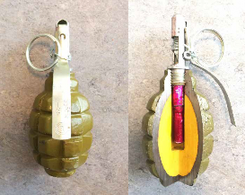

Болгарська Ф1 і запал УЗГРМ-2. Зображення © Данський центр розвідки й утилізації вибухових боєприпасів (Danish EOD and Search Center)

| СУБКАТЕГОРІЯ ОЗБРОЄННЯ          | Осколкова граната |
| ------------------------------- | ----------------- |
| СПОРЯДЖЕННЯ БОЙОВОЇ ЧАСТИНИ (г) | 60 г, тротил      |
| ПОВНА МАСА (г)                  | 600 г             |
| РОЗМІРИ (мм)                    | 130 x 55          |
| КРАЇНА ПОХОДЖЕННЯ               | Росія/Болгарія    |
| ПІДРИВНИК                       | УЗРГМ-2           |

Попри свій вік, Ф-1 залишається однією з найпоширеніших осколкових гранат. Запал УЗРГМ-2 — це простий зведений ударник. Спусковий важіль, який утримує зведений ударник, блокується стандартною чекою.

Попередня фрагментація корпусу має відносно низьку якість і мало коли ділиться на рівномірні уламки. Стверджується, що уламки є смертельними на відстані до 200 м, хоча більш імовірним є смертельне ураження в межах 30 метрів.

Для цієї гранати можна використовувати запали УЗРГМ-2, що виготовляються низкою країн. Запал, зазвичай, спрацьовує через 3,2-4,2 секунди після того, як відпускається спусковий важіль. Теоретично з гранатою Ф-1 може використовуватися будь-який запал, що має різьбу М10. Наприклад, простий підривник МУВ із детонатором МД-5 можна легко приєднати як запальний пристрій. Ці гранати часто використовуються в Україні як грубі міни-пастки, зазвичай із застосуванням якогось тягового механізму, наприклад дроту. Гранати також можуть використовуватися як елементи невилучення, коли їх розміщують під предметом із вилученою запобіжною чекою, або як пристрої для захисту від несанкціонованого доступу, якщо вони розміщуються в ґрунті поруч з осколковою всеспрямованою протипіхотною міною на кілку або поруч із закопаною осколковою міною, що вистрибує.

## РГД-5

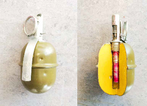

Зображення © Данський центр розвідки й утилізації вибухових боєприпасів (Danish EOD and Search Center)

| СУБКАТЕГОРІЯ ОЗБРОЄННЯ          | Осколкова граната |
| ------------------------------- | ----------------- |
| СПОРЯДЖЕННЯ БОЙОВОЇ ЧАСТИНИ (г) | 110 г, тротил     |
| ПОВНА МАСА (г)                  | 310 г             |
| РОЗМІРИ (мм)                    | 114 x 58          |
| КРАЇНА ПОХОДЖЕННЯ               | Росія/Болгарія    |
| ПІДРИВНИК                       | УЗРГМ-2           |

РГД-5, що використовується з 1950-х років, є звичайною наступальною гранатою. Послаблена фрагментація призводить до зменшення ефективної дальності на 15-20 м. Різьба М10 для запалу відповідає стандартному запалу УЗРГМ-2. Також можуть бути встановлені сумісні підривники — наприклад, серії МУВ із детонатором МД-5. Як у випадку з іншими гранатами, УЗРГМ-2 має затримку 3,2-4,2 секунди.

Ця граната також може легко використовуватися як міна-пастка.

Ця граната зазвичай маркується чорною великою літерою «Т», що вказує на спорядження тротилом. Маркування різниться в залежності від того, де була виготовлена конкретна граната. Також маркування буде присутнє на спусковому важелі запалу УЗРГМ-2.

## ВОГ-17/ВОГ-17M

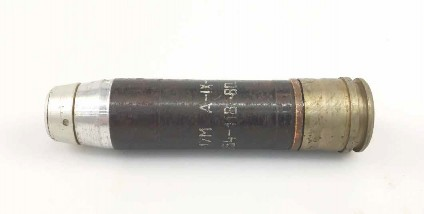

ВОГ-17M. Зображення © Данський центр розвідки й утилізації вибухових боєприпасів (Danish EOD and Search Center)

| СУБКАТЕГОРІЯ ОЗБРОЄННЯ          | Осколкова граната              |
| ------------------------------- | ------------------------------ |
| СПОРЯДЖЕННЯ БОЙОВОЇ ЧАСТИНИ (г) | 34 г, вибухова речовина A-IX-1 |
| ПОВНА МАСА (г)                  | 350 г                          |
| РОЗМІРИ (мм)                    | 132 x 30                       |
| КРАЇНА ПОХОДЖЕННЯ               | Росія/Болгарія                 |
| ПІДРИВНИК                       | ВМГ/ВМГ-M                      |

ВОГ-17 — це вистрілювана осколкова граната. Зазвичай її вистрілюють із гранатомета АГС-17 і можуть використовувати як засіб легкої локальної непрямої вогневої підтримки. ВМГ — це детонувальний підривник ударної дії, який зводиться під дією інерції та відцентрової сили. Версія ВМГ-M, що використовується на ВОГ-17M, застосовує функцію самознищення через піротехнічний сповільнювач, який ініціюється під дією інерції на етапі пострілу. Слід зазначити, що ВМГ-M містить невеликий ротор, який утримує запальний пристрій поза лінією з вогневим каналом, поки запобіжні механізми не будуть зняті на етапі зведення. У ВМГ немає такого ротора, отже він містить запальний пристрій в одну лінію з вогневим каналом, а тому не є безпечним. ВОГ-17 із підривниками ВМГ, навіть коли виявлені як вибухові боєприпаси, які не вибухнули (НВБ), вимагають поводження відповідним чином. Граната вистрілюється за допомогою однокомпонентного заряду на основі нітроцелюлози, що ініціюється внаслідок наколу капсуля ударником в АГС-17.

Під час удару ударник, який тепер на одній лінії з капсулем ВОГ-17М, долає відносно слабку контрзапобіжну пружину, щоб ініціювати вогневий ланцюг.

Ззовні ВОГ-17 і ВОГ-17М практично ідентичні. Маркування — це найпростіший спосіб виявити різницю. На чорному корпусі гранати нанесене маркування вибухової речовини A-IX-1.

## САМОРОБНА РУЧНА ГРАНАТА ВОГ-17

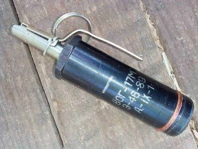

Зображення © З приватних джерел

| СУБКАТЕГОРІЯ ОЗБРОЄННЯ          | Осколкова граната                            |
| ------------------------------- | -------------------------------------------- |
| СПОРЯДЖЕННЯ БОЙОВОЇ ЧАСТИНИ (г) | 34 г, вибухова речовина A-IX-1 (за оцінками) |
| ПОВНА МАСА (г)                  | 300 г (за оцінками)                          |
| РОЗМІРИ (мм)                    | Не відомо                                    |
| КРАЇНА ПОХОДЖЕННЯ               | Росія/Болгарія                               |
| ПІДРИВНИК                       | УЗРГМ-2 / УДЗ                                |

Саморобна граната ВОГ-17 спостерігалася в Чечні, Сирії та Україні. Її іноді називають

«хаттабка». «Хаттабкою» також можуть називати інші саморобні або модифіковані гранати, як, наприклад, гранати зроблені з ВОГ-25. Запал УЗРГМ-2 спрацьовує як і у випадку будь-якої іншої осколкової гранати.

Цю гранату не слід плутати з гранатою АР-РОГ стандартного виробництва, яка виготовляється в Болгарії. Різні запали є найпростішим способом визначити різницю, оскільки запал ДВМ явно відрізняється від УЗРГМ-2.

## ВОГ-25

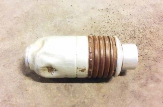

Зображення © Данський центр розвідки й утилізації вибухових боєприпасів (Danish EOD and Search Center)

| СУБКАТЕГОРІЯ ОЗБРОЄННЯ          | Осколкова граната              |
| ------------------------------- | ------------------------------ |
| СПОРЯДЖЕННЯ БОЙОВОЇ ЧАСТИНИ (г) | 48 г, вибухова речовина A-IX-1 |
| ПОВНА МАСА (г)                  | 250 г                          |
| РОЗМІРИ (мм)                    | 102 x 40                       |
| КРАЇНА ПОХОДЖЕННЯ               | Росія/Болгарія                 |
| ПІДРИВНИК                       | ВМГ-К                          |

ВОГ-25 — це осколкова граната, яка переважно вистрілюється з гранатомета ГП-25 УГЛ. Вона часто використовується для ведення вогню непрямим наведенням. Заявлено, що ефективний радіус пострілу становить до 400 метрів. Як і у випадку з іншими вистрілюваними гранатами, початкова швидкість відносно мала (77 м/с). Необхідно докласти порівняно невелике зусилля для зведення підривника.

ВМГ-К — це підривник контактної дії з піротехнічним елементом самознищення, який ініціюється під дією інерції.

Зазвичай на носовій частині підривника ВМГ-К видно заводське маркування.

На балістичному ковпаку гранати внаслідок удару зазвичай з’являються вм’ятини. Такі пошкодження внаслідок удару й вм’ятини на капсулі, а також сліди вигоряння порохового заряду є найпростішим способом ідентифікувати гранату, що не спрацювала.

## ВОГ-25M

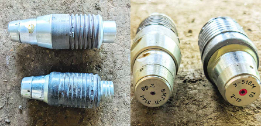

Зображення © Шон Мурхаус (Sean Moorhouse)

| СУБКАТЕГОРІЯ ОЗБРОЄННЯ          | Осколкова граната              |
| ------------------------------- | ------------------------------ |
| СПОРЯДЖЕННЯ БОЙОВОЇ ЧАСТИНИ (г) | 70 г, вибухова речовина A-IX-1 |
| ПОВНА МАСА (г)                  | 278 г                          |
| РОЗМІРИ (мм)                    | 107 x 40                       |
| КРАЇНА ПОХОДЖЕННЯ               | Росія/Болгарія                 |
| ПІДРИВНИК                       | ВМГ-К                          |

ВОГ-25М — це 40-мм вистрілювана граната. Вона може застосовуватися з усіма російськими 40-мм гранатометами. ВМГ-К зводиться під дією інерції та відцентрової сили. Версія ВОГ-25ПМ є осколковою гранатою, що вистрибує. Вона дуже схожа на ВОГ-25M. Заряд: 68-70 г вибухової речовини A-IX-1 є більшим, ніж той, що використовується в інших гранатах серії ВОГ.

Дві версії ВОГ-25М були помічені в Україні. Можливо, що одна з них є навчально-тренувальною версією.

Болгарська версія гранати промаркована позначкою «ARFG-25B».

## САМОРОБНА ВОГ-25M

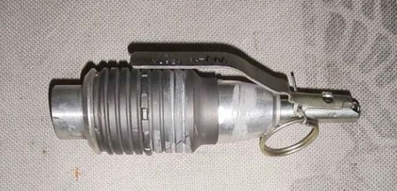

Зображення © З приватних джерел

| СУБКАТЕГОРІЯ ОЗБРОЄННЯ          | Осколкова граната                             |
| ------------------------------- | --------------------------------------------- |
| СПОРЯДЖЕННЯ БОЙОВОЇ ЧАСТИНИ (г) | 50 г, вибухова речовина A-IX-1 (за оцінками). |
| ПОВНА МАСА (г)                  | Не відомо                                     |
| РОЗМІРИ (мм)                    | Не відомо                                     |
| КРАЇНА ПОХОДЖЕННЯ               | Чечня/Сирія/Україна                           |
| ПІДРИВНИК                       | УЗРГМ-2                                       |

Дану гранату також називають «хаттабка». У корпусі гранати просвердлено отвір і нарізана різьба для встановлення 10-мм запалу УЗРГМ-2. Незрозуміло, чи видалено пороховий заряд.

Можливо, інший механізм підривника змінює величину повної маси вибухової речовини, хоча осколковий ефект залишається в будь-якому випадку. Також імовірно, що заряд вибухової речовини є меншим, якщо порівняти з ВОГ-25М, щоб залишити місце для детонатора, прикріпленого до запалу УЗРГМ-2.

## РГО/РГН

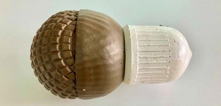

Зображення © Ролі Еванс (Roly Evans)

| СУБКАТЕГОРІЯ ОЗБРОЄННЯ          | Осколкова граната                                 |
| ------------------------------- | ------------------------------------------------- |
| СПОРЯДЖЕННЯ БОЙОВОЇ ЧАСТИНИ (г) | 90-110 г, вибухова речовина A-IX-1 (за оцінками). |
| ПОВНА МАСА (г)                  | 530 г                                             |
| РОЗМІРИ (мм)                    | 114 x 60                                          |
| КРАЇНА ПОХОДЖЕННЯ               | Росія/Болгарія                                    |
| ПІДРИВНИК                       | УДЗ                                               |

«Ручная Граната Оборонительная» (ручна граната оборонна) — це осколково-фугасна оборонна граната. Вона споряджена всюдибійним запалом УДЗ із двома піротехнічними елементами самознищення. Унаслідок удару кругова інерційна вага, зведена після піротехнічної затримки в 1-2 секунди, виштовхує ударник у напрямку капсуля. У цьому відношенні УДЗ є відносно нетиповим запалом осколкової ручної гранати. Функція самознищення спрацьовує за 3,2-4,2 секунди. У будь-якому випадку цей запал має затримку, аналогічну затримці в УЗРГМ-2.

РГН є майже ідентичною до РГО. Головна відмінність полягає в тому, що РГН має корпус з алюмінієвого сплаву, у той час, як корпус РГО виготовлений зі сталі. У деяких публікаціях зазначено, що РГН має основний заряд 110 г проти 90 г у РГО, хоча незрозуміло наскільки це точно.

Попри те, що вибухова речовина A-IX-1 є найпоширенішим сучасним наповнювачем гранат, також використовувалися ТГ-30 і ТГ-40.

Всюдибійний запал УДЗ, як відомо, є дуже небезпечним. Спеціалістам зі знешкодження ВНП рекомендується бути вкрай обережними.

## РКГ-3

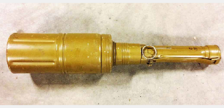

Зображення © Данський центр розвідки й утилізації вибухових боєприпасів (Danish EOD and Search Center)

| СУБКАТЕГОРІЯ ОЗБРОЄННЯ          | Кумулятивна протитанкова граната        |
| ------------------------------- | --------------------------------------- |
| СПОРЯДЖЕННЯ БОЙОВОЇ ЧАСТИНИ (г) | 350 г, ТГ-50                            |
| ПОВНА МАСА (г)                  | 1 070 г                                 |
| РОЗМІРИ (мм)                    | 362 x 72                                |
| КРАЇНА ПОХОДЖЕННЯ               | Росія/Болгарія/Східна Німеччина         |
| ПІДРИВНИК                       | Ударно-інерційний/підпружинений ударник |

РКГ-3 є ручною кумулятивною протитанковою гранатою, розробленою для використання під час боїв в умовах міської забудови, коли її можна кидати вниз із будівель. Скорочення

«РКГ» розшифровується як «ручна кумулятивна граната». Існує також версія РКГ-3 М, в якій використовується мідна, а не сталева кумулятивна виїмка. Також використовується довша версія РКГ-3EM із покращеною конфігурацією простору між дном кумулятивної виїмки й поверхнею, що піддається ураженню.

Найпростішою ознакою того, що граната зведена, є розгорнутий невеликий білий гальмівний парашут.

Як і РГО/РГН, РКГ-3 має контактний запал. Зведений ударник може застосуватися, коли від сили удару перемістяться останні затискні пристрої (гільза й стопорні кульки). Відомо, що запал зі зведеним ударником є дуже небезпечним. Спеціалістам зі знешкодження ВНП рекомендується бути максимально обережними.

Є ознаки того, що цей пристрій був адаптований для застосування в ролі невеликої авіаційної кумулятивної бомби з маркуванням РКГ-1600, яка скидається з БПЛА. У цій конфігурації система запалу в ручці замінена тим, що вважається ударним інерційним запалом у вогневому каналі.

## DM-51

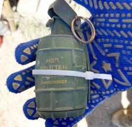 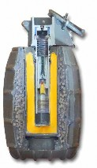

Зображення © Державна служба України з надзвичайних ситуацій та Manniman2

| СУБКАТЕГОРІЯ ОЗБРОЄННЯ          | Граната, осколково-фугасна       |
| ------------------------------- | -------------------------------- |
| СПОРЯДЖЕННЯ БОЙОВОЇ ЧАСТИНИ (г) | 60 г речовини на основі пентриту |
| ПОВНА МАСА (г)                  | 450 г                            |
| РОЗМІРИ (мм)                    | 112x40 мм                        |
| КРАЇНА ПОХОДЖЕННЯ               | Німеччина                        |

DM-51 — це німецька універсальна граната, яку можна адаптувати як під наступальні, так і під оборонні завдання. Якщо гранату поміщено в осколкову «сорочку» (як на зображенні), вона має характеристики оборонної. Ця сорочка має жовте (фугасна дія) трафаретне маркування

«HGR DM51 Splitter». У сорочці міститься 6500 стальних кульок розміром 2–2,5 мм.

Це конвенційна граната. Вона використовує спусковий важіль і закритий ударний запал типу

«мишоловка» з капсулем-детонатором з уповільненням. Затримка запалу складає від 3 до 5 секунд. Радіус суцільного ураження становить 10 м (в оборонній конфігурації з поміщенням в осколкову сорочку).

## M430A1

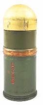 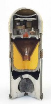 

Зображення © Нідерландський центр утилізації вибухових боєприпасів (Dutch EOD Center) та з приватних джерел

| СУБКАТЕГОРІЯ ОЗБРОЄННЯ          | Граната / саморобна скидувана бомба |
| ------------------------------- | ----------------------------------- |
| СПОРЯДЖЕННЯ БОЙОВОЇ ЧАСТИНИ (г) | 45 г речовини Composition A5        |
| ПОВНА МАСА (г)                  | 340 г                               |
| РОЗМІРИ (мм)                    | 112x40 мм                           |
| КРАЇНА ПОХОДЖЕННЯ               | США                                 |
| ПІДРИВНИК                       | Модифікований M550                  |

M430 — це поширена вистрілювана граната калібру 40 мм, модифікована під використання в якості невеликої бомби, що скидається з БПЛА. Цей осколково-фугасний постріл подвійної дії містить невеликий кумулятивний заряд із мідним облицюванням. Виробник стверджує, що цей кумулятивний заряд здатен пробивати катану однорідну броню товщиною 76 мм. Залишається невідомим як саме цей боєприпас модифіковано для скидання з БПЛА. Піропатрон із викидним зарядом вилучено для розміщення стабілізаторів. Підтверджень того, що боєприпас оснащується додатковою пластиковою вибуховою речовиною для збільшення маси основного заряду, немає, але така модифікація реалістична. Підривна система потребує внесення змін, але немає однозначної відповіді, як саме це реалізовано. Імовірно, стопор- пірнало вилучається, а обертально-шестерневий механізм дальнього зведення модифікується таким чином, щоб сумістити капсуль-запалювач M55 з ударником. У момент удару три ударних грузила подають суміщений ударник у капсуль-детонатор, і кумулятивний заряд спрацьовує за рахунок вогневого каналу. Такі вироби, споряджені на БПЛА, імовірно, уже перебувають у зведеному стані та вимагають надзвичайно обережного поводження.