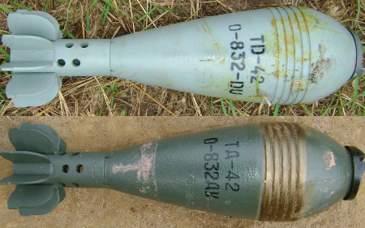
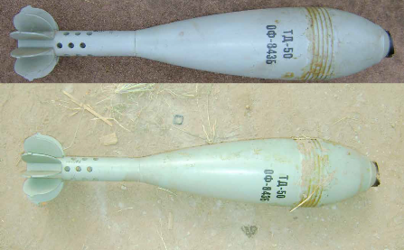
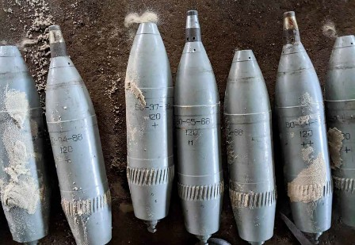
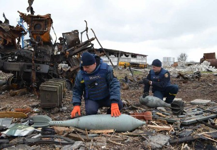
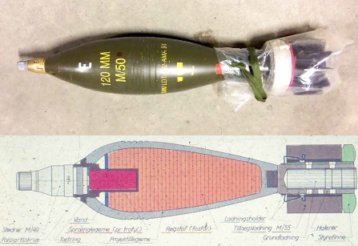
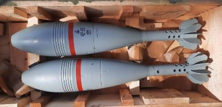
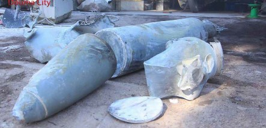

#### МІНОМЕТНІ ПОСТРІЛИ

## 82-ММ МІНОМЕТНИЙ ПОСТРІЛ О-832

Зображення © Ролі Еванс (Roly Evans)

| СУБКАТЕГОРІЯ ОЗБРОЄННЯ          | Мінометний постріл |
| ------------------------------- | ------------------ |
| СПОРЯДЖЕННЯ БОЙОВОЇ ЧАСТИНИ (г) | 440 г, тротил      |
| ПОВНА МАСА (г)                  | 3 230 г            |
| РОЗМІРИ (мм)                    | 329 x 82           |
| КРАЇНА ПОХОДЖЕННЯ               | Росія/Болгарія     |
| ПІДРИВНИК                       | М-6                |

O-832 — це поширений осколковий 82-мм мінометний постріл. Літера «О» означає

«осколковий». Ці постріли завжди комплектуються порівняно простими підривниками M-6 контактної дії. У цих підривниках використовується стандартний радянський механізм пружини інерційно-реакційного втулка. Якщо підривник не встановлено, постріл постачається із чорною пластиковою заглушкою. Міномети зазвичай постачаються з десятьма пострілами в коробці з бічним відділенням для підривників у герметично закритих банках.

На зображеннях вище показана трохи покращена версія 53-O-832ДУ.

## 120-ММ МІНОМЕТНИЙ ПОСТРІЛ ОФ-843

Зображення © Ролі Еванс (Roly Evans)

| СУБКАТЕГОРІЯ ОЗБРОЄННЯ          | Мінометний постріл        |
| ------------------------------- | ------------------------- |
| СПОРЯДЖЕННЯ БОЙОВОЇ ЧАСТИНИ (г) | 1 400 г, тротил або ТД-50 |
| ПОВНА МАСА (г)                  | 16 000 г                  |
| РОЗМІРИ (мм)                    | 674 x 120                 |
| КРАЇНА ПОХОДЖЕННЯ               | Росія                     |
| ПІДРИВНИК                       | M-12                      |

ОФ-843 — це осколково-фугасний мінометний постріл для гладкодульного міномета. Зазвичай споряджається підривником контактної дії. Підривник M-12 має у своєму складі не тільки інерційно-реакційну гільзу, але також повзунок і селекторний перемикач для вибору затримки та/або миттєвої дії. Якщо підривник не встановлено, постріл постачається із чорною пластиковою заглушкою.

Абревіатура ОФ означає «осколково-фугасний».

Зазвичай 120-мм осколково-фугасні мінометні постріли постачаються по дві одиниці в ящику. Підривники знаходяться в герметично закритих банках у бічному відсіку коробки. Існує номенклатура осколково-фугасних мінометних пострілів ОФ-843 із суфіксами A і B для позначення незначних відмінностей. Зауважте, що додаткові метальні заряди в мішечках, що використовуються із цим типом мінометних боєприпасів, дуже легко пошкоджуються, отже слід бути обережними, щоб не просипати пороховий заряд під час поводження зі зброєю.

## 120-ММ МІНОМЕТНИЙ ПОСТРІЛ ОФ-49

Зображення © Шон Мурхаус (Sean Moorhouse)

| СУБКАТЕГОРІЯ ОЗБРОЄННЯ          | Мінометний постріл                |
| ------------------------------- | --------------------------------- |
| СПОРЯДЖЕННЯ БОЙОВОЇ ЧАСТИНИ (г) | 4 900 г, вибухова речовина A-IX-2 |
| ПОВНА МАСА (г)                  | 17 200 г                          |
| РОЗМІРИ (мм)                    | 590 x 120                         |
| КРАЇНА ПОХОДЖЕННЯ               | Росія                             |
| ПІДРИВНИК                       | М-12                              |

Цей 120-мм осколково-фугасний мінометний постріл відрізняється від багатьох інших, які знаходяться на озброєнні російської армії, тим, що він не призначений для гладкодульних мінометів, а має попередньо прорізаний напрямний поясок. Його зазвичай вистрілюють із 120-мм самохідного міномета 2С9 «Нона».

Попри те, що на етапі пострілу до даного міномету докладається більше відцентрове зусилля, ніж до стандартної моделі, боєприпас споряджається підривником 3В35, який зводиться силою інерції. Уважається, що боєприпаси, які зазнали пожежі у транспортному засобі, повинні розглядатися як зведені, отже з ними потрібно поводитися обережно.

## 240-ММ МІНОМЕТНИЙ ПОСТРІЛ Ф-864

Зображення © Державна служба України з надзвичайних ситуацій

| СУБКАТЕГОРІЯ ОЗБРОЄННЯ          | Мінометний постріл |
| ------------------------------- | ------------------ |
| СПОРЯДЖЕННЯ БОЙОВОЇ ЧАСТИНИ (г) | 31900 г, тротил    |
| ПОВНА МАСА (г)                  | 130 700 г          |
| РОЗМІРИ (мм)                    | 1 541 x 240        |
| КРАЇНА ПОХОДЖЕННЯ               | Росія              |
| ПІДРИВНИК                       | M-16               |

240-мм мінометний постріл Ф-864 частіше всього асоціюється з російським самохідним мінометом 2С4 «Тюльпан».

Постріл Ф-864 часто комплектується механічними підривником контактної дії, швидше за все моделі M-16. Якщо підривник не встановлено, постріли постачаються зі встановленою сірою транспортною заглушкою, як показано вище. Кожне гніздо підривника зазвичай має певний вид адаптера для відповідного підривника. Мінометний постріл оснащується піропатроном, закріпленим на хвостовій частині. Додаткові метальні заряди в мішечках, що використовуються із цим типом мінометних боєприпасів, дуже легко пошкоджуються, отже слід бути обережними, щоб не просипати пороховий заряд під час поводження зі зброєю.

## АРТИЛЕРІЙСЬКА МІНА M50 120 ММ

Зображення © Данський центр пошуку та утилізації вибухових боєприпасів (Danish EOD and Search Center) і Forsvarets Krigsmateriel Forvaltning (Управління військового забезпечення Збройних Сил)

| СУБКАТЕГОРІЯ ОЗБРОЄННЯ          | Артилерійська міна осколково-фугасної дії |
| ------------------------------- | ----------------------------------------- |
| СПОРЯДЖЕННЯ БОЙОВОЇ ЧАСТИНИ (г) | 2325 г тротилу                            |
| ПОВНА МАСА (г)                  | 13 800                                    |
| РОЗМІРИ (мм)                    | 590x120 мм                                |
| КРАЇНА ПОХОДЖЕННЯ               | Швеція                                    |

Артилерійська міна M50 калібру 120 мм постачається з підривниками M49 ударної дії. Основний заряд міни — тротил, проміжний детонатор — пластифікований гексоген. Якщо для знешкодження використовується повільна детонація, слід зважати на розташування проміжного детонатора. Міна зазвичай містить на хвостовій частині додаткові заряди в пластикових корпусах.

## ЗАПАЛЮВАЛЬНА МІНА 3ВЗ4

Зображення © Державна служба України з надзвичайних ситуацій

| СУБКАТЕГОРІЯ ОЗБРОЄННЯ          | Артилерійська міна, запалювальна |
| ------------------------------- | -------------------------------- |
| СПОРЯДЖЕННЯ БОЙОВОЇ ЧАСТИНИ (г) | Запалювальний склад НК           |
| ПОВНА МАСА (г)                  | 16 900                           |
| РОЗМІРИ (мм)                    | 612x120 мм                       |
| КРАЇНА ПОХОДЖЕННЯ               | Росія                            |

3ВЗ4 — це запалювальна міна. Вона приводиться в дію дистанційним підривником із вогневим ланцюгом Т1. Це піротехнічний дистанційний підривник із можливістю встановлення на ударну дію. На підривнику перед пострілом встановлюється необхідна часова затримка. У момент спрацьовування підривника запалюється виштовхувальний заряд. Цей заряд підпалює запалювальні пелети та утворює всередині міни тиск. Під дією тиску корпус міни розділяється уздовж шва між центрувальним потовщенням і хвостовою частиною. Відбувається розкидування запалювальних пелет, що горять. Тривалість горіння пелет — близько однієї хвилини. Вважається, що в якості запалювального використовується термітний склад. Запалювальна міна 3ВЗ4 калібру 120 мм має характерну маркувальну червону лінію по периметру нижче центрувального потовщення.

## КОНТЕЙНЕРНА АРТИЛЕРІЙСЬКА МІНА 3-О-8

Зображення © З відкритих джерел

| СУБКАТЕГОРІЯ ОЗБРОЄННЯ          | Контейнерний мінометний постріл / касетний боєприпас |
| ------------------------------- | ---------------------------------------------------- |
| СПОРЯДЖЕННЯ БОЙОВОЇ ЧАСТИНИ (г) | Чотирнадцять суббоєприпасів 3-О-10                   |
| ПОВНА МАСА (г)                  | 230 кг                                               |
| РОЗМІРИ (мм)                    | 240 мм                                               |
| КРАЇНА ПОХОДЖЕННЯ               | Росія                                                |

Боєприпас 3-О-8 калібру 240 мм — це активно-реактивний контейнерний артилерійський постріл, що стабілізується в польоті. Артилерійські постріли калібру 240 мм зазвичай використовуються російським самохідним мінометом 2С4 «Тюльпан». Це мінометна система найбільшого калібру в сучасному використанні. Позначення «3-O-8» включає весь артилерійський постріл, включно з реактивним двигуном. Контейнерна бойова частина містить чотирнадцять суббоєприпасів 3-О-10 (технічні характеристики наведено у відповідному розділі). Постріл обладнується реактивним двигуном 3М15, що також використовується на кількох інших активно-реактивних мінометних пострілах. На постріл 3-О-8 може встановлюватися гальмівне кільце 3Ч20. Воно використовується, якщо міномет веде вогонь по цілях на малій дальності. Надійною візуальною ознакою застосування таких касетних боєприпасів є невеликі парашути, що стабілізують суббоєприпаси 3-О-10. На твердій поверхні кожен суббоєприпас також утворює характерну картину розльоту осколків, що може показати напрямок руху суббоєприпасів і касетного боєприпаса. Ці ознаки стануть у пригоді в процесі аналізу обсягу застосування ударів касетними боєприпасами.
